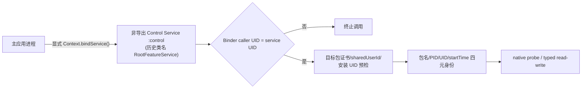

# MINIX 功能迁移执行文档

> **基线日期：** 2026-08-17  
> **项目目录：** `D:\Projects\minix`  
> **当前阶段：** 产品、同 UID 控制链和 typed 读写的主路径已闭合；防闪、飞行、玩家传送、数据读取与模拟飞行均已进入真机验收。SearchID 的 AIDL v10、Controller 生命周期和控制页 40 槽扫描入口已完成静态验收；LIFE_STATE 已恢复为当前 exact-SHA GameApp 的 `AttrHPComponent` float32 当前生命值链并接入生产字段档案，设备端复核排在 ADB 重连后执行。  
> **执行原则：** 先保持产品、权限、悬浮窗和已闭合功能可用，再按证据逐项开放目标进程功能。任何身份、版本、映射或字段证据不完整的功能均保持 fail-closed。

本文是当前代码的唯一迁移执行基线。历史内部类名仍含 `Root*`，它们表示早期命名，不代表当前存在 `su`、UID 0、特权守护进程或提权流程。当前控制链只使用证书、`sharedUserId`、普通 Android Service、Binder 和同 Linux UID 访问条件。

> **Root 方案弃用公告（2026-08-18）：** 当前发布架构不启用 Root shell、`su`、UID 0、Magisk、Shizuku 或独立特权守护进程。证书、`android:sharedUserId="ca.sailboat.a"`、安装后的同 Linux UID、普通非导出 `:control` Service 与 AIDL/Binder 才是有效控制链。`root` 包目录、`Root*` 类名、方法名和 AIDL 名称仅为历史兼容标识；新文档统一写“控制服务/控制桥/控制会话”。详细解释与阅读索引见 [`docs/README.md`](docs/README.md) 和 [`docs/2026-08-18_架构-Root方案弃用说明-report.md`](docs/2026-08-18_架构-Root方案弃用说明-report.md)。

## 0. Root 方案弃用与命名兼容

Root 相关名称暂时保留在源码路径、Manifest 组件名、JNI 注册名、AIDL descriptor 和测试引用中，以维持现有协议与构建工件的稳定性。它们不改变以下事实：

| 维度 | 当前基线 |
|---|---|
| 身份 | MINIX 与目标包使用活动 signer SHA-256 `A40DA80A59D170CAA950CF15C18C454D47A39B26989D8B640ECD745BA71BF5DC`，并声明相同 `android:sharedUserId="ca.sailboat.a"` |
| IPC | `android:exported="false"` 的普通 `android.app.Service`，运行于 `:control`，通过 AIDL/Binder 调用 |
| UID 门禁 | PackageManager 分配的安装 UID、服务 UID、Binder caller UID 与目标 effective UID 逐层核对 |
| native 边界 | 仅在同 UID、四元进程身份、完整 SO SHA 和 scoped maps 通过后执行 typed probe/读写 |
| Root 入口 | 当前发布链路未启用；历史 `Root*` 名称只用于兼容和证据追溯 |

后续新增功能和文档应采用 `Control*` 语义。外层 UI/ViewModel/Action 已完成 `Control` 命名迁移，`MinixApplication.rootController` 仅作为带 `@Deprecated` 的源兼容别名；底层 root 包、AIDL descriptor、Manifest 组件和 JNI 注册名保持不变。若要继续重命名底层符号，先建立兼容别名并完成 AIDL、Manifest、JNI、单元测试和 APK 签名验收，再移除无引用的历史名称。运行时控制路径和协议未改变。

## 1. 目标、边界与发布结论

MINIX 已迁入一套本地优先 Android 应用：主界面、权限引导、悬浮面板、预设与本地数据管理已实现；目标进程控制以独立 `:control` 进程中的普通非导出 Service 承载，并以目标安装包身份、进程四元身份、精确 SO 指纹和 scoped maps 身份逐层门禁。防闪使用固定静态档案、22 ms worker、逐项回读和可重试的条件回滚，不接受 UI 或外部输入的地址与补丁值。

### 1.1 必须保留的产品边界

- 不含账号注册、登录、卡密或订阅验证。
- 不声明网络权限，不连接服务器，不下载远程配置。
- 不含远程命令、隐藏入口、静默更新或后门逻辑。
- 用户配置仅保存在设备本地；导入和导出通过系统文件选择器完成。
- 目标功能由静态版本档案驱动，不接受服务器下发的地址、补丁值或脚本。
- 当前没有 Root shell、`su`、UID 0 Service、Shizuku 或特权授权依赖。

### 1.2 当前发布结论

| 范围 | 状态 | 结论 |
|---|---|---|
| 产品 UI 与导航 | 已完成 | 手机/宽屏自适应的 Compose 五页结构已落地 |
| 权限申请 | 已完成 | 悬浮窗设置页与 Android 13+ 通知权限按需申请 |
| 悬浮窗 | 已完成 | 前台 `specialUse` Service、拖动、吸附、收起、设置同步和权限撤销监听 |
| 本地功能 | 已完成 | DataStore、预设、点位、本地媒体、主题、JSON 导入导出、重置 |
| 本地 Binder 控制桥 | 已完成 | 普通非导出 Service、`:control` 进程、显式 `bindService()`、协议 v10 |
| 包与进程身份门禁 | 已完成 | 证书、shared UID、安装 UID和包名/PID/UID/startTime 四元身份闭合 |
| SO 静态身份 | 已完成 | 完整 SHA-256、Build-ID、ELF/PT_LOAD、BSS 派生布局均已独立复核 |
| 防闪事务 | 静态与真机验收通过 | 双 SO 指纹、6 个代码区、17 个 u32、22 ms worker、逐项回读、停止和条件回滚均已验证 |
| 功能接线 | 已闭合主路径 | FLIGHT、FAKE_FLIGHT、PLAYER_TELEPORT、SearchID、LIFE_STATE、KILL_COUNT 与 GetDataLong(1) 已有 typed 路径 |
| 目标设备运行时 | 主路径通过 | API 36 / arm64-v8a / SELinux Enforcing 下两包同为 UID 10552；ANTI_FLASH、FLIGHT、PLAYER_TELEPORT、FAKE_FLIGHT 指令往返和两个只读字段已通过 |
| 未闭合功能 | 禁用 | AIM、DRAW 以及全实体 HITBOX 不进入 resolved patch map；HITBOX 的旧 worker 100 槽语义已闭合，但当前 exact-SHA 集合映射/生命周期未唯一化 |

## 2. 产品与 UI 实现

视觉以附图的浅蓝背景、白色大圆角内容面、深墨色文字、薄荷色状态强调和低密度导航为参考，实际实现使用 Material 3，并支持系统浅色/深色主题和四种强调色。

### 2.1 页面结构

| 页面 | 当前能力 |
|---|---|
| 主页 | 版本与运行状态、主视觉、本地预设摘要、权限摘要、刷新、启动/停止悬浮工具 |
| 控制 | 本地目标会话、九渠道选择与自动扫描、功能门禁、玩家三轴位置、SearchID 40 槽扫描、只读字段、悬浮面板参数 |
| 预设 | 三个内置预设、自定义预设保存/删除、选择应用、JSON 导入导出 |
| 本地库 | 本地背景、本地音频、传感器预览、本地条目收藏、点位增删改、活动记录 |
| 设置 | 权限状态、同 UID 服务连接、主题、强调色、数据导入导出与本地配置重置 |

### 2.2 本地设置与媒体

`SettingsRepository` 以 Preferences DataStore 持久化网格、触觉反馈、面板透明度/尺寸/位置、展开状态、灵敏度、响应模式、对齐辅助、轨迹预览、效果高亮、主题、强调色、背景 URI、音频 URI、收藏、预设和点位。系统文件选择器提供持久 URI 读取权限；音频由本地 `MediaPlayer` 异步播放。导入 JSON 有版本、字段、类型、范围和数量校验，校验失败时不覆盖现有数据。

### 2.3 悬浮窗

`OverlayService` 是普通非导出前台 Service：

1. 首页先检查 `Settings.canDrawOverlays()`；未开启时跳转本应用悬浮窗设置页。
2. Android 13 及以上再按需申请 `POST_NOTIFICATIONS`。
3. `ContextCompat.startForegroundService()` 启动 `specialUse` 前台服务。
4. `WindowManager.TYPE_APPLICATION_OVERLAY` 承载 Compose 面板。
5. 面板支持拖动、显示边界约束、20 dp 近边吸附、展开/收起、关闭，以及网格、轨迹、高亮、透明度的即时同步。
6. AppOps 监听悬浮权限变化；权限被撤销时移除 View 并停止服务。
7. 通知包含打开应用和停止面板操作；任务移除时服务停止。

Manifest 只声明以下用户可见能力：

- `SYSTEM_ALERT_WINDOW`
- `FOREGROUND_SERVICE`
- `FOREGROUND_SERVICE_SPECIAL_USE`
- `POST_NOTIFICATIONS`
- `VIBRATE`

Manifest 不含 `INTERNET` 或 `ACCESS_NETWORK_STATE`，并设置 `android:allowBackup="false"`。合并 Manifest 还会由 AndroidX 自动加入应用内 signature 级 `me.dartcv.minix.DYNAMIC_RECEIVER_NOT_EXPORTED_PERMISSION` 及其 uses-permission；它不扩大目标包可见性或网络能力。

## 3. 同 UID 控制架构

### 3.1 组件与调用方式

> **命名提示：** 本节中的 `RootFeatureService` 是现有实现类的历史全限定名。它继承的是普通 `android.app.Service`，并非 Root 服务；新文档可称为“控制服务”。

- `RootFeatureService` 继承普通 `android.app.Service`。
- Manifest 设为 `android:exported="false"`、`android:process=":control"`。
- UI 进程用显式 `Intent().setComponent(...)` 和 `Context.bindService(..., BIND_AUTO_CREATE)` 绑定。
- 不启动外部二进制、不拉起 shell、不依赖守护进程。
- AIDL 协议版本为 10；客户端校验协议版本、服务 PID、服务 ABI 和服务 UID。SearchID 命令额外回传请求 ID、typed 状态、可选槽位、失败原因和进程 startTime，客户端拒绝形状不一致的响应。
- 服务端 `onTransact()` 要求 `Binder.getCallingUid() == Process.myUid()`。
- 客户端要求 AIDL 返回的服务 UID 等于 UI 进程 `Process.myUid()`。
- 同进程 maps 刷新保留已启用功能状态；客户端在字段刷新后重新读取开关、支持集合、目标身份和档案元数据，避免发布旧快照。
- `MODULE_NOT_FOUND`、`FINGERPRINT_UNAVAILABLE` 等暂态档案会由轮询重新执行 `openOrRefresh`；即使数据读取已先就绪，注入档案仍会继续独立重探。运行时预读失败会保留错误详情，但不会永久锁死飞行、模拟飞行或玩家传送的重试入口。



### 3.2 证书、sharedUserId 与 v3 的准确关系

Manifest 固定：

```xml
<manifest android:sharedUserId="ca.sailboat.a">
```

Debug 和 Release 使用同一 PKCS12 signing config，当前证书 SHA-256 为：

```text
A40DA80A59D170CAA950CF15C18C454D47A39B26989D8B640ECD745BA71BF5DC
```

构建配置为 `minSdk = 28`，并启用 v3-only：

```kotlin
enableV1Signing = false
enableV2Signing = false
enableV3Signing = true
enableV4Signing = false
```

必须区分两件事：

- **共享 Linux UID 的身份条件**是安装包使用兼容的签名证书身份，并声明相同的 `android:sharedUserId`；最终是否分配同一 UID 由设备 PackageManager 决定。
- **APK Signature Scheme v3**只是 APK 的签名封装与校验方案。v3 本身不会创建 shared UID，也不会替代证书身份和 `sharedUserId`。

因此发布时不能只看“v3 已验证”。必须同时核对 MINIX 与目标包的活动 signer、目标包 `sharedUserId` 和安装后 Linux UID。

### 3.3 目标包安装身份预检

`AndroidTargetPackageIdentityVerifier` 在所有 PID 查找入口和内存探测前读取目标 `PackageInfo`，严格要求：

1. 目标包已安装且对 MINIX 可见。
2. `sharedUserId == "ca.sailboat.a"`。
3. 活动 signer 集合恰好只有预期证书 SHA-256。
4. `applicationInfo.uid == Process.myUid()`。

任一条件缺失或不匹配即停止，且不会进入 `/proc` 进程查找或 native 内存探测。Manifest 的 `<queries>` 只枚举九个已支持目标包，用于 Android 包可见性；它不是权限，不等同于 `QUERY_ALL_PACKAGES`，项目也未声明后者。

### 3.4 进程四元身份

会话固定以下四元组：

```text
(packageName, pid, effectiveUid, startTimeTicks)
```

- 包名来自静态渠道目录，格式先规范化和校验。
- PID 通过受限 `/proc` 扫描查找；优先主进程，再考虑匹配的 `package:process`。
- effective UID 严格解析 `/proc/<pid>/status` 唯一 `Uid:` 行的四个字段，并取第二个字段；缺失、重复、非十进制或溢出全部失败。
- startTimeTicks 取 `/proc/<pid>/stat` 第 22 字段，用来阻断 PID 重用。
- 目标 effective UID 必须等于控制 Service UID和安装包 UID。
- native probe 前后、每次刷新、字段读取、功能写入、SearchID 扫描和 Binder 快照读取期间均复核身份。
- PID、UID、startTime 或包身份变化时立即清空会话、功能状态、native 状态和版本档案。

## 4. SO 精确身份与 maps 布局

目标模块静态身份来自 `D:\Projects\bingxi\liblibGameApp.so`，已写入：

- `artifacts/liblibGameApp-1.58.2-elf-identity.json`
- `artifacts/liblibGameApp-1.58.2-elf-verification.json`
- `app/src/main/java/me/dartcv/minix/root/RootGameAppArtifact1582.kt`

### 4.1 已确认身份

| 属性 | 值 |
|---|---|
| 文件名 / SONAME | `liblibGameApp.so` |
| 文件大小 | `176533320` bytes |
| SHA-256 | `d8efe55c37b061ce41cb3830ec743401138bf40b8bacf251f18f7b026bf0140e` |
| GNU Build-ID | `662a450a7331aff319cbc4b3897c2124f8fd61f9` |
| ELF | ELF64、little-endian、AArch64、ET_DYN |
| Entry | `0x02c49f50` |
| PT_LOAD 数 | 3 |
| `.bss` | `0x0a85c780` |
| 匿名 BSS 页锚点 | `0x0a85d000` |
| 虚拟内存结束 | `0x0b3c0128` |
| 页对齐结束 | `0x0b3c1000` |

PT_LOAD：

| # | file offset | virtual address | file size | memory size | flags |
|---|---:|---:|---:|---:|---|
| 0 | `0x00000000` | `0x00000000` | `0x0a13dde0` | `0x0a13dde0` | `R-X` |
| 1 | `0x0a13dde0` | `0x0a13ede0` | `0x00653110` | `0x00653110` | `RW-` |
| 2 | `0x0a790ef0` | `0x0a792ef0` | `0x000c9890` | `0x00c2d238` | `RW-` |

### 4.2 运行时绑定规则

- 对目标 backing file 计算完整 SHA-256，而不是短哈希、文件名或局部字节签名。
- 普通映射通过 `/proc/<pid>/root/<path>` 读取；路径带 ` (deleted)` 时，先在受限 maps 快照中唯一定位 offset-zero 映射，再通过 `/proc/<pid>/map_files/<start>-<end>` 读取并计算完整 SHA-256。
- 完整 SHA 命中后，才继承已静态验证的 Build-ID、PT_LOAD 和 BSS 派生布局。
- 要求同名模块唯一，存在有效 offset-zero `r-xp` 映射，且内存中 ELF 头可读。
- `liblibGameApp.so:bss` resolver 还要求预期地址处存在唯一、独立的 `rw-p [anon:.bss]` 映射。
- 在完整文件散列前后读取 maps；路径、映射范围、load bias、匿名 BSS 或 startTime 变化均停止解析。
- 防闪不绑定整个进程 maps 文本，而是只选中覆盖 6 个代码区、BSS marker 和 17 个写地址的唯一映射。Kotlin 与 C++ 使用相同 canonical 行：`start-end perms offset device inode path`，按映射索引排序后计算 64-bit FNV-1a；`device`、`inode` 或路径变化都会改变指纹。
- 不将文件大小误当作进程 `mappedBytes`；二者属于不同测量值。

离线复核命令：

```powershell
Set-Location 'D:\Projects\minix'
python tools\verify_gameapp_elf.py `
  'D:\Projects\bingxi\liblibGameApp.so' `
  --identity-json artifacts\liblibGameApp-1.58.2-elf-identity.json `
  --output artifacts\liblibGameApp-1.58.2-elf-verification.json
```

验收条件是进程退出码为 0，报告中 `verified` 为 `true` 且 `mismatches` 为空。

### 4.3 防闪静态档案

防闪档案 `miniworld-1.58.2-arm64-antiflash-v1` 仅适用于 `arm64-v8a`，同时固定两份模块身份：

| 模块 | 大小 | SHA-256 | GNU Build-ID |
|---|---:|---|---|
| `liblibGameApp.so` | `176533320` bytes | `d8efe55c37b061ce41cb3830ec743401138bf40b8bacf251f18f7b026bf0140e` | `662a450a7331aff319cbc4b3897c2124f8fd61f9` |
| `libtprt.so` | `1883784` bytes | `056726e1419d68284deafa21b64e55a919adacd7a8171c9e1d5fb1998cd95cc8` | `e9e9ba3856e5c644983d3886abf9a4ddb253e77c` |

档案含 6 个代码区：GameApp RVA `0x09253ce8`，以及 tprt RVA `0x0014c288`、`0x0016ce78`、`0x0013c5fc`、`0x0013cc74`、`0x000fc270`。这些区域展开为 16 个可执行映射 u32 写入，另加 GameApp 匿名 BSS `+0x80 = 0x002475F6`，总计 17 项。档案同时保存每个代码区的 original bytes 和 patch bytes；缺少任一身份、区域、原始字节或写入项时，profile 不会进入可运行状态。

## 5. 功能迁移矩阵

这里的“静态闭合”表示地址配方、类型、预期值和实现边界已进入代码与单元测试；真机状态以表格最后一列为准。当前生产字段档案暴露 LIFE_STATE、KILL_COUNT 与 GetDataLong(1) 三个 exact-SHA typed 字段。

| 功能 | 当前静态状态 | 运行路径 | 发布状态 |
|---|---|---|---|
| 目标渠道选择/扫描 | 已闭合 | 九个静态包名；每个查找入口先做安装身份预检 | 可进入真机验收 |
| native maps/模块探测 | 已闭合 | 有界读取 maps、模块汇总、ELF 头与完整文件 SHA | 可进入真机验收 |
| ANTI_FLASH | 静态与真机闭合 | 双 SO 精确身份；6 区 preflight；17 个 u32 写后逐项回读；22 ms worker；完整条件回滚 | API 36 真机通过 |
| SearchID | 静态闭合 | exact-SHA BSS anchor；`rootOffset=0x18760`；40 槽固定扫描；AIDL v10 与控制页 int32 输入 | UI 与 typed 结果已接通；真机命中结果待有效房间 ID |
| LIFE_STATE | 当前版本静态闭合 | `control=*(BSS+0x781370)` → `player=*(+0x1a0)` → `ClientActor=*(+0x140)` → `AttrHPComponent=*(+0x210)` → `float32 currentHP@+0x38`；按原 JNI `FCVTZS` 向零截断为 int32 | 已进入生产字段档案；ADB 重连后复核 HP 与生死变化 |
| KILL_COUNT | 静态与真机闭合 | GameApp 匿名 BSS anchor `+0x1cc78`；读取 int32 | 真机稳定读到 `0` |
| GetDataLong(1) | 静态与真机闭合 | production：`read_u64(*(GameApp BSS + 0x5b860) + 0x548)`；使用 `POINTER64`，旧 `LEGACY_MASKED_H` 已淘汰 | 连续 12 次稳定为 `0x00000f547c994f5e` |
| READABLE_DATA | 静态与真机主路径闭合 | native memory-ready + exact-SHA 字段档案；只要求档案中实际定义的字段成功 | 档案现含 3 个字段；KILL_COUNT/GetDataLong(1) 已实读，LIFE_STATE 待设备复核 |
| FLIGHT | 静态与真机闭合 | `control=*(loadBias+0x0afde370)`；`player=*(control+0x1a0)`；`player+0xf0` bit 3，按位设置/清除并保留其他 flag | 同 UID 只读采样 raw=`12 (0x0c)`、bit 3 已设置，UI 开关可用 |
| PLAYER_TELEPORT | 静态与真机闭合 | 公共 pointer64 链后 X/Y/Z `+0x2c8/+0x2cc/+0x2d0`；`rawUnitsPerWorldUnit=100`；三轴事务回读/回滚 | 同 UID只读 raw=`60600/7693/60572`，即 `606.00/76.93/605.72` |
| AIM | 候选/过滤闭合，writer 未闭合 | 已唯一化 40 槽候选链、`+0x488 == 100.0f` 状态 gate、`+0x24 != B+0x1CC74` 本地身份排除和 JNI selector 1–5 本地配置；GameApp 最终 writer/宽度/目标值/回读仍缺 | 禁用，继续追唯一 consumer/writer |
| SetheadSpeed / 头部旋转 | 静态证据与 gated supervisor 已闭合，公开接线保留门禁 | selector `17` 已在 `[1,101]×{0,1}` 正式扫描中唯一命中 worker；MINIX 自有 supervisor 使用 exact-SHA、PID/startTime/maps 门禁、单 worker、可中断 stop/join、`0xb9005909↔0x72a80bea` compare-exchange、两轴快照/回滚；native 适配复用带 maps 指纹的 u32 批处理；UI 契约单独记录 selector 17（头部）与 selector 18（准心） | `production_ready=false`；RootFeature/AIDL/UI 公开列表暂不加入。fixture、lint、assemble 和 arm64 native 编译已通过，剩余门禁是 target-side native/runtime identity 证据 |
| DRAW | 读取/协议部分闭合 | 已闭合实体表与坐标/元数据字段、矩阵链、W 分量和 9 字段文本协议；DRAW 自身循环上限、完整投影/框体/距离公式及 health/zy/name 映射未闭合 | 禁用，SearchID 的 40 槽边界不外推 |
| FAKE_FLIGHT | 静态闭合、真机写链通过 | exact-SHA GameApp RVA `0x052e13f8`；U32 `0x39449269` (`LDRB`) ↔ `0xd503201f` (`NOP`)；要求 executable 映射、4 字节对齐、写前 expected word 和写后回读 | UI 可用，真机双向字节往返通过；实际移动效果待人工对局验收 |
| HITBOX | 本地链与旧 100 槽 worker 已闭合，当前集合映射未唯一化 | exact-SHA 本地玩家链、PlayerLocoMotion vptr/vslot、三轴字段和快照回滚规则已闭合；旧 worker 固定遍历 `0..99`、stride 8，`B+0x1CC50` secondary identity gate、`B+0x1CC74` local identity gate、marker/三轴 writer 均有 witness | 公开开关禁用，继续唯一化当前 exact-SHA FULL_ENTITY_SET 映射/生命周期 |

### 5.1 typed 写入事务

FLIGHT、FAKE_FLIGHT 与玩家三轴位置共享以下原则：

1. 确认包身份与四元进程身份。
2. 确认目标 ABI、模块完整 SHA、maps 和版本档案。
3. 解析结构化地址 recipe，不接受 UI 传入裸地址。
4. 验证地址落在要求的可读/可写映射内。
5. 预读当前 typed scalar；仅当它等于档案的 expected value 时写入。
6. native 层用 `process_vm_readv/writev`，并提供 `/proc/<pid>/mem` 的 `pread64/pwrite64` 回退。
7. 写入后复核 startTime 和实际值。
8. 玩家位置按 X、Y、Z 顺序执行；任一轴失败时逆序恢复已经写入的轴，并验证回滚。

任何预读失败、expected value 不匹配、部分写、身份变化、回读不一致或回滚失败都会返回 typed 状态，而不是把 UI 开关标记为成功。

**2026-08-17 16:30 只读回读证据：** `run-as me.dartcv.minix` 在同 UID 条件下只读 `/proc/28779/mem`，未执行写入。`player+0xf0` 的 raw 值为 `12 (0x0000000c)`，bit 3 已设置；actor 三轴 raw 值为 `60600/7693/60572`，对应 `606.00/76.93/605.72` world units，闭合 `rawUnitsPerWorldUnit=100`。证据文件为 `artifacts/runtime/2026-08-17/live-flight-position-readback-1630.txt`，SHA-256 `F7AA6000E1532A38B4101E0823E40AD29DC11ACFBFDE03D6217CED08DF73B14E`。

**2026-08-17 17:32–17:36 FAKE_FLIGHT 真机证据：** GameApp load bias 为 `0x7334e2d000`，RVA `0x052e13f8` 对应 VA `0x733a10e3f8`，位于 offset-zero `r-xp` 映射。开启前为 `69 92 44 39`，UI 开关置为 `checked=true` 后回读 `1f 20 03 d5`；关闭后恢复 `69 92 44 39`。三次采样中 PID 均为 `28779`、startTime ticks 均为 `1231376`。UI 同时显示 `3 typed injection features verified`，数据读取可开启并实读 KILL_COUNT=`0`、GetDataLong(1)=`0xf547c994f5e`，玩家传送三轴输入与应用按钮均为 enabled。字节回读证明写链和恢复链成立；跨进程执行段写入没有目标进程 I-cache 刷新握手，因此实际移动语义仍以人工对局观察为最终验收。

### 5.2 SearchID 只读扫描

SearchID 生产档案为 `miniworld-1.58.2-arm64-search-id-v2`，只适用于精确 GameApp SHA。运行路径固定为：

1. UI 只接受 int32 输入，并要求 Binder READY、目标包/PID/UID/startTime 四元身份已验证、native probe memory-ready。
2. 通过唯一 `liblibGameApp.so:bss` 锚点解析 `H(anchor + 0x18760)`，随后依次解析 `H(+0x88)` 与 `H(+0xd8)`。
3. 固定扫描 40 个 stride=8 的槽；每槽先解析候选，候选非零时要求 `candidate+0x488` 的 u32 bits 等于 `0x42c80000`，再读取 `candidate+0x0` 的 int32 ID。
4. 结果严格区分 `MATCH`、`NOT_FOUND` 和带原因的 `INVALID`；任何 resolver、标量读取、完整 SHA、maps、地址溢出或进程身份异常都返回 typed 失败，不把部分扫描解释为未命中。
5. AIDL v10 同时返回请求 ID、槽位、失败原因和 startTime；客户端校验布尔命令结果与 typed payload 一致性。Controller 只保存属于原 PID/startTime 的结果，目标变化、关闭或断连时清除。

控制页显示“扫描 40 槽”，命中使用 1-based 槽位文案；未命中与 typed 失败分别展示。相关静态证据、测试与构建记录见 `work/searchid-ui-20260817/README.md`。

### 5.3 防闪事务与回滚

防闪运行链固定为：

1. 以包身份、四元进程身份、ABI、GameApp/tprt 完整 SHA 和唯一 offset-zero RX 映射解析目标。
2. 验证 GameApp 匿名 BSS，并生成只覆盖本事务地址的 scoped maps 指纹。
3. 每轮一次性预读 6 个代码区和 BSS marker；代码区只接受 original 或 patch bytes，首次有效 preflight 保存 BSS 原值。
4. native 层按 1 到 17 顺序写入，每项写后立即回读，只有 17 项全部完成才记为一次成功 iteration。
5. 每个成功 iteration 后等待 `22 ms`，再开始下一轮；worker 由 `RootFeatureService` 持有。
6. 停止、切换目标、关闭目标、断开控制服务和 Service 销毁都先进入同一串行停止流程，并等待 worker 结束当前事务。

回滚是完整 17 项条件批次，不按“本轮写了几项”猜测范围：

- 停止前重新读取 17 项；每项只接受原值、补丁值或二者的 bytewise blend，其他值按未知并 fail-closed。
- 每个回滚项同时携带 `expectedCurrentBytes`。native 写前再次读取 guard；guard 已是原值时只验证，guard 与预读值一致时才恢复原值，guard 已变化时停止批次并保留上下文。
- 每项恢复后立即回读；只有 17 项全部验证成功，才清除 target 和 BSS 原值上下文。
- 首轮写入或部分写入后即使 maps 发生变化，只要 PID/startTime 仍匹配且 native 返回新的 scoped 指纹，监督器会保留并更新回滚身份；回滚失败时状态保持 `applied=true`，允许后续停止操作重试。
- `RootController.disconnect()`、渠道切换和目标关闭均由协程互斥锁串行；回滚未完成时保留 Binder 连接和目标会话，不提前销毁恢复所需上下文。

状态通过协议 v10 暴露，主要状态包括 `WAITING_FOR_TARGET`、`RUNNING`、`STOPPING`、`STOPPED`、`TARGET_CHANGED`、`PROFILE_MISMATCH`、`READ_FAILED`、`WRITE_FAILED`、`VERIFY_FAILED`、`ROLLBACK_FAILED` 和 `BACKEND_UNAVAILABLE`。UI 只有在 `requestedEnabled && workerRunning` 时显示防闪已启用。

**2026-08-17 真机验收结果：** 设备为 Android 16 / API 36、`arm64-v8a`、SELinux Enforcing；`com.minitech.miniworld` 与 `me.dartcv.minix` 均由 PackageManager 分配 UID `10552`。worker 在启动采样约 `2.866 s` 时出现；运行证据分别记录“循环 537 · 已验证写入 9129”和“循环 642 · 已验证写入 10914”，均满足每轮 17 项写入。后续证据记录“循环 1273 · 已验证写入 21641”，停止后 worker 消失，UI 显示“防闪 · 已停止”并保留 `Anti-flash stopped and rollback verified`。证据保存在 `artifacts/runtime/2026-08-17/`：`device-identity.txt`、`startup-trace.tsv`、`running-537.xml`、`running-642.xml`、`running-button.xml`、`stop-trace-worker-gone.tsv` 和 `stopped-rollback-verified.xml`。

### 5.4 未闭合项的处理

- `AIM`、`DRAW` 以及多人等价 `HITBOX` 的档案继续缺少生产所需字段，保持在 resolved patch map 之外。AIM 的候选/过滤配方保存在 `work/aim-direct-recovery-20260817`；DRAW 的实体/矩阵/wire 配方保存在 `work/draw-recovery-20260817`；HITBOX 的本地玩家配方保存在 `work/hitbox-recovery-20260817`。SetheadSpeed 的静态门禁、生命周期、恢复字、轴快照和 UI 契约分别保存在 `work/headspeed-recovery-20260817/headspin_lifecycle_cfg.json`、`headspin_prepatch_restore.json`、`headspin_axis_snapshot.json`、`headspin_ui_contract.json`；gated Kotlin supervisor 与 maps-aware native adapter 位于 `app/src/main/java/me/dartcv/minix/root/HeadSpin.kt` 和 `RootHeadSpinNativeBackend.kt`，生产公开列表仍保持关闭。2026-08-18 的统一静态审计见 `work/feature-readiness-audit-20260818.json`，后续按 `head_spin → DRAW → AIM` 推进，并保留 HEAD_A–HEAD_G 门禁、预期工件和 scalar executor 边界。
- `FAKE_FLIGHT` 的旧公式 `runtime anchor + 0x04046e18` 已废弃。当前 exact-SHA SO 中通过控制流约束把 12 个相同 word 命中唯一收敛到 RVA `0x052e13f8`：前驱 `CBNZ W9` 的落空路径证明 `W9==0`，NOP 保留零值并绕过 movement gate；重复候选 `0x052e1398` 的进入路径证明 `W9>=1`，NOP 后会被紧随的 `CBNZ` 退出，因此排除。
- UI 可以展示功能名称和档案状态，但只有 `supportedFeatures` 中的条目可操作。
- 后续只有在唯一地址、类型、disabled/enabled 值、映射要求、目标版本和完整证据来源同时闭合后，才增加生产 profile。

## 6. 分阶段执行计划

### 阶段 A：产品壳、权限和本地能力 — 已完成

- [x] 创建 Compose 主界面和五页导航。
- [x] 按参考图建立浅蓝/白/深墨色视觉体系及响应式布局。
- [x] 实现悬浮权限、通知权限和状态反馈。
- [x] 实现可拖动、吸附、收起和停止的 Compose 悬浮面板。
- [x] 实现 DataStore 设置、预设、点位、背景、音频和 JSON 导入导出。
- [x] 保持无登录、无卡密、无网络与无隐藏入口。

### 阶段 B：本地 Service 与身份链 — 已完成

- [x] 使用普通非导出 `android.app.Service`，运行于 `:control`。
- [x] 使用显式 `Context.bindService()` 和 Binder death recipient。
- [x] 服务端验证 Binder caller UID，客户端验证 service UID。
- [x] Manifest 声明 `android:sharedUserId="ca.sailboat.a"`。
- [x] 构建切换到 `minSdk 28` 和 v3-only 签名。
- [x] 以 `<queries>` 精确枚举九个目标包，不声明 `QUERY_ALL_PACKAGES`。
- [x] 在所有 PID 查找与探测入口前验证目标 signer、sharedUserId 和安装 UID。
- [x] 固定并重复验证包名/PID/UID/startTime 四元身份。

### 阶段 C：native 只读和 SO 身份 — 已完成静态实现

- [x] 有界解析 `/proc/<pid>/maps`、status 和 stat。
- [x] 实现目标模块 ELF 头读回与 backing file 完整 SHA-256。
- [x] 固定 GameApp SHA、Build-ID、SONAME、PT_LOAD 与 BSS 布局。
- [x] 实现 exact-SHA + 唯一映射 + 稳定 maps 的 fail-closed resolver。
- [x] 接入 SearchID、LIFE_STATE、KILL_COUNT 和 GetDataLong(1) typed 读取；SearchID 已接通 AIDL v10、Controller 生命周期和控制页输入/结果，LIFE_STATE 已用当前 exact-SHA `AttrHPComponent` 配方替换旧 masked-H 草案。

### 阶段 D：typed 写入 — 已完成静态实现

- [x] 接入 FLIGHT bit 3 按位 compare-exchange 写入，并以同 UID 只读采样确认 raw=`12`、bit 3 已设置。
- [x] 接入 PLAYER_TELEPORT X/Y/Z 事务写入、`100` 倍 world-unit 编码、回读和逆序回滚；HUD 与只读 raw=`60600/7693/60572` 共同闭合比例。
- [x] 接入 FAKE_FLIGHT RVA `0x052e13f8` executable U32 双向 guarded write；真机确认 `0x39449269 ↔ 0xd503201f`、UI checked 状态与关闭恢复。
- [x] 让地址、宽度、映射要求和 expected value 只来自版本化档案。
- [x] 为身份变化、预读、写入、验证和回滚建立 typed 失败状态。
- [x] 保持 AIM、DRAW 和全实体 HITBOX evidence-gated；HITBOX 本地玩家链与旧 worker 100 槽证据已完成 39 项静态校验。

### 阶段 E：防闪事务 — 静态实现与真机验收已完成

- [x] 固定 GameApp/tprt 双 SO SHA-256、Build-ID、文件大小和 arm64 ABI。
- [x] 固定 6 个代码区、16 个可执行映射 u32 和 BSS `+0x80` marker，共 17 项。
- [x] native 单周期执行 preflight、条件写入、逐项回读和 PID/startTime/maps 复核。
- [x] scoped maps canonical 同时包含地址、权限、offset、device、inode 和 path。
- [x] deleted backing file 通过唯一 `/proc/<pid>/map_files/<start>-<end>` 计算完整 SHA-256。
- [x] 实现完整 17 项 guard 回滚、已恢复项校验、未知值 fail-closed 和失败后上下文保留。
- [x] 将目标切换、关闭、断开和 Service 销毁纳入串行停止及回滚流程。
- [x] 通过 Kotlin 单测、JNI adapter 单测和 C++ Debug native 构建。
- [x] 在 API 36 / arm64-v8a / SELinux Enforcing 真机确认两包同为 UID `10552`，worker 绑定目标 PID 并稳定运行。
- [x] 真机确认每轮成功写入恰为 17 项，运行状态按钮切换为“防闪运行中，返回游戏”。
- [x] 真机确认停止后 worker 消失、状态进入 `STOPPED`，并保留完整回滚验证结果。

### 阶段 F：已闭合功能真机验收 — 主要路径已完成

已完成真机设备、ABI、SELinux、配套包 signer/shared UID/安装 UID，以及 ANTI_FLASH、FLIGHT、PLAYER_TELEPORT、FAKE_FLIGHT 写链、KILL_COUNT 和 GetDataLong(1) 的主路径验收。2026-08-18 的 Control 命名迁移构建产物为 Debug `app/build/outputs/apk/debug/app-debug.apk`（58,850,243 bytes，SHA-256 `898627CE1E88177C597E8E1A7E34C023E179B215ED7C1F95557006E5FC13FDAD`）和 Release `app/build/outputs/apk/release/app-release.apk`（42,748,032 bytes，SHA-256 `7E6ED32AE96F34783E4F471B48943ACEFC69E5357411D5ED41F1BF2BA6BD4171`）；两者均为 v3-only、单 signer，证书 SHA-256 为 `A40DA80A59D170CAA950CF15C18C454D47A39B26989D8B640ECD745BA71BF5DC`。`34 suites / 252 tests / 0 failures / 0 errors`；assemble Debug/Release 与 lint 均通过，lint error 为 0、warning 为 15。LIFE_STATE 当前版配方另有 13/13 静态检查，HITBOX evidence verifier 为 39/39；本轮构建时 ADB 设备列表为空，故新 APK 覆盖安装、LIFE_STATE 实读和 SearchID UI Automator 取证排在设备重新连接后的首位。后续只推进真机 SearchID/LIFE_STATE 结果、故障注入、人工效果验收和仍缺唯一地址证据的功能：

1. 启动目标进程，确认 MINIX 的自动扫描仅发现身份预检通过的渠道。
2. 对其余功能复核目标四元身份、offset-zero RX 映射、唯一 backing path、完整 SHA 和匿名 BSS 映射。
3. LIFE_STATE 已进入生产字段档案；设备重连后保存 HP 正常值、受伤变化和归零状态证据。KILL_COUNT 与 GetDataLong(1) 已完成重复读取稳定性核对。
4. SearchID 的 40 槽边界、typed 未命中、int32 输入和目标身份失效已由单测覆盖；真机接入后保存 NOT_FOUND/typed failure XML，并在取得有效房间 ID 后保存 MATCH 槽位证据。
5. FLIGHT 正常启用已通过；FAKE_FLIGHT 的开启/关闭指令往返已通过，实际移动效果由人工对局验收；继续补充目标重启失效、expected mismatch 与 I-cache 可见性验证。
6. PLAYER_TELEPORT 正常三轴写入与 HUD 回读已通过；继续补充单轴写失败、逆序回滚和重启失效故障注入。
7. 对 ANTI_FLASH 补充 expected guard 变化、部分写失败、目标切换和控制服务断开等故障注入覆盖；正常连续运行、停止和回滚路径已经通过。
8. 任一运行时条件未满足时保留对应功能禁用，并将可复现证据回填到版本档案和测试。

## 7. 验收命令

以下命令从 `D:\Projects\minix` 执行。

### 7.1 静态测试、构建与 lint

```powershell
Set-Location 'D:\Projects\minix'
.\gradlew.bat :app:testDebugUnitTest :app:externalNativeBuildDebug `
  :app:assembleDebug :app:assembleRelease :app:lintDebug `
  --rerun-tasks --console=plain
```

2026-08-18 对当前代码使用 `--rerun-tasks` 完成 Control 命名迁移后的 Debug/Release 主流程构建：

```text
test result: BUILD SUCCESSFUL; 34 suites / 252 tests / 0 failures / 0 errors
build result: BUILD SUCCESSFUL; assembleDebug + assembleRelease passed
native build: arm64-v8a Debug and RelWithDebInfo passed
lint errors / warnings: 0 / 15
```

警告必须逐项审阅，但发布硬门槛是 lint error 为 0；新增 warning 需在变更说明中给出来源。

### 7.2 APK 签名方案与证书

```powershell
$bt = 'D:\Android\SDK\build-tools\37.0.0'
& "$bt\apksigner.bat" verify --verbose --print-certs `
  app\build\outputs\apk\debug\app-debug.apk
& "$bt\apksigner.bat" verify --verbose --print-certs `
  app\build\outputs\apk\release\app-release.apk
```

必须同时满足：

```text
Verified using v1 scheme: false
Verified using v2 scheme: false
Verified using v3 scheme: true
Verified using v4 scheme: false
Number of signers: 1
certificate SHA-256 digest:
a40da80a59d170caa950cf15c18c454d47a39b26989d8b640ecd745ba71bf5dc
```

最终 Debug/Release APK 生成后执行：

```powershell
& "$bt\zipalign.exe" -c -P 16 -v 4 app\build\outputs\apk\debug\app-debug.apk
& "$bt\zipalign.exe" -c -P 16 -v 4 app\build\outputs\apk\release\app-release.apk
```

最终产物必须确认 native library offset 均为 `16384` 的整数倍，满足 16 KiB page alignment 检查。

### 7.3 合并 Manifest

```powershell
$bt = 'D:\Android\SDK\build-tools\37.0.0'
& "$bt\aapt2.exe" dump xmltree `
  app\build\outputs\apk\release\app-release.apk `
  --file AndroidManifest.xml
```

最终产物检查：

- `minSdkVersion=28`、`targetSdkVersion=36`
- `sharedUserId=ca.sailboat.a`
- 九个 `<queries><package>` 全部存在
- `RootFeatureService exported=false` 且 `process=:control`
- `OverlayService exported=false`
- 业务权限为 5 项；另有 AndroidX 自动生成的应用内 signature 权限
- 不存在 `INTERNET`、`QUERY_ALL_PACKAGES` 或额外目标包可见性声明

### 7.4 APK 哈希

```powershell
Get-FileHash -Algorithm SHA256 app\build\outputs\apk\debug\app-debug.apk
Get-FileHash -Algorithm SHA256 app\build\outputs\apk\release\app-release.apk
```

当前代码最终统一验收产物：

| APK | 大小 | SHA-256 |
|---|---:|---|
| Debug | 58,850,243 bytes | `898627CE1E88177C597E8E1A7E34C023E179B215ED7C1F95557006E5FC13FDAD` |
| Release | 42,748,032 bytes | `7E6ED32AE96F34783E4F471B48943ACEFC69E5357411D5ED41F1BF2BA6BD4171` |

重建后哈希自然可能变化；发布记录必须使用当次最终产物重新计算的值。

上一轮 Debug 已通过 `adb install -r`、设备端哈希与冷启动烟测；对应记录仍见 `artifacts/runtime/2026-08-17/final-build-verification.txt`（SHA-256 `43976CE2EA961DF71E969BBFB8D4F56FBC188EFF09859B47F0CA01F7C6CABE8A`）及 `final-smoke.xml`。上表为包含 SearchID UI、当前 LIFE_STATE 配方、HITBOX 100 槽门禁文案和 Control 命名迁移的新构建；本轮静态验收记录见 `artifacts/control-transport-verification-20260818.txt`。设备重新连接后需重新覆盖安装并生成新的设备端哈希与 UI XML。

### 7.4.1 HITBOX 静态收敛状态

HITBOX 的本地玩家尾链已闭合为 `B+0xAFDE370 -> *(+0x1A0) -> *(+0x140)=actor -> *(+0x10) -> *(+0xE8) -> *(+0x140)=PlayerLocoMotion`，三轴 raw int32 字段为 `+0x1C4/+0x1C8/+0x1CC`；selector 1 控制 X/Z，selector 2 控制 Y。旧 `libClient.so` worker 也已闭合：固定遍历 `index=0..99`、stride 8，根为 `H(H(H(H(B+0x7D3630)+0x08)+0xF0)+0x68)`，`B+0x1CC50` 对比 `actor+0x130`，`B+0x1CC74` 排除本地 ID，并按 marker/identity gates 后写 `loco+0x1C4/+0x1C8/+0x1CC`。`w14=0/6` 是内部 accepted/skip 码，不是生命状态；ELF 初值 `9999` 也不是恢复值。关闭仍必须恢复绑定 PID/startTime/actor/loco/vptr 的原始三轴快照。`work/hitbox-recovery-20260817/verification-result.json` 的 39 项静态检查全部通过。当前 exact-SHA GameApp 全实体集合与旧表/handle 模型的唯一映射和对象生命周期仍未闭合，因此公开开关继续 fail-close。

### 7.4.2 LIFE_STATE 当前版配方

LIFE_STATE 已从旧 masked-H 草案迁移到当前 exact-SHA GameApp 对象链：`control=read64(BSS+0x781370)` → `player=read64(control+0x1A0)` → `ClientActor=read64(player+0x140)` → `AttrHPComponent=read64(actor+0x210)` → `float32 currentHP@+0x38`。`libClient.so` 的原 `GetData(2)` 在读取该 float32 语义后执行 `FCVTZS`，因此生产解码保持“向零截断为 signed int32”；`>0` 为存活，`<=0` 为死亡。`work/life-state-recovery-20260817/verification-result.json` 的 13 项 exact-SHA、RTTI、构造器、getter 和地址链检查全部通过，配方文档 SHA-256 为 `28AB2266C7EC23178CABC70FBDA6E787E53F9D2B6D4D64055927114110CFB0B7`。设备端正常/受伤/归零值待 ADB 重连后补录。

### 7.4.3 SetheadSpeed 收敛状态

SetheadSpeed 的 JNI setter 已闭合为 `libClient+0x58918c` 唯一写 `libClient+0x971e04`，宽度 4B，保存值为 `int32(input)*10` 微秒；唯一 consumer worker 为 `0x589698`，每轮通过 H 链取得 `p3+0x54/+0x58` 两个 float 轴，计算 `fmod(angle+1.0f,361.0)` 后写回，再按 delay 休眠。正式 selector 域扫描已闭合为 selector `17`，生命周期审计同时确认原 detached worker 的停用路径不适合作为运行时入口。MINIX 现在保留 `HeadSpin.kt` 的单 worker gated supervisor 和 `RootHeadSpinNativeBackend.kt` 的 maps-aware 批处理适配，使用 exact-SHA 代码字 `0xb9005909` 与恢复字 `0x72a80bea`、会话轴快照和受保护回滚；adapter conversion fixtures 已覆盖 unknown after、observed verify failure 和 partial pair。`headspin_ui_contract.json` 记录 UI 10..955、raw=1000-ui 以及 selector 17/18 分流，`tools/verify_headspin_native_batch_contract.ps1` 对 native loop 的 8/8 completed-count 不变量做静态检查。`work/headspeed-recovery-20260817/headspin_minix_verification.json` 记录 36 suites/271 tests（HeadSpin 12 + adapter 7）、lint、native contract 8/8、arm64 native build 与 Debug/Release assemble 全部通过；target-side native/runtime 仍 pending，故 `production_ready=false`，RootFeature/AIDL/UI 列表暂不改动。 正式专项报告为 `docs/2026-08-18_headspin-gated-implementation-report.md`。 Debug `app/build/outputs/apk/debug/app-debug.apk` SHA-256 `290F1272CE6E90CCABF2412983861D422383ADC6399B55641DB88296B1B7662B`、Release SHA-256 `9B7006927CD45236486E52ECF3EEF3BF4522860BEA878A494DA337BE2F20C768`。

### 7.5 真机身份检查

将 `TARGET_PACKAGE` 替换为当前渠道包：

```powershell
adb shell dumpsys package me.dartcv.minix | Select-String `
  'userId=|sharedUserId=|signatures=|SigningInfo'
adb shell dumpsys package TARGET_PACKAGE | Select-String `
  'userId=|sharedUserId=|signatures=|SigningInfo'
adb shell ps -A -o USER,UID,PID,NAME | Select-String `
  'me.dartcv.minix|TARGET_PACKAGE'
adb shell getenforce
adb shell cat /proc/TARGET_PID/status | Select-String `
  'Uid:|TracerPid:|NoNewPrivs:|Seccomp:'
adb shell cat /proc/TARGET_PID/maps | Select-String `
  'liblibGameApp.so|\[anon:.bss\]'
```

设备输出必须作为运行时证据保存；静态代码和 APK signer 结果不能替代这些检查。

## 8. 发布门槛

只有以下条件全部满足，才把对应功能列为可发布：

### 8.1 通用 APK 门槛

- Gradle 构建成功；全部单元测试通过；lint error 为 0。
- 最终 APK 仅使用 v3，只有一个 signer，证书 SHA-256 与预期一致。
- 合并 Manifest 保留预期 sharedUserId、精确 `<queries>` 和两个非导出 Service。
- APK 不声明网络权限、全包查询权限或未说明的导出组件。
- UI 中不存在登录、卡密、远程配置、静默更新或隐藏控制入口。

### 8.2 同 UID 运行门槛

- MINIX 与目标包实际 signer 身份匹配。
- 两者都声明 `ca.sailboat.a`，并由 PackageManager 分配同一安装 UID。
- UI、`:control` Service 和目标进程 effective UID 相同。
- 包名/PID/UID/startTime 四元身份在一次操作全程稳定。
- SELinux、dumpable、ptrace 和进程内存访问条件允许所需的只读或写入操作。

### 8.3 版本与功能门槛

- 目标模块 backing file 完整 SHA-256 精确命中。
- 同名模块、offset-zero RX 映射和匿名 BSS 映射均唯一且稳定。
- typed 地址 recipe、宽度、expected/desired 值与映射要求均来自当前版本档案。
- 读功能在多次运行和目标重启后给出可解释、稳定的结果。
- 写功能必须通过预读、写入、回读、关闭恢复和异常回滚测试。
- 防闪必须验证双 SO identity、6 区 preflight、17 项逐项回读、22 ms 循环、完整 guard 回滚，以及切换、关闭和断开时的上下文保留。
- AIM、DRAW 和全实体 HITBOX 在各自生产证据未闭合期间保持不可操作；HITBOX 的旧 100 槽 worker 已闭合，但当前 exact-SHA 集合映射/生命周期未唯一化，仍不作为公开功能启用条件。

## 9. 关键实现位置

| 模块 | 文件 |
|---|---|
| Manifest 与 queries | `app/src/main/AndroidManifest.xml` |
| 构建与 v3-only 签名 | `app/build.gradle.kts` |
| 主 UI | `app/src/main/java/me/dartcv/minix/ui/MinixApp.kt` |
| 权限协调 | `app/src/main/java/me/dartcv/minix/permissions/PermissionCoordinator.kt` |
| 悬浮服务 | `app/src/main/java/me/dartcv/minix/overlay/OverlayService.kt` |
| Binder 服务 | `app/src/main/java/me/dartcv/minix/root/RootFeatureService.kt` |
| Binder 客户端 | `app/src/main/java/me/dartcv/minix/root/RootFeatureBridgeClient.kt` |
| 防闪档案、resolver、监督器与状态机 | `app/src/main/java/me/dartcv/minix/root/RootAntiFlash.kt` |
| 防闪 JNI 后端与 deleted 映射散列 | `app/src/main/java/me/dartcv/minix/root/RootNativeProbe.kt` |
| native adapter 与 wire decoder | `app/src/main/java/me/dartcv/minix/root/nativeadapter/TargetNativeProbe.kt` |
| 控制生命周期与回滚保留 | `app/src/main/java/me/dartcv/minix/root/RootController.kt` |
| 控制传输策略元数据 | `app/src/main/java/me/dartcv/minix/transport/TransportPolicy.kt` |
| 包安装身份预检 | `app/src/main/java/me/dartcv/minix/root/TargetPackageIdentityVerifier.kt` |
| 四元目标会话 | `app/src/main/java/me/dartcv/minix/root/RootTargetSession.kt` |
| GameApp 静态身份 | `app/src/main/java/me/dartcv/minix/root/RootGameAppArtifact1582.kt` |
| head_spin 内部 supervisor 与 native adapter | `app/src/main/java/me/dartcv/minix/root/HeadSpin.kt`、`app/src/main/java/me/dartcv/minix/root/RootHeadSpinNativeBackend.kt` |
| head_spin fixture/native contract checks | `app/src/test/java/me/dartcv/minix/root/HeadSpinTest.kt`、`app/src/test/java/me/dartcv/minix/root/HeadSpinNativeBackendTest.kt`、`tools/verify_headspin_native_batch_contract.ps1` |
| maps/BSS anchor | `app/src/main/java/me/dartcv/minix/root/ProcRootSearchIdAnchorResolver.kt` |
| 只读字段档案 | `app/src/main/java/me/dartcv/minix/root/RootReadOnlyFieldProfiles.kt` |
| typed 写入档案 | `app/src/main/java/me/dartcv/minix/root/RootInjection.kt` |
| SearchID | `app/src/main/java/me/dartcv/minix/root/RootSearchId.kt` |
| JNI/C++ 读写、防闪 cycle 与条件回滚 | `app/src/main/cpp/target_native_probe.cpp` |
| 本轮功能解锁与 FAKE_FLIGHT 证据报告 | `docs/2026-08-17_逆向移植-MINIX功能接线-report.md` |
| 未闭合功能统一静态审计 | `work/feature-readiness-audit-20260818.json` |
| ELF 独立验证器 | `tools/verify_gameapp_elf.py` |
| ELF 身份工件 | `artifacts/liblibGameApp-1.58.2-elf-identity.json` |
| ELF 验证工件 | `artifacts/liblibGameApp-1.58.2-elf-verification.json` |

后续工作按“身份先于查找、查找先于探测、探测先于解析、解析先于读写、读写后必须验证”的顺序推进。不得为了快速显示功能可用而绕过证书、UID、startTime、完整 SHA、maps 或 expected value 中的任何一道门禁。

## 10. 2026-08-17 配套游戏包与真机身份结果

原 `迷你世界_1.58.2.apk` 未声明 `sharedUserId`，所以 MINIX 会显示
`目标包 sharedUserId 不匹配: <空>`；授予 Root 不会改变 PackageManager 的安装身份。

现已制作配套包：

```text
D:\Projects\bingxi\miniworld_1.58.2_shared_uid_debuggable_testkey.apk
```

确定性验收结果：

- package：`com.minitech.miniworld`
- versionCode/versionName：`80386` / `1.58.2`
- sharedUserId：`ca.sailboat.a`
- application debug flag：`android:debuggable=true`
- signer SHA-256：`A40DA80A59D170CAA950CF15C18C454D47A39B26989D8B640ECD745BA71BF5DC`
- 签名方案：v1 + v2 + v3，全部通过 `apksigner verify`
- APK SHA-256：`A3389DDB568D116112A4D65AF7F44C924E153AF6F5E898775CAFE9C99BDAF73A`
- arm64 `liblibGameApp.so` SHA-256：`D8EFE55C37B061CE41CB3830EC743401138BF40B8BACF251F18F7B026BF0140E`
- 16 KiB page alignment 检查通过
- 除 Manifest 新增 shared UID、清理旧签名并生成新签名外，4326 个功能载荷条目逐项内容哈希零差异

与 Release MINIX 配套安装：

```text
D:\Projects\minix\app\build\outputs\apk\release\app-release.apk
```

一键脚本：

```powershell
powershell -ExecutionPolicy Bypass -File "D:\Projects\bingxi\install_shared_uid_pair.ps1"
```

默认流程会在明确输入 `YES` 后卸载旧包再安装配套包。若设备上已经是同一证书、同一 shared UID 的配套版本，只需覆盖更新并保留数据，可追加 `-SkipUninstall`；该分支对两个 APK 使用 `adb install -r`，安装后仍会重新校验 UID 与目标 `DEBUGGABLE` flag。

实际配套下限为 Android 9 / API 28 且设备支持 `arm64-v8a`。由于游戏官方包的证书和
shared UID 均发生变化，安装配套包前需卸载官方游戏；此操作会清除游戏本地数据。

Android 16 真机复验补充：二进制 Manifest 中 framework 属性必须按资源 ID 排序；将
`sharedUserId` 放到 `versionCode` 之前后，PackageManager 才会登记共享组。本次已在
API 36 设备验证：游戏与 MINIX 均为 UID `10552`，`dumpsys package` 的
`SharedUser [ca.sailboat.a]` 同时包含两个包。
