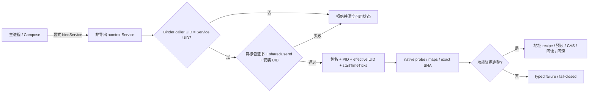

# MINIX shared-UID 控制服务与 GameApp 静态还原报告

> 报告日期：2026-08-12  
> 分析方式：静态逆向、源码接线、JVM 单元测试、离线 ELF/APK 检查  
> 当前结论：普通 shared-UID Service 路线已落盘；最新身份门禁改动后的全量单元测试、assemble、lint、v3 签名与对齐验收已通过，真机运行时矩阵仍是发布门槛  
> 约束：本轮未启动模拟器、虚拟机或真机

## 1. 执行摘要

MINIX 当前采用 Android 正常应用模型：主进程通过显式 `Context.bindService()` 绑定本应用内、`exported=false`、运行于 `:control` 进程的普通 `android.app.Service`。应用与目标包必须同时声明 `android:sharedUserId="ca.sailboat.a"`、使用固定证书，并由系统分配相同 Linux UID。代码没有引入登录、卡密、网络、远程配置或隐藏入口。

目标会话在读取 `/proc` 或执行 native probe 之前先核对目标安装包身份：active signer SHA-256、`sharedUserId` 与安装 UID 必须全部匹配。Manifest 只通过 `<queries><package .../></queries>` 声明九个目标包的可见性；这不是 `QUERY_ALL_PACKAGES` 权限，也不会扩大为全量应用枚举。

进程打开后，运行时固定 `包名 + PID + effective UID + /proc/<pid>/stat startTimeTicks` 四元身份。服务端在 native probe 前后以及每次读取、写入、刷新和 SearchID 前复核身份；Binder 调用方、控制服务和目标进程还必须同 UID。任一证据缺失、变化或不匹配都会清空会话、字段档案、注入档案和已启用功能。

用户提供的 `liblibGameApp.so` 已由独立 ELF 验证器复核为指定的 ELF64/AArch64 文件。完整文件 SHA-256 是生产档案的运行时绑定键；Build-ID、PT_LOAD 与 BSS 布局作为该哈希对应文件的静态证据。SearchID、`KILL_COUNT`、`FLIGHT` 与 `PLAYER_TELEPORT` 的静态链路已经接入；`FAKE_FLIGHT`、AIM、DRAW、HITBOX 仍缺唯一目标证据，生产档案保持 fail-closed。

## 2. 范围与状态

范围契约见 [`../work/minix-gameapp-fingerprint-20260812/scope.md`](../work/minix-gameapp-fingerprint-20260812/scope.md)，时间线见 [`../work/minix-gameapp-fingerprint-20260812/timeline.md`](../work/minix-gameapp-fingerprint-20260812/timeline.md)。

| 项目 | 当前状态 |
|---|---|
| 实现项目 | `D:/Projects/minix` |
| 输入 ELF | `D:/Projects/bingxi/liblibGameApp.so` |
| 目标 ABI | `arm64-v8a` |
| 控制进程 | 普通、非导出 `android.app.Service`，进程名 `:control` |
| 进程间通信 | 显式组件 `Context.bindService()` + AIDL；本报告快照协议版本 7（当前实现为 v11） |
| Android 身份 | 固定证书 + `android:sharedUserId="ca.sailboat.a"` + 同 Linux UID |
| 目标包可见性 | Manifest `<queries>` 精确列举九包；未声明 `QUERY_ALL_PACKAGES` |
| 已静态接线 | SearchID、LIFE_STATE、KILL_COUNT、GetDataLong(1)、FLIGHT、PLAYER_TELEPORT |
| 显式关闭 | FAKE_FLIGHT、AIM、DRAW、HITBOX |
| 最新静态验收 | Gradle `BUILD SUCCESSFUL`；SO 验证器通过；24 个套件、147 项测试全通过；lint 0 error / 14 warning；debug/release APK v3-only 签名与 zipalign 通过 |
| 运行时验收 | 真机证书/shared UID、SELinux、dumpable/ptrace、真实 maps、字段和值与写后置条件待验证 |

> **版本说明：** 本报告封存的是 2026-08-12 的静态快照；其中协议 v7 仅用于还原当日证据。当前代码已迁移到 `me.dartcv.minix.control`，AIDL/Service 协议为 v11，现行调用链与验收基线见 [`2026-08-18_架构-Control传输说明-report.md`](2026-08-18_架构-Control传输说明-report.md)。

## 3. 架构与门禁



### 3.1 Android 包身份

`AndroidTargetPackageIdentityVerifier` 使用 `PackageManager.GET_SIGNING_CERTIFICATES` 获取安装包证据，并要求：

- active signer 集合严格等于 `A40DA80A59D170CAA950CF15C18C454D47A39B26989D8B640ECD745BA71BF5DC`；
- `PackageInfo.sharedUserId` 严格等于 `ca.sailboat.a`；
- `ApplicationInfo.uid` 严格等于控制服务的 `Process.myUid()`；
- 缺包、不可见、多 signer、签名不符、sharedUserId 不符或 UID 不符均关闭会话。

该核对发生在 `findPid()` 和 `memoryProbe.inspect()` 之前，并在后续会话复核中重复执行。`app/build.gradle.kts` 当前 `minSdk=28`；debug/release 均配置 v3-only 签名。v3 是 APK 签名封装方案，shared UID 的身份基础仍是安装包证书与 `sharedUserId` 的共同匹配。

### 3.2 Binder 与进程身份

- `ControlService.onTransact()` 要求 `Binder.getCallingUid() == Process.myUid()`；
- 客户端连接后要求服务 UID 等于客户端预期 UID，并验证当时快照中的 AIDL 协议版本 7（当前实现为 v11）；
- `/proc/<pid>/status` 的 `Uid:` 必须恰有一行、恰有四个非负 32 位十进制字段，使用 effective UID；
- 会话固定包名、PID、effective UID、startTimeTicks；缺失、格式错误、PID 复用或 UID 变化全部失效；
- native probe 后再次复核，字段读取、SearchID、功能写入和玩家坐标事务的各关键阶段继续复核。

## 4. GameApp SO 身份与布局

| 属性 | 验证值 |
|---|---|
| 文件大小 | `176533320` bytes |
| SHA-256 | `d8efe55c37b061ce41cb3830ec743401138bf40b8bacf251f18f7b026bf0140e` |
| GNU Build-ID | `662a450a7331aff319cbc4b3897c2124f8fd61f9` |
| ELF | ELF64, little-endian, AArch64, ET_DYN |
| SONAME | `liblibGameApp.so` |
| Entry | `0x02c49f50` |
| PT_LOAD[0] | off/VA `0`, size `0x0a13dde0`, `R-X` |
| PT_LOAD[1] | off `0x0a13dde0`, VA `0x0a13ede0`, size `0x00653110`, `RW-` |
| PT_LOAD[2] | off `0x0a790ef0`, VA `0x0a792ef0`, filesz `0x000c9890`, memsz `0x00c2d238`, `RW-` |
| `.bss` | VA `0x0a85c780`, size `0x00b639a8` |
| 匿名 BSS anchor | `loadBias + 0x0a85d000` |
| 虚拟结束 / 页结束 | `0x0b3c0128` / `0x0b3c1000` |

独立验证器输出 [`../artifacts/liblibGameApp-1.58.2-elf-verification.json`](../artifacts/liblibGameApp-1.58.2-elf-verification.json) 的 `verified=true` 且 `mismatches=[]`。运行时 resolver 要求唯一同名模块、有效 offset-zero `r-xp` 映射、完整 backing-file SHA-256 命中，以及符合静态布局的独立 `rw-p [anon:.bss]` 范围；任一不满足都停止解析。

## 5. 功能闭合状态

| 功能 | 静态状态 | 生产行为 | 剩余验证 |
|---|---|---|---|
| SearchID | 已接入固定 40 槽 scanner 与 SHA-bound module-spec anchor | 身份、maps 或边界失败即 typed failure | 真机槽值、maps 形态 |
| LIFE_STATE | 已接入恢复的 H recipe | 档案和内存就绪后可解析 | 真机地址和值语义 |
| KILL_COUNT | `anonBssAnchor + 0x1cc78`，即 `loadBias + 0x0a879c78` | 限定 4 字节读取，前后复核身份 | 真机业务值 |
| GetDataLong(1) | `read_u64(*(GameApp BSS + 0x5b860) + 0x548)`，`POINTER64` | 两次限定 8 字节读取；旧 `LEGACY_MASKED_H` 已淘汰 | 真机连续 12 次稳定为 `0x00000f547c994f5e` |
| FLIGHT | H recipe；disabled=`0`、enabled=`8` | 预读、expected compare、写入、回读 | 真机后置条件 |
| PLAYER_TELEPORT | X/Y/Z 三个独立 recipe | 三轴事务写入、回读、失败时逆序回滚 | 真机三轴语义与回滚 |
| FAKE_FLIGHT | 未闭合 | 不进入 resolved patch map | 唯一 RVA 与指令数据流 |
| AIM / DRAW / HITBOX | 未闭合 | 不进入 resolved patch map | 唯一地址、值语义与写后置条件 |

`FAKE_FLIGHT` 的旧公式是 `runtime_anchor_971b98 + 0x04046e18`。当前精确 SO 在 RVA `0x04046e18` 的 word 为 `0xb940091c`，而旧 disabled word `0x39449269` 在当前文件有 12 个命中；其中 `0x052e1398` 与 `0x052e13f8` 都仍具 movement 相关数据流，现有证据不能唯一选择。因此生产档案只保留 unresolved 记录，不生成写地址。

## 6. Evidence

### E-001：GameApp 精确 ELF 身份

- `source_ref`: `D:/Projects/bingxi/liblibGameApp.so`
- `content_hash`: `d8efe55c37b061ce41cb3830ec743401138bf40b8bacf251f18f7b026bf0140e`
- `evidence_ref`: [`../work/minix-gameapp-fingerprint-20260812/evidence/E-001.md`](../work/minix-gameapp-fingerprint-20260812/evidence/E-001.md)
- `repro_command`:

```powershell
Set-Location 'D:\Projects\minix'
python tools\verify_gameapp_elf.py `
  'D:\Projects\bingxi\liblibGameApp.so' `
  --identity-json artifacts\liblibGameApp-1.58.2-elf-identity.json `
  --output artifacts\liblibGameApp-1.58.2-elf-verification.json
```

- `result`: `verified=true`、`mismatches=[]`；验证报告 SHA-256 为 `76e02b2c7c86ecdedeaa639704c9abb590a0fe2d3a6d80bfd074bd5eb9597410`。

### E-002：包证书与 shared UID 身份门禁

- `source_ref`: `app/src/main/java/me/dartcv/minix/control/TargetPackageIdentityVerifier.kt`
- `content_hash`: `03ba74a4885c167050b1ea34882e84163281ba8ca81ee85aa16aca31fb5a4547`
- `linked_source`: `ControlService.kt`, `ControlTargetSession.kt`, `TargetPackageIdentityVerifierTest.kt`
- `repro_command`:

```powershell
Select-String -Path `
  app\src\main\java\me\dartcv\minix\control\TargetPackageIdentityVerifier.kt, `
  app\src\main\java\me\dartcv\minix\control\ControlService.kt, `
  app\src\main\java\me\dartcv\minix\control\ControlTargetSession.kt `
  -Pattern 'SIGNER_SHA256|SHARED_USER_ID|packageIdentityVerifier|expectedUid'
```

- `result`: signer、sharedUserId 与安装 UID 使用精确相等比较；目标包身份检查位于进程查找和 native probe 之前。

### E-003：Manifest、Service 与精确包可见性

- `source_ref`: `app/src/main/AndroidManifest.xml`
- `content_hash`: `7a20186267a927daca06c00a1a1e33196a76ed7ae21e049778276e18d723747f`
- `repro_command`:

```powershell
Select-String -Path app\src\main\AndroidManifest.xml `
  -Pattern 'sharedUserId|<queries>|<package|ControlService|exported|:control|QUERY_ALL_PACKAGES'
```

- `result`: `sharedUserId="ca.sailboat.a"`；控制 Service 为 `exported=false`、`:control`；`<queries>` 精确列九包；未声明 `QUERY_ALL_PACKAGES`。

### E-004：UID 四元身份与 Binder 门禁

- `source_ref`: `ControlTargetSession.kt`, `ControlService.kt`, `ControlBridgeClient.kt`, `IControlBridge.aidl`
- `content_hash`: 以当前源码及统一验收产物为准
- `repro_command`:

```powershell
Select-String -Path app\src\main\java\me\dartcv\minix\control\*.kt, `
  app\src\main\aidl\me\dartcv\minix\control\IControlBridge.aidl `
  -Pattern 'Binder.getCallingUid|readEffectiveUid|getTargetUid|startTimeTicks|hasVerifiedTargetIdentity'
```

- `result`: Binder caller/service/target 同 UID；包名、PID、effective UID、startTimeTicks 固定并持续复核；当时 AIDL 协议版本 7 暴露 target UID 快照，当前协议已升级到 v11。

### E-005：功能接线与 unresolved 分流

- `source_ref`: `ControlInjection.kt`, `ControlReadOnlyFieldProfiles.kt`, `ControlGameAppArtifact1582.kt`, `ProcControlSearchIdAnchorResolver.kt`
- `supporting_evidence`:
  - [`E-002-fake-flight-patch.md`](../work/minix-gameapp-fingerprint-20260812/evidence/E-002-fake-flight-patch.md), SHA-256 `e59172fd55dfa836d3a689cdf440d4acc0be1450e21ecf9bd5209678fe7e436c`
  - [`E-003-fake-flight-independent.md`](../work/minix-gameapp-fingerprint-20260812/evidence/E-003-fake-flight-independent.md), SHA-256 `255154ea583a7e9a725d179d04a9709cfe63112dd364f647d44f7df956db164e`
- `result`: 已闭合功能进入 exact-SHA profile；FAKE_FLIGHT/AIM/DRAW/HITBOX 使用 unresolved evidence，不进入可写功能集合。

### E-006：静态测试与构建验收

- `source_ref`: `app/build/test-results`, `app/build/reports/lint-results-debug.xml`, `app/build/outputs/apk/debug/app-debug.apk`, `app/build/outputs/apk/release/app-release.apk`
- `content_hash`: debug APK SHA-256 `61c386c28afc74fbe10251585554c7afebf3509eb3a46090ecc3a953e9607b2a`；release APK SHA-256 `90c253315d6ce1fc956e1cfa3344f32f4c18dd9515ad6aa70a3bbd237844d0d2`
- `status`: 2026-08-12 11:21–11:23 生成的最新统一产物已验收。
- `repro_command`:

```powershell
Set-Location 'D:\Projects\minix'
.\gradlew.bat :app:cleanTestDebugUnitTest :app:testDebugUnitTest `
  :app:assembleDebug :app:lintDebug --rerun-tasks
$apks = @(
  'app\build\outputs\apk\debug\app-debug.apk',
  'app\build\outputs\apk\release\app-release.apk'
)
foreach ($apk in $apks) {
  & 'D:\Android\SDK\build-tools\37.0.0\apksigner.bat' verify --verbose --print-certs $apk
  & 'D:\Android\SDK\build-tools\37.0.0\zipalign.exe' -c -P 16 -v 4 $apk
}
```

- `result`:
  - JUnit：24 suites / 147 tests / 0 failures / 0 errors / 0 skipped；其中 `TargetPackageIdentityVerifierTest` 5 项通过；
  - Gradle：`BUILD SUCCESSFUL`；
  - lint：0 error / 14 warning；
  - debug APK：`58197864` bytes，SHA-256 `61c386c28afc74fbe10251585554c7afebf3509eb3a46090ecc3a953e9607b2a`；
  - release APK：`42306192` bytes，SHA-256 `90c253315d6ce1fc956e1cfa3344f32f4c18dd9515ad6aa70a3bbd237844d0d2`；
  - debug/release apksigner：v1=false、v2=false、v3=true、v3.1=false、v3.2=false、v4=false；单一 RSA-2048 signer；证书 SHA-256 与 E-002 相同；
  - debug/release zipalign：4 字节与 16 KiB shared-library alignment 验证成功；
  - merged manifest：sharedUserId、九个精确 `<queries>` 包、非导出 `:control` Service 均保留，未出现 `QUERY_ALL_PACKAGES`。

## 7. Findings

### F-001：控制路径是普通 shared-UID Service

- `severity`: `n/a_re`
- `status`: `validated_source`
- `evidence_ids`: `E-002`, `E-003`, `E-004`
- `confidence`: high
- `location`: `AndroidManifest.xml`, `ControlService.kt`, `ControlBridgeClient.kt`
- `finding`: 控制服务是应用内非导出 Service，客户端使用显式 bind；它依赖证书、sharedUserId 与系统安装 UID，而不是独立权限提升通道。

### F-002：目标身份在包层与进程层双重 fail-closed

- `severity`: `n/a_re`
- `status`: `validated_source`
- `evidence_ids`: `E-002`, `E-004`
- `confidence`: high
- `location`: `TargetPackageIdentityVerifier.kt`, `ControlTargetSession.kt`
- `finding`: 包层要求 signer/sharedUserId/安装 UID 精确匹配；进程层固定包名/PID/effective UID/startTimeTicks。任一检查失败会在 native probe 之前或操作期间终止并清空状态。

### F-003：SO 身份与 BSS 布局已闭合

- `severity`: `n/a_re`
- `status`: `validated_static`
- `evidence_ids`: `E-001`
- `confidence`: high
- `location`: `ControlGameAppArtifact1582.kt`, `ProcControlSearchIdAnchorResolver.kt`
- `finding`: 独立解析器已复核完整 SHA、Build-ID、SONAME、PT_LOAD、`.text/.data/.bss` 和派生 BSS 地址；运行时用完整 SHA 绑定 backing file，并验证 maps 结构。

### F-004：KILL_COUNT 与 SearchID 静态链路已接入

- `severity`: `n/a_re`
- `status`: `validated_source`
- `evidence_ids`: `E-001`, `E-005`
- `confidence`: high
- `location`: `ControlReadOnlyFieldProfiles.kt`, `ControlSearchId.kt`, `ProcControlSearchIdAnchorResolver.kt`
- `finding`: `KILL_COUNT` 地址为 `loadBias+0x0a879c78`；SearchID 使用 SHA-bound BSS anchor 与固定 40 槽扫描器。真机字段值仍待核验。

### F-005：FLIGHT 与 PLAYER_TELEPORT 独立于未闭合功能

- `severity`: `n/a_re`
- `status`: `validated_source`
- `evidence_ids`: `E-005`
- `confidence`: high
- `location`: `ControlInjection.kt`, `ControlTargetSession.kt`
- `finding`: FLIGHT 有独立 recipe 与 `0/8` 值；传送有 X/Y/Z recipe、预读、事务写入、回读与逆序回滚，不依赖 FAKE_FLIGHT 的候选选择。

### F-006：FAKE_FLIGHT 等功能维持 fail-closed

- `severity`: `n/a_re`
- `status`: `unresolved`
- `evidence_ids`: `E-005`
- `confidence`: high（对二义与关闭结论）
- `location`: `ControlInjectionProfileCatalog`
- `finding`: FAKE_FLIGHT 尚有两个高相关 RVA，AIM/DRAW/HITBOX 也缺唯一 scalar patch；这些条目不进入 resolved map，调用返回 typed non-success。

### F-007：最新统一静态验收已通过，真机行为仍是发布门槛

- `severity`: `info`
- `status`: `validated_static`
- `evidence_ids`: `E-006`
- `confidence`: high
- `location`: build/runtime acceptance matrix
- `finding`: 最新 Gradle 构建、147 项测试、lint、debug/release v3-only 签名、zipalign 与 merged manifest 检查均通过；目标设备上的证书/shared UID 安装行为、SELinux、dumpable/ptrace、maps、读取与写后置条件仍待验证。

## 8. Path

### P-001：建立目标会话

- `path_type`: `callflow`
- `start`: 主进程请求打开目标包
- `goal`: 在任何 `/proc` 内存探测前形成受约束会话
- `steps`:
  1. 显式 bind 本应用非导出 `:control` Service；`E-003` → `F-001`。
  2. Binder 验证 caller UID 等于 service UID，客户端复核协议与 service UID；`E-004` → `F-001`。
  3. PackageManager 核对 active signer、sharedUserId、安装 UID；`E-002` → `F-002`。
  4. 查找进程并固定包名/PID/effective UID/startTimeTicks；`E-004` → `F-002`。
  5. native probe 后再次核对身份；变化则清空会话和功能状态；`E-004` → `F-002`。
- `residual_risks`: 目标设备须实际满足相同证书、shared UID 和系统进程访问策略。

### P-002：读取 KILL_COUNT

- `path_type`: `callflow`
- `start`: 已验证目标会话中的 typed readable-data 请求
- `goal`: 读取 exact-SHA 目标模块的击杀数字段
- `steps`:
  1. 复核包名/PID/UID/startTimeTicks；`E-004` → `F-002`。
  2. 找到唯一 offset-zero `r-xp` GameApp 映射并核对 backing file 完整 SHA；`E-001` → `F-003`。
  3. 核验 `rw-p [anon:.bss]` 范围与稳定 maps，计算 anchor `loadBias+0x0a85d000`；`E-001` → `F-003`。
  4. 加 `0x1cc78` 得 `loadBias+0x0a879c78`，限定读取 4 字节；`E-005` → `F-004`。
  5. 读后再次复核身份，只返回 typed value 或 typed failure；`E-004` → `F-002`。
- `residual_risks`: 真机 maps 形态与字段业务语义待验证。

### P-003：功能写入与 unresolved 分流

- `path_type`: `callflow`
- `start`: 已验证目标会话中的 typed 功能请求
- `goal`: 只让证据闭合的功能进入写入后端
- `steps`:
  1. resolver 要求 exact-SHA 模块与完整 recipe/patch evidence；`E-001`, `E-005` → `F-003`。
  2. FLIGHT 或 PLAYER_TELEPORT 执行地址解析、身份复核和预读；`E-004`, `E-005` → `F-005`。
  3. 后端执行 expected-value compare、写入、回读；传送在部分失败时逆序回滚；`E-005` → `F-005`。
  4. FAKE_FLIGHT/AIM/DRAW/HITBOX 因 unresolved 不进入 supported/resolved 集合；`E-005` → `F-006`。
- `residual_risks`: 真机写权限、SELinux、ptrace/dumpable 与写后置条件待验证。

## 9. 静态复现与验收

### 9.1 复核 SO

```powershell
Set-Location 'D:\Projects\minix'
python tools\verify_gameapp_elf.py `
  'D:\Projects\bingxi\liblibGameApp.so' `
  --identity-json artifacts\liblibGameApp-1.58.2-elf-identity.json `
  --output artifacts\liblibGameApp-1.58.2-elf-verification.json
```

成功条件：进程退出码为 0，输出 JSON 中 `verified=true`、`mismatches=[]`。

### 9.2 执行最终离线验收

```powershell
Set-Location 'D:\Projects\minix'
.\gradlew.bat :app:cleanTestDebugUnitTest :app:testDebugUnitTest `
  :app:assembleDebug :app:lintDebug --rerun-tasks

$apks = @(
  'app\build\outputs\apk\debug\app-debug.apk',
  'app\build\outputs\apk\release\app-release.apk'
)
foreach ($apk in $apks) {
  Get-FileHash -Algorithm SHA256 $apk
  & 'D:\Android\SDK\build-tools\37.0.0\apksigner.bat' verify --verbose --print-certs $apk
  & 'D:\Android\SDK\build-tools\37.0.0\zipalign.exe' -c -P 16 -v 4 $apk
}
```

验收时还应核对 merged manifest：sharedUserId 保留、九个 `<queries>` 包存在、控制 Service 非导出且进程为 `:control`、没有 `QUERY_ALL_PACKAGES`。

## 10. 真机剩余门槛

1. 安装前确认目标 APK 与 MINIX 的 active signer 证书 SHA-256 均为 `A40DA80A…F5DC`，且二者都声明 `ca.sailboat.a`。
2. 安装后确认 PackageManager 报告相同 Linux UID；不同签名、残留旧安装或系统拒绝 shared UID 时记录安装失败原因。
3. 确认主进程可绑定非导出 `:control` Service，协议版本、service UID 与 target UID 一致。
4. 验证 SELinux、`dumpable`、ptrace 与 `/proc/<pid>/{status,stat,maps,mem,pagemap}` 的实际访问结果；同 UID 不等于自动拥有所有内核访问能力。
5. 验证唯一 GameApp offset-zero 映射、完整 SHA、独立 `[anon:.bss]` 与 maps 稳定性。
6. 验证 SearchID、LIFE_STATE、KILL_COUNT 的真实值和目标重启/PID 复用失效行为；GetDataLong(1) 已以 `POINTER64` 连续读取 12 次稳定为 `0x00000f547c994f5e`，后续只需补充重启/PID 复用门禁测试。
7. 验证 FLIGHT 的 `0/8` 后置条件，以及 PLAYER_TELEPORT 的三轴回读、部分失败逆序回滚和目标退出路径。
8. FAKE_FLIGHT/AIM/DRAW/HITBOX 在唯一证据闭合前继续保持关闭。

## 11. 关键实现与附件

| 对象 | 路径 |
|---|---|
| Android 包身份验证器 | `app/src/main/java/me/dartcv/minix/control/TargetPackageIdentityVerifier.kt` |
| 普通控制 Service | `app/src/main/java/me/dartcv/minix/control/ControlService.kt` |
| Binder 客户端 | `app/src/main/java/me/dartcv/minix/control/ControlBridgeClient.kt` |
| 四元身份会话 | `app/src/main/java/me/dartcv/minix/control/ControlTargetSession.kt` |
| AIDL 协议 | `app/src/main/aidl/me/dartcv/minix/control/IControlBridge.aidl` |
| GameApp 常量 | `app/src/main/java/me/dartcv/minix/control/ControlGameAppArtifact1582.kt` |
| maps/BSS resolver | `app/src/main/java/me/dartcv/minix/control/ProcControlSearchIdAnchorResolver.kt` |
| SearchID | `app/src/main/java/me/dartcv/minix/control/ControlSearchId.kt` |
| 字段档案 | `app/src/main/java/me/dartcv/minix/control/ControlReadOnlyFieldProfiles.kt` |
| 注入档案 | `app/src/main/java/me/dartcv/minix/control/ControlInjection.kt` |
| ELF 身份 | `artifacts/liblibGameApp-1.58.2-elf-identity.json` |
| ELF 验证报告 | `artifacts/liblibGameApp-1.58.2-elf-verification.json` |
| ELF 验证器 | `tools/verify_gameapp_elf.py` |

本报告记录的执行模型以当时 Manifest、Service、Binder、证书、sharedUserId 和 Linux UID 证据为准；现行实现统一使用 `me.dartcv.minix.control`、Control 命名和 AIDL v11，更新后的组件索引见架构说明。
