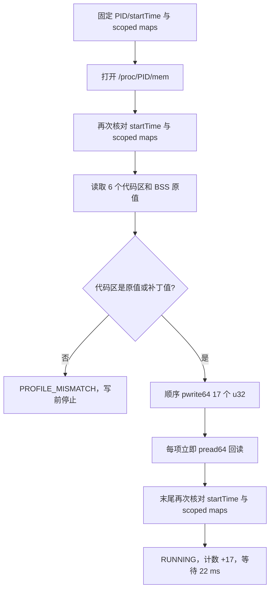
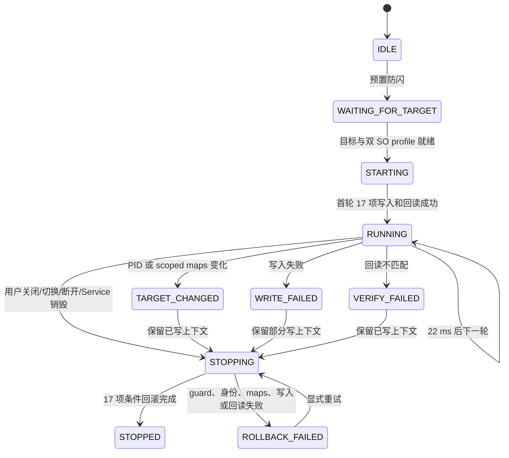

# 冰昔防闪静态还原与 MINIX 移植报告

> 报告日期：2026-08-13  
> 分析方式：APK/ELF 静态逆向、源码审查、JVM 单元测试、NDK/Gradle 离线构建、APK 离线验收  
> 当前结论：冰昔的防闪写入 profile 已在 MINIX 中形成可构建、可测试、可条件回滚的实现；目标设备上的实际防闪效果仍须通过运行时矩阵验收  
> 本轮约束：未启动模拟器、虚拟机或真机，未把历史日志结论作为本报告的成功依据

## 1. 执行摘要

冰昔的“防闪”不是 Java 层异常捕获，也不是单一开关。静态闭包显示，其 `libClient.so` worker `0x55425c` 会等待目标进程映射，解析 `liblibGameApp.so`、`libtprt.so` 与 GameApp 匿名 BSS，随后每轮写入 17 个 u32：一个 GameApp 指令、五个 `libtprt` 函数入口组成的 15 个指令字，以及 `GameApp:BSS+0x80 = 0x002475F6`。完整轮次结束后执行 `usleep(22000)`，即约 22 ms 后继续覆盖。

MINIX 已把这组静态结果固化为 `miniworld-1.58.2-arm64-antiflash-v1` profile，并增加了冰昔原 worker 不具备的事务保护：双 SO 完整 SHA-256 绑定、6 个代码区原值/补丁值预检、目标 PID `startTimeTicks` 固定、只覆盖实际访问区域的 scoped maps 指纹、逐项写后回读、17 项完整条件回滚，以及目标切换、关闭、断开时的串行生命周期管理。

离线验收结果为：29 个测试套件、199 项测试全部通过；Debug/Release、native debug 与 lint 构建矩阵通过；lint 为 0 error / 14 warning；Debug/Release APK 均为 v3-only 单 signer 并通过 16 KiB page alignment 检查。上述结果证明静态 profile、协议、状态机、native 接口和产物形态闭合，不等同于目标设备上已经消除闪退。

## 2. 目标与范围

| 项目 | 范围 |
|---|---|
| 逆向对象 | `D:/Projects/bingxi/冰昔4.2.105.1.apk` 与其解包/静态分析产物 |
| 目标版本 | 迷你世界 `1.58.2`、`arm64-v8a` |
| 关键目标 ELF | `liblibGameApp.so`、`libtprt.so` |
| 实现项目 | `D:/Projects/minix` |
| 实现边界 | 普通 Android 应用、证书 + `sharedUserId` + 同 Linux UID Binder Service；无登录、卡密、网络配置或隐藏入口 |
| 验证范围 | 源码、静态证据、JVM 测试、native 构建、Debug/Release APK、签名、对齐、Manifest |
| 未完成范围 | 真机 `/proc/<pid>/mem` 可访问性、SELinux/dumpable/ptrace 条件、真实 maps 形态、写入后的业务效果与长时间稳定性 |

既有工程范围契约见 [`../work/minix-gameapp-fingerprint-20260812/scope.md`](../work/minix-gameapp-fingerprint-20260812/scope.md)，时间线见 [`../work/minix-gameapp-fingerprint-20260812/timeline.md`](../work/minix-gameapp-fingerprint-20260812/timeline.md)。本报告聚焦 2026-08-13 完成的防闪 profile、native cycle、回滚和生命周期闭合。

## 3. 输入样本与身份

| 样本 | 大小 | SHA-256 |
|---|---:|---|
| `冰昔4.2.105.1.apk` | `22,441,161` bytes | `557B34F68103944E229F616FBEED4941B6BDCE37445968EE346F8DB8DD05546B` |
| `迷你世界_1.58.2.apk` | `1,726,189,290` bytes | `B86981913294B85026FFD815821378D98D16CEEB140C953A5A077500BBDB1AAB` |
| `liblibGameApp.so` | `176,533,320` bytes | `D8EFE55C37B061CE41CB3830EC743401138BF40B8BACF251F18F7B026BF0140E` |
| `libtprt.so` | `1,883,784` bytes | `056726E1419D68284DEAFA21B64E55A919ADACD7A8171C9E1D5FB1998CD95CC8` |

MINIX profile 还固定了 GNU Build-ID：GameApp 为 `662a450a7331aff319cbc4b3897c2124f8fd61f9`，tprt 为 `e9e9ba3856e5c644983d3886abf9a4ddb253e77c`。运行时可用性的决定性绑定键是两个完整文件 SHA-256；Build-ID 和文件大小作为 profile 完整性与审计信息。

## 4. 冰昔防闪静态 profile

### 4.1 worker 与写入接口

静态启动链为：

```text
Java_mini_tencent_ca_Jni_wannian @ libClient+0x55d7c0
  -> libClient+0x55dc60
  -> thread launcher libClient+0x50384c
  -> pthread_create(start=libClient+0x55425c)
```

worker 从 `/sdcard/Android/data/mini.tencent.ca/pid.txt` 读取目标 PID，通过 `/proc/<pid>/maps` 解析模块和 BSS。其 `writer_u32 @ libClient+0x4e66d4` 打开 `/proc/<pid>/mem`，使用 `pwrite64(fd, &value, 4, absoluteAddress)` 写入目标进程绝对虚拟地址。

完整布尔矩阵归约出三个路径：

```text
quick_single_write = b != 0
full_patch_loop    = b == 0 && e != 0
poll_without_write = b == 0 && e == 0
```

quick 路径只写 BSS 标记并返回；full 路径写完 17 项后 `usleep(22000)` 并循环；poll 路径等待目标映射而不写。MINIX 移植的是完整 profile 语义，并把等待目标、身份门禁、写入验证与停止回滚纳入显式状态机。

### 4.2 6 个代码区与 17 个 u32

| # | 目标 RVA/偏移 | 补丁 u32 | 归属代码区 | 静态语义 |
|---:|---|---:|---:|---|
| 1 | `GameApp+0x09253CE8` | `0xD503201F` | 1 | 将 `bl tp2_setuserinfo` 改为 AArch64 `nop` |
| 2 | `tprt+0x0014C288` | `0x52800780` | 2 | `mov w0,#60` |
| 3 | `tprt+0x0014C28C` | `0x9400DFF1` | 2 | `bl sleep@plt` |
| 4 | `tprt+0x0014C290` | `0x17FFFFFE` | 2 | 回跳入口 |
| 5 | `tprt+0x0016CE78` | `0x52800780` | 3 | `mov w0,#60` |
| 6 | `tprt+0x0016CE7C` | `0x94005CF5` | 3 | `bl sleep@plt` |
| 7 | `tprt+0x0016CE80` | `0x17FFFFFE` | 3 | 回跳入口 |
| 8 | `tprt+0x0013C5FC` | `0x52800780` | 4 | `mov w0,#60` |
| 9 | `tprt+0x0013C600` | `0x94011F14` | 4 | `bl sleep@plt` |
| 10 | `tprt+0x0013C604` | `0x17FFFFFE` | 4 | 回跳入口 |
| 11 | `tprt+0x0013CC74` | `0x52800780` | 5 | `mov w0,#60` |
| 12 | `tprt+0x0013CC78` | `0x94011D76` | 5 | `bl sleep@plt` |
| 13 | `tprt+0x0013CC7C` | `0x17FFFFFE` | 5 | 回跳入口 |
| 14 | `tprt+0x000FC270` | `0x52800780` | 6 | `mov w0,#60` |
| 15 | `tprt+0x000FC274` | `0x94021FF7` | 6 | `bl sleep@plt` |
| 16 | `tprt+0x000FC278` | `0x17FFFFFE` | 6 | 回跳入口 |
| 17 | `GameApp:BSS+0x80` | `0x002475F6` | BSS | 持续状态标记，字段业务名仍未恢复 |

五个 tprt 入口均被改写为：

```asm
mov w0, #60
bl  sleep@plt
b   entry
```

因此它们不是返回伪造成功值，而是进入不可返回的 60 秒休眠循环。静态语义显示，五处原入口分别覆盖 HTTP GET、反作弊域名/TCP 握手、detached pthread 创建、enable-byte 路径和信号/完整性链。防闪的静态作用可概括为：持续压制多条保护、联网、后台线程与完整性路径，同时移除一次 GameApp `tp2_setuserinfo` 调用并维护 BSS 标记。

## 5. MINIX 实现

### 5.1 profile 与目标解析

`RootAntiFlashProfileCatalog` 将以下条件固化为不可变 profile：

- `arm64-v8a`、目标版本 `1.58.2`；
- GameApp 与 tprt 的 SHA-256、大小和 Build-ID；
- 6 个代码区的原始字节与补丁字节；
- 顺序固定的 17 个 u32；
- BSS marker 偏移 `0x80`、值 `0x002475F6`；
- 成功轮次后的等待时间 `22 ms`。

resolver 要求两个模块各自只有一个 offset-zero `r-xp` 映射，全部代码地址落在对应可执行映射内，并要求精确的 `rw-p [anon:.bss]` 区间覆盖 marker。模块名相同但 SHA 不符、映射歧义、地址越界或目标身份变化均 fail closed。

### 5.2 scoped maps 身份

MINIX 不再把 `/proc/<pid>/maps` 中无关映射变化视为防闪目标变化。它只选择实际承载 6 个代码区、17 个写地址和 BSS marker 的唯一映射，并在 Kotlin 与 C++ 两侧使用相同 canonical 行：

```text
start-end perms offset device inode path
```

其中 `start`、`end` 和 `offset` 为 16 位小写十六进制；`device` 与 `inode` 也参与 FNV-1a 64 位指纹。结果是：无关映射增删不使当前 cycle 失效，而被访问映射的地址、权限、offset、设备号、inode 或路径变化都会被识别为新一代 maps。

### 5.3 deleted 映射指纹

当模块路径带 ` (deleted)` 时，普通的 `/proc/<pid>/root<path>` 已不能代表当前映射对象。`ProcRootModuleFingerprintProvider` 会在 maps 中选择唯一、offset-zero、loadBase 精确匹配的行，再从：

```text
/proc/<pid>/map_files/<start>-<end>
```

读取完整文件流并计算 SHA-256。找不到唯一映射、offset 不为零、长度越界或 map_files 不可读时不接受该模块身份。

### 5.4 单轮写入事务

一次 native cycle 的顺序为：



native cycle 明确使用 `/proc/<pid>/mem + pwrite64`，与冰昔 writer 的核心写入接口一致。通用 `WriteProcessMemory` 仍包含 `process_vm_writev` 优先、`/proc/<pid>/mem` 后备的路径，但防闪 `RunAntiFlashCycle` 本身直接打开 mem fd 并逐项 `pwrite64`。

cycle 在写前允许代码区为原值或已补丁值，以支持持续重写；任何未知字节均在首次写入前返回 `PROFILE_MISMATCH`。每个 u32 写后立即读取并比较，失败结果携带完成数量、失败索引、是否已尝试写入、preflight 快照和最新 maps 指纹。

### 5.5 完整条件回滚

MINIX 停止时不是只回滚“看起来已经写过”的部分，而是构造完整 17 项回滚批次：

1. 读取 17 个当前位置。
2. 代码字只接受原值、补丁值或逐字节由二者组成的中间态；BSS 使用首轮保存的原始值。
3. 每项回滚请求同时携带 `expectedCurrentBytes`，即回滚预读时看到的值。
4. native 写前再次读取 guard；guard 改变即 `PROFILE_MISMATCH`，不写该项并保留上下文。
5. guard 已等于目标原值时跳过重复写，但仍计入已验证项。
6. 其余项执行 `pwrite64` 并逐项回读；批次末尾再次核对目标身份与 scoped maps。

这套条件回滚处理了三个关键竞态：其他线程在预读后改变目标字、首轮部分写失败、写入后 maps 变化。回滚失败时状态保持 `applied=true`、`ROLLBACK_FAILED`，目标和 BSS 原值上下文继续保留，允许显式重试；系统不会用新会话覆盖这份残留状态。

### 5.6 生命周期串行

服务端使用 `antiFlashCommandLock` 串行化：启动/停止防闪、打开或刷新目标、关闭目标和 Service 销毁。worker 停止流程先设置停止标志，再等待当前事务结束，之后执行完整回滚。

客户端 `RootController` 也通过 `operationMutex` 串行管理目标切换、扫描、关闭和断开。`disconnect()` 是挂起操作：先请求服务停止并确认 `requestedEnabled=false`、`workerRunning=false`、`applied=false`，再解绑；回滚失败则保留 Binder 连接、旧目标会话和错误状态。Application 不再在同步生命周期回调中直接丢弃 controller 上下文。

### 5.7 状态机



## 6. Evidence

### E-001：冰昔 worker 静态闭包

- `observed_at`: `2026-08-13`
- `source_type`: `file`
- `source_ref`: `D:/Projects/bingxi/ice_4_2_105_1_analysis/reports/native_tools/evidence/antiflash_worker_55425c_static_closure.md`
- `content_hash`: `968399573FFFC41FAC43DB5795802DB30642BFA84DCFEC6AFBCC603A5189EDEE`
- `linked_workitem`: `n/a`
- `supersedes`: `none`
- `repro_command`:

```powershell
Get-Content -LiteralPath `
  'D:\Projects\bingxi\ice_4_2_105_1_analysis\reports\native_tools\evidence\antiflash_worker_55425c_static_closure.md' `
  -Encoding UTF8
```

- `raw_excerpt`: worker `0x55425c`、writer `0x4e66d4`、17 写集合、`usleep(22000)` 与 `/proc/<pid>/mem + pwrite64` 已形成静态闭包。

### E-002：机器可读写入序列与入口语义

- `observed_at`: `2026-08-13`
- `source_type`: `file`
- `source_ref`: `D:/Projects/bingxi/ice_4_2_105_1_analysis/reports/native_tools/evidence/antiflash_entry_semantics.json`
- `content_hash`: `6B78BB576E178AD0D8CDFC4F8949B49AD18D3D43F54916A3E98F1FF76F0272A8`
- `linked_workitem`: `n/a`
- `supersedes`: `none`
- `repro_command`:

```powershell
$p = 'D:\Projects\bingxi\ice_4_2_105_1_analysis\reports\native_tools\evidence\antiflash_entry_semantics.json'
$j = Get-Content -LiteralPath $p -Encoding UTF8 -Raw | ConvertFrom-Json
$j.paths.full_patch_loop
$j.full_iteration_writer_sites | Format-Table site,destination,payload
```

- `raw_excerpt`: `writes_per_iteration=17`、`usleep_argument=22000`；16 个代码 u32 与 `B+0x80 / 0x002475f6` 顺序固定。

### E-003：MINIX 精确 profile 与 supervisor

- `observed_at`: `2026-08-13`
- `source_type`: `file`
- `source_ref`: `app/src/main/java/me/dartcv/minix/root/RootAntiFlash.kt`
- `content_hash`: `F05003F9B9FE9833ABD54D19CDD8B860F0C0C87ED3638810D266FE87A1B90CD6`
- `linked_workitem`: `n/a`
- `supersedes`: `none`
- `repro_command`:

```powershell
Select-String -Path app\src\main\java\me\dartcv\minix\root\RootAntiFlash.kt `
  -Pattern 'profileId|sha256|codeRegions|word\(|bssMarkerOffset|iterationDelayMillis|expectedCurrentBytes|stopAndRollback'
```

- `raw_excerpt`: profile 固定双 SO SHA、6 区、17 写、BSS `+0x80`、22 ms；supervisor 保存首轮 BSS 原值并实施条件回滚。

### E-004：native cycle、scoped maps 与 rollback guard

- `observed_at`: `2026-08-13`
- `source_type`: `file`
- `source_ref`: `app/src/main/cpp/target_native_probe.cpp`
- `content_hash`: `1DD338B49872EC70819BE795CA3C7A90AE9352595678B39398ABB8E52D78DD6B`
- `linked_workitem`: `n/a`
- `supersedes`: `none`
- `repro_command`:

```powershell
Select-String -Path app\src\main\cpp\target_native_probe.cpp `
  -Pattern 'CanonicalMapRegion|RunAntiFlashCycle|kCodeRegionCount|kWriteCount|expected_current_value|Rollback guard|pwrite64'
```

- `raw_excerpt`: canonical maps 包含 device/inode；cycle 固定 6/17 形状，直接使用 mem fd，逐项写后回读；rollback 写前再次比较 expected current value。

### E-005：deleted 模块完整 SHA-256

- `observed_at`: `2026-08-13`
- `source_type`: `file`
- `source_ref`: `app/src/main/java/me/dartcv/minix/root/RootNativeProbe.kt`
- `content_hash`: `8ED03EB76D82ADE2590C4767CFCDF360324962EFEEA6AAF7C2044BC91B66F760`
- `linked_workitem`: `n/a`
- `supersedes`: `none`
- `repro_command`:

```powershell
Select-String -Path app\src\main\java\me\dartcv\minix\root\RootNativeProbe.kt `
  -Pattern 'DELETED_MAPPING_SUFFIX|map_files|findDeletedMapping|expectedLength|sha256StreamFile'
```

- `raw_excerpt`: deleted 路径必须唯一匹配 offset-zero loadBase 行，再从 map_files 读取完整映射文件计算 SHA-256。

### E-006：生命周期串行与回滚失败保留

- `observed_at`: `2026-08-13`
- `source_type`: `file`
- `source_ref`: `RootFeatureService.kt`, `RootController.kt`, `MinixApplication.kt`
- `content_hash`: Service `A3A894393EA2867400AB0EC14EE207522538F23908D39475896F3BD01FE8EC2A`；Controller `65A92D96B9B3A1EDFAA9676881B892316F10752BF19BBD61F6E168B0B6EF5ED1`；Application `7FCF0E74A63ACF90AD5D5113C63A7A4DE50785FA37FA881303CDB184278D7646`
- `linked_workitem`: `n/a`
- `supersedes`: `none`
- `repro_command`:

```powershell
Select-String -Path `
  app\src\main\java\me\dartcv\minix\root\RootFeatureService.kt, `
  app\src\main\java\me\dartcv\minix\root\RootController.kt, `
  app\src\main\java\me\dartcv\minix\MinixApplication.kt `
  -Pattern 'antiFlashCommandLock|stopAntiFlashIfActiveLocked|suspend fun disconnect|stopActiveTargetForSwitchLocked|rootControllerDelegate'
```

- `raw_excerpt`: 服务端命令锁和客户端 operation mutex 均阻止带残留补丁的目标被关闭、替换或无条件断开。

### E-007：测试、构建和 APK 验收

- `observed_at`: `2026-08-13`
- `source_type`: `command`
- `source_ref`: `app/build/test-results/testDebugUnitTest`, `app/build/reports/lint-results-debug.xml`, `app/build/outputs/apk`
- `content_hash`: Debug APK `C63C144F2104F5B738A0668EB9E56F8D6582AA0E8BEB14D719579EED1CC2E6DD`；Release APK `FF87FAE023C3AD151311A50722A02D4DCCAEAE58FD8D76F199E9CD9DFEF526FF`
- `linked_workitem`: `n/a`
- `supersedes`: `none`
- `repro_command`:

```powershell
Set-Location 'D:\Projects\minix'
.\gradlew.bat :app:testDebugUnitTest :app:externalNativeBuildDebug `
  :app:assembleDebug :app:assembleRelease :app:lintDebug `
  --rerun-tasks --console=plain

$bt = 'D:\Android\SDK\build-tools\37.0.0'
foreach ($name in 'debug','release') {
  $apk = "app\build\outputs\apk\$name\app-$name.apk"
  & "$bt\apksigner.bat" verify --verbose --print-certs $apk
  & "$bt\zipalign.exe" -c -P 16 -v 4 $apk
  Get-FileHash -Algorithm SHA256 -LiteralPath $apk
}
```

- `raw_excerpt`: 29 suites / 199 tests / 0 failure / 0 error / 0 skipped；Gradle matrix 成功；lint 0 error / 14 warning；两包 v3-only、单 signer、对齐通过。

## 7. Findings

### F-001：冰昔防闪是持续写入 worker

- `severity`: `n/a_re`
- `category`: `reverse_algo`
- `status`: `validated`
- `evidence_ids`: `E-001`, `E-002`
- `location`: `libClient.so+0x55425c`, `libClient.so+0x4e66d4`
- `confidence`: `high`
- `impact`: 防闪效果来自持续覆盖目标代码和 BSS，而不是 Java 异常处理或一次性 patch。
- `repro_steps`: 读取静态闭包；解析机器可读 17 写序列；核对 `usleep_argument=22000`。
- `remediation`: `n/a for pure RE`

### F-002：静态 profile 精确绑定到两个 SO

- `severity`: `n/a_re`
- `category`: `design`
- `status`: `validated`
- `evidence_ids`: `E-002`, `E-003`, `E-005`
- `location`: `RootAntiFlashProfileCatalog`, `ProcRootAntiFlashTargetResolver`, `ProcRootModuleFingerprintProvider`
- `confidence`: `high`
- `impact`: 同名但不同版本、不同 inode 或 deleted backing object 不会进入写入阶段。
- `repro_steps`: 核对 profile 双 SHA；核对唯一 offset-zero RX 映射；核对 deleted map_files 路径。
- `remediation`: 新目标版本必须重新生成双 SO profile、原字节和地址证据。

### F-003：MINIX 写入 cycle 是逐项验证事务

- `severity`: `n/a_re`
- `category`: `design`
- `status`: `validated`
- `evidence_ids`: `E-003`, `E-004`, `E-007`
- `location`: `RootAntiFlashSupervisor.runOneCycle`, `RunAntiFlashCycle`
- `confidence`: `high`
- `impact`: 未知原值、身份变化、mapping 变化、短写或回读不符均产生 typed failure，不继续静默写入。
- `repro_steps`: 运行完整单测；审查 6 区 preflight；审查 17 项 pwrite64/pread64 和末尾身份复核。
- `remediation`: `n/a`

### F-004：scoped maps 同时降低误报并提高对象绑定强度

- `severity`: `n/a_re`
- `category`: `design`
- `status`: `validated`
- `evidence_ids`: `E-003`, `E-004`, `E-007`
- `location`: `RootAntiFlashTarget.scopedMapsGeneration`, `CanonicalMapRegion`, `PrepareScopedMapsSnapshot`
- `confidence`: `high`
- `impact`: 无关 maps 抖动不会强制停止；真正承载目标字节的 mapping 身份变化会 fail closed。
- `repro_steps`: 运行 `RootAntiFlashScopedMapsTest`；比较 device/inode 变化与无关 mapping 变化用例。
- `remediation`: Kotlin/C++ canonical 格式必须同步变更并保留交叉测试。

### F-005：回滚是完整 17 项 CAS 风格批次

- `severity`: `n/a_re`
- `category`: `design`
- `status`: `validated`
- `evidence_ids`: `E-003`, `E-004`, `E-006`, `E-007`
- `location`: `RootAntiFlashSupervisor.stopAndRollback`, `JniRootAntiFlashBackend.writeAndVerifyBatch`, native `ROLLBACK`
- `confidence`: `high`
- `impact`: guard 变化时不覆盖第三方或目标自身的新值；失败上下文保留，可再次停止并重试。
- `repro_steps`: 运行 guard mismatch、partial failure、maps change 和 retry 单测；审查 expected current native pread。
- `remediation`: `applied=true` 时不得清理目标上下文或无条件解绑。

### F-006：静态完成不等于真机防闪已经生效

- `severity`: `info`
- `category`: `other`
- `status`: `candidate`
- `evidence_ids`: `E-007`
- `location`: `目标设备运行时`
- `confidence`: `high`
- `impact`: SELinux、dumpable/ptrace、shared UID 安装状态、真实映射布局或目标版本差异都可能让 profile 在真机 fail closed，或让写入成功但业务效果与预期不同。
- `repro_steps`: 安装证书/shared-UID 配对包；启动带防闪预置的目标；记录状态、iterationCount、17 项回读和退出行为。
- `remediation`: 发布前执行第 10 节的真机矩阵，不以 APK 构建成功替代业务验收。

## 8. Path

### P-001：冰昔静态结果到 MINIX 条件回滚的调用路径

- `path_type`: `callflow`
- `start`: 冰昔 `Java_mini_tencent_ca_Jni_wannian`
- `goal`: MINIX 中可验证、可停止、可重试回滚的防闪 worker
- `steps`:
  1. `JNI -> pthread_create -> worker 0x55425c`，确定独立持续线程。evidence: `E-001`; finding: `F-001`
  2. `maps resolver -> GameApp/tprt/BSS -> 17 writer_u32`，恢复 6 区、17 u32 与 22 ms 周期。evidence: `E-001`, `E-002`; finding: `F-001`
  3. `RootAntiFlashProfileCatalog -> ProcRootAntiFlashTargetResolver`，用双 SO SHA、原字节和 scoped maps 固定目标。evidence: `E-003`, `E-005`; finding: `F-002`, `F-004`
  4. `RootFeatureService -> RootAntiFlashSupervisor -> TargetNativeProbe.runAntiFlashCycle`，完成 preflight、17 写、逐项回读和末尾身份复核。evidence: `E-003`, `E-004`; finding: `F-003`
  5. `stop/target switch/disconnect -> stopAndRollback -> rollbackU32Batch`，用 17 个 expected-current guard 恢复原值。evidence: `E-003`, `E-004`, `E-006`; finding: `F-005`
- `residual_risks`: 真机 mem fd 权限、SELinux、目标启动时序、真实 maps、写入后的实际稳定性和防闪业务效果待验证。

## 9. 离线验收结果

### 9.1 构建与测试

统一命令：

```powershell
.\gradlew.bat :app:testDebugUnitTest :app:externalNativeBuildDebug `
  :app:assembleDebug :app:assembleRelease :app:lintDebug `
  --rerun-tasks --console=plain
```

| 检查 | 结果 |
|---|---|
| JVM 单元测试 | `29 suites / 199 tests / 0 failures / 0 errors / 0 skipped` |
| 防闪 supervisor | 6 区/17 写/22 ms、写前 profile mismatch、maps change、partial write、guard mismatch、回滚重试均有通过用例 |
| native adapter | 20 项测试通过，覆盖成功/失败 cycle 解码、partial preflight、条件回滚 guard 和实际 maps fingerprint |
| native 构建 | `:app:externalNativeBuildDebug` 成功；独立 `clang++ -fsyntax-only` 检查 exit 0 |
| Debug/Release | `:app:assembleDebug` 与 `:app:assembleRelease` 成功 |
| Android lint | `0 errors / 14 warnings` |

### 9.2 APK 产物

| 产物 | 大小 | SHA-256 |
|---|---:|---|
| `app/build/outputs/apk/debug/app-debug.apk` | `58,702,728` bytes | `C63C144F2104F5B738A0668EB9E56F8D6582AA0E8BEB14D719579EED1CC2E6DD` |
| `app/build/outputs/apk/release/app-release.apk` | `42,649,728` bytes | `FF87FAE023C3AD151311A50722A02D4DCCAEAE58FD8D76F199E9CD9DFEF526FF` |

两包验收一致：

- v1=false、v2=false、v3=true、v3.1=false、v3.2=false、v4=false；
- signer 数量为 1，RSA-2048；
- 证书 SHA-256：`A40DA80A59D170CAA950CF15C18C454D47A39B26989D8B640ECD745BA71BF5DC`；
- `zipalign -c -P 16 -v 4` 返回 `Verification successful`。

### 9.3 Release Manifest

| 属性 | 结果 |
|---|---|
| 包名 | `me.dartcv.minix` |
| `sharedUserId` | `ca.sailboat.a` |
| `minSdk` / `targetSdk` | `28` / `36` |
| ABI | `arm64-v8a` |
| 目标包可见性 | `<queries>` 精确列举 9 个渠道包 |
| 控制 Service | `RootFeatureService`，`exported=false`，`process=:control` |
| 网络/全包权限 | 未声明 `INTERNET`，未声明 `QUERY_ALL_PACKAGES` |
| Binder 协议 | v8 |

## 10. 真机运行时验收门槛

静态与构建闭合后，发布结论仍需要以下目标设备矩阵：

| 场景 | 必须观察的结果 |
|---|---|
| 目标未启动，先预置防闪 | 状态保持 `WAITING_FOR_TARGET`，不生成写入计数，不丢失预置意图 |
| 目标启动且双 SO 精确匹配 | worker 进入 `RUNNING`，每个成功 iteration 增加 17 次成功写入 |
| 模块延迟加载 | 目标已发现但 profile 未就绪时继续等待，模块就绪后再启动 worker |
| 正常关闭防闪 | worker 结束，17 项回滚完成，最终 `STOPPED` 且 `applied=false` |
| 目标切换/关闭/断开 | 旧目标先停止并回滚；回滚未完成时不发布新目标、不解绑 |
| maps 或 PID 变化 | fail closed；若已有写入则保留回滚上下文，禁止静默清空 |
| guard 被其他逻辑改变 | 回滚返回 `ROLLBACK_FAILED` 或 profile mismatch，保留连接与上下文供重试 |
| 目标业务效果 | 对比未启用/启用防闪的启动、进服、联网、后台线程、长时间运行和退出行为 |

真机结果应至少保存：目标包签名/shared UID/安装 UID、PID/startTime、双 SO SHA、scoped maps fingerprint、状态迁移、iterationCount、successfulWriteCount、失败索引和最终回滚状态。只有上述矩阵通过后，才能把“静态实现完成”提升为“目标设备防闪功能已验证”。

## 11. 关键实现位置

| 责任 | 文件 |
|---|---|
| 防闪 profile、resolver、supervisor、回滚状态 | `app/src/main/java/me/dartcv/minix/root/RootAntiFlash.kt` |
| 双 SO 指纹与 deleted map_files | `app/src/main/java/me/dartcv/minix/root/RootNativeProbe.kt` |
| JNI 参数与 typed payload | `app/src/main/java/me/dartcv/minix/root/nativeadapter/TargetNativeProbe.kt` |
| scoped maps、mem cycle、条件 rollback | `app/src/main/cpp/target_native_probe.cpp` |
| worker 与服务端命令串行 | `app/src/main/java/me/dartcv/minix/root/RootFeatureService.kt` |
| 预置、轮询、目标切换与挂起断开 | `app/src/main/java/me/dartcv/minix/root/RootController.kt` |
| UI 轮询接线 | `app/src/main/java/me/dartcv/minix/MainViewModel.kt` |
| controller 生命周期所有权 | `app/src/main/java/me/dartcv/minix/MinixApplication.kt` |

## 12. 结论

冰昔防闪的静态核心已经还原为一套明确、可复核的 profile：双 SO、6 个代码区、17 个 u32、BSS `+0x80 = 0x002475F6`、22 ms 持续循环。MINIX 已完成对应的 profile、解析、native 写入、逐项验证、scoped maps 身份、deleted 映射完整 SHA、完整条件回滚和串行生命周期实现，并通过当前离线构建与测试矩阵。

剩余工作不是继续猜测静态地址，而是在匹配证书/shared UID 的目标设备上验证访问条件、真实映射和业务效果。当前发布状态应表述为：**防闪静态移植与工程验收完成，真机功能验收待执行。**
