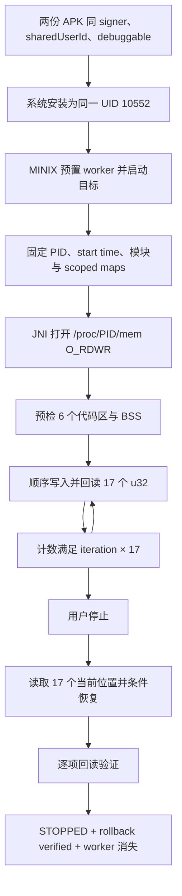

# MINIX 防闪真机运行时验收报告

> 报告日期：2026-08-17  
> 项目：`D:\Projects\minix`  
> 目标版本：迷你世界 `1.58.2` / `arm64-v8a`  
> 验收结论：证书 + `sharedUserId` + `debuggable` 路径已在 Android 16 真机通过；本次路径未调用 Root 或 `su` 读写目标内存。  
> 产物说明：防闪闭环运行时证据绑定 SHA-256 为 `388438A67ACA9206A19B5CC97D9A087A5C7BE79E01FFDAD9C878AD555142E4A8` 的历史 Debug APK。随后从相同代码状态强制重建，Debug/Release SHA-256 分别为 `6793F04B542BA8697E287A3CF3B10669B092D8AB8C944030772F9817B02353C3` 和 `8539A63FBCF70975F5ED10BB68786FCC695A30BF630AD6376222C769FC85F227`；重建导致 APK 字节级哈希变化。最终 Debug 已安装并通过冷启动冒烟，但没有重新执行整套防闪循环。

## 1. 执行摘要

MINIX 防闪 worker 已在真机上完成启动、持续写入、状态同步、停止和条件回滚闭环。目标进程 PID 为 `23696` 时，三份 UI 快照分别记录：

| 迭代数 | 已验证写入数 | 校验 |
|---:|---:|---:|
| `537` | `9129` | `537 × 17 = 9129` |
| `642` | `10914` | `642 × 17 = 10914` |
| `1273` | `21641` | `1273 × 17 = 21641` |

所有固化样本均满足：

```text
successfulWriteCount = iterationCount × 17
```

启动采样显示 worker 在目标启动后的 `2.866 s` 出现。停止后的 UI 明确显示 `防闪 · 已停止` 和 `Anti-flash stopped and rollback verified`；独立停止采样显示 worker 从存在变为消失。顶部按钮也能进入 `防闪运行中，返回游戏` 状态。

本次验收使用的实际访问链为：两个 APK 使用相同签名证书和 `sharedUserId`，目标 APK 设置 `debuggable=true`，系统把两个包安装为同一 Linux UID `10552`；MINIX 再通过 JNI 打开 `/proc/<pid>/mem` 执行受 PID、进程启动时间和 scoped maps 指纹约束的读写。源码中的 `Root*` 命名是历史命名，不代表本次路径会请求或使用 Root 权限。

防闪验收后又执行了最终完整构建矩阵：`110/110` tasks、`31` 个测试套件、`206` 项单元测试全部通过，lint 为 `0 error / 15 warning`。最终 Debug 已重新安装到同一设备，设备端 APK 哈希与本地构建一致，并以冷启动方式在 `598 ms` 内打开主界面。

此前静态还原、地址 profile、6 个代码区和 17 个 u32 的详细来源见 [2026-08-13_reverse-minix-antiflash-report.md](2026-08-13_reverse-minix-antiflash-report.md)。本文只封存 2026-08-17 的真机运行时结论。

## 2. Scope

本报告直接嵌入本轮 Scope 和 Timeline；运行时证据目录中没有独立的 `scope.md` 或 `timeline.md`。

| 项目 | 本轮范围 |
|---|---|
| 被测应用 | MINIX：`me.dartcv.minix` |
| 目标应用 | `com.minitech.miniworld`，版本 `1.58.2` |
| 配套目标 APK | `D:\Projects\bingxi\miniworld_1.58.2_shared_uid_debuggable_testkey.apk` |
| MINIX APK | `D:\Projects\minix\app\build\outputs\apk\debug\app-debug.apk` |
| 设备 | Serial `3B15AR005R800000`，Android `16` / API `36`，`arm64-v8a` |
| 系统状态 | SELinux `Enforcing` |
| 身份路径 | 同签名证书 + `sharedUserId=ca.sailboat.a` + 目标 `debuggable=true` |
| 运行时验证 | 包 UID、worker 启停、PID 绑定、17 写计数恒等式、UI 状态、停止回滚结果 |
| 最终构建验证 | 强制重跑 unit test、native debug、Debug/Release assemble 与 lint；安装最终 Debug 并冷启动冒烟 |
| 取证方法 | Manifest/签名静态检查、UI hierarchy XML、`/proc` 线程采样、设备身份快照 |
| 明确排除 | Root 读写链、logcat 归因、虚拟机、长时间稳定性、游戏全部场景、其他功能项完整验收 |

### 2.1 样本身份

| 样本 | 大小 | SHA-256 | 签名证书 SHA-256 |
|---|---:|---|---|
| 防闪闭环运行时测试的 MINIX Debug APK | `59,099,267` bytes | `388438A67ACA9206A19B5CC97D9A087A5C7BE79E01FFDAD9C878AD555142E4A8` | `A40DA80A59D170CAA950CF15C18C454D47A39B26989D8B640ECD745BA71BF5DC` |
| 最终完整构建并重新安装的 MINIX Debug APK | `58,702,728` bytes | `6793F04B542BA8697E287A3CF3B10669B092D8AB8C944030772F9817B02353C3` | `A40DA80A59D170CAA950CF15C18C454D47A39B26989D8B640ECD745BA71BF5DC` |
| 最终完整构建的 MINIX Release APK | `42,649,728` bytes | `8539A63FBCF70975F5ED10BB68786FCC695A30BF630AD6376222C769FC85F227` | `A40DA80A59D170CAA950CF15C18C454D47A39B26989D8B640ECD745BA71BF5DC` |
| 配套目标 APK | `1,726,344,936` bytes | `A3389DDB568D116112A4D65AF7F44C924E153AF6F5E898775CAFE9C99BDAF73A` | `A40DA80A59D170CAA950CF15C18C454D47A39B26989D8B640ECD745BA71BF5DC` |

防闪运行时配对的两份 Debug Manifest 均包含：

```text
android:sharedUserId="ca.sailboat.a"
android:debuggable="true"
```

设备侧安装结果：

```text
package:com.minitech.miniworld uid:10552
package:me.dartcv.minix uid:10552
```

## 3. Evidence

### E-001 设备与同 UID 身份快照

- `observed_at`: `2026-08-17T11:53:55.8103753+08:00`
- `source_type`: `file`
- `source_ref`: [device-identity.txt](../artifacts/runtime/2026-08-17/device-identity.txt)
- `content_hash`: `A611B4CCCFEEB1E31B300D2D547B166C89360889D6DE3E18C79EF1820E151CF2`
- `linked_workitem`: `n/a`
- `supersedes`: `none`
- `repro_command`:

```powershell
Get-Content -LiteralPath `
  'D:\Projects\minix\artifacts\runtime\2026-08-17\device-identity.txt' `
  -Encoding UTF8
```

- `raw_excerpt`: Android `16`、API `36`、`arm64-v8a`、SELinux `Enforcing`；目标包与 MINIX 均为 UID `10552`。该快照在目标退出后生成，因此 `target_pid` 为空，不用于证明运行中的 PID。

### E-002 APK Manifest、签名与文件哈希

- `observed_at`: `2026-08-17`
- `source_type`: `command`
- `source_ref`: 防闪运行时使用的历史 `app-debug.apk` 身份记录；当前 `app-debug.apk`；`miniworld_1.58.2_shared_uid_debuggable_testkey.apk`
- `content_hash`: 防闪运行时 MINIX 历史身份 `388438A67ACA9206A19B5CC97D9A087A5C7BE79E01FFDAD9C878AD555142E4A8`；目标 `A3389DDB568D116112A4D65AF7F44C924E153AF6F5E898775CAFE9C99BDAF73A`。历史构建路径随后被最终强制构建覆盖，旧 APK 字节已不在该路径；当前最终 Debug 的可复算哈希见 E-010。
- `linked_workitem`: `n/a`
- `supersedes`: `none`
- `repro_command`:

```powershell
$aapt2 = 'D:\Android\SDK\build-tools\37.0.0\aapt2.exe'
$signer = 'D:\Android\SDK\build-tools\37.0.0\apksigner.bat'
$target = 'D:\Projects\bingxi\miniworld_1.58.2_shared_uid_debuggable_testkey.apk'

Get-FileHash -Algorithm SHA256 -LiteralPath $target
& $aapt2 dump xmltree $target --file AndroidManifest.xml |
  Select-String 'sharedUserId|debuggable'
& $signer verify --print-certs $target |
  Select-String 'certificate SHA-256 digest'
```

- `raw_excerpt`: 当前可复核的配套目标 APK 声明 `sharedUserId=ca.sailboat.a`、`debuggable=true`，signer SHA-256 为 `A40DA80A...BF5DC`。防闪运行时 MINIX 的 `388438...E4A8`、Manifest 与相同 signer 是当时的验收记录；该旧二进制已被最终重建覆盖而未单独保留，因此不宣称可从当前构建路径复算。当前最终 MINIX APK 的可复现身份、签名和设备安装校验统一见 E-010。

### E-003 worker 启动延迟采样

- `observed_at`: `2026-08-17 11:32:47 +08:00`
- `source_type`: `file`
- `source_ref`: [startup-trace.tsv](../artifacts/runtime/2026-08-17/startup-trace.tsv)
- `content_hash`: `C6E74E3DCF37EAC55E65F0E546AD1819CC2CC449DDBC094620A5C020476A8B90`
- `linked_workitem`: `n/a`
- `supersedes`: `none`
- `repro_command`:

```powershell
Import-Csv -Delimiter "`t" -LiteralPath `
  'D:\Projects\minix\artifacts\runtime\2026-08-17\startup-trace.tsv' |
  Format-Table -AutoSize
```

- `raw_excerpt`: `Worker=0` 持续到 `2.603 s`，在 `2.866 s` 首次变为 `1`。

### E-004 运行态快照 537 / 9129

- `observed_at`: `2026-08-17 11:46:11 +08:00`
- `source_type`: `file`
- `source_ref`: [running-537.xml](../artifacts/runtime/2026-08-17/running-537.xml)
- `content_hash`: `78856526E074343C1083334929989F49362BB38968C853695D01A9681C527DDA`
- `linked_workitem`: `n/a`
- `supersedes`: `none`
- `repro_command`:

```powershell
[xml]$ui = Get-Content -LiteralPath `
  'D:\Projects\minix\artifacts\runtime\2026-08-17\running-537.xml' `
  -Encoding UTF8 -Raw
$ui.SelectNodes('//*[@text!=""]') | ForEach-Object text
```

- `raw_excerpt`: 目标 PID `23696`、防闪运行中、循环 `537`、已验证写入 `9129`、`17 anti-flash writes verified`。

### E-005 运行态快照 642 / 10914

- `observed_at`: `2026-08-17 11:47:56 +08:00`
- `source_type`: `file`
- `source_ref`: [running-642.xml](../artifacts/runtime/2026-08-17/running-642.xml)
- `content_hash`: `B97981655D27E6805934BB46DA4D27F6F7952EBA907B0CC16A5BEE9712580F14`
- `linked_workitem`: `n/a`
- `supersedes`: `none`
- `repro_command`:

```powershell
[xml]$ui = Get-Content -LiteralPath `
  'D:\Projects\minix\artifacts\runtime\2026-08-17\running-642.xml' `
  -Encoding UTF8 -Raw
$ui.SelectNodes('//*[@text!=""]') | ForEach-Object text
```

- `raw_excerpt`: 同一目标 PID `23696`、循环 `642`、已验证写入 `10914`，计数继续单调增长。

### E-006 运行态顶部按钮同步

- `observed_at`: `2026-08-17 11:48:26 +08:00`
- `source_type`: `file`
- `source_ref`: [running-button.xml](../artifacts/runtime/2026-08-17/running-button.xml)
- `content_hash`: `8F6F92B7135A1974BC3975891A610C538F206FA998D4EDEC0CC75CC32BFA96E8`
- `linked_workitem`: `n/a`
- `supersedes`: `none`
- `repro_command`:

```powershell
[xml]$ui = Get-Content -LiteralPath `
  'D:\Projects\minix\artifacts\runtime\2026-08-17\running-button.xml' `
  -Encoding UTF8 -Raw
$ui.SelectNodes('//*[@text!=""]') | ForEach-Object text
```

- `raw_excerpt`: 顶部启动按钮进入 `防闪运行中，返回游戏` 状态，证明 UI 能从预置态同步到 worker 运行态。

### E-007 停止与回滚验证

- `observed_at`: `2026-08-17 11:51:12 +08:00`
- `source_type`: `file`
- `source_ref`: [stopped-rollback-verified.xml](../artifacts/runtime/2026-08-17/stopped-rollback-verified.xml)
- `content_hash`: `79052D2045F7D46CBCF583EC94CEAF2A80C511C78F3858EA4BC6986D6976547C`
- `linked_workitem`: `n/a`
- `supersedes`: `none`
- `repro_command`:

```powershell
[xml]$ui = Get-Content -LiteralPath `
  'D:\Projects\minix\artifacts\runtime\2026-08-17\stopped-rollback-verified.xml' `
  -Encoding UTF8 -Raw
$ui.SelectNodes('//*[@text!=""]') | ForEach-Object text
```

- `raw_excerpt`: `防闪 · 已停止`、循环 `1273`、已验证写入 `21641`、PID `23696`、`Anti-flash stopped and rollback verified`。同一快照还显示目标进程已退出。

### E-008 worker 停止后消失采样

- `observed_at`: `2026-08-17 11:22:28 +08:00`
- `source_type`: `file`
- `source_ref`: [stop-trace-worker-gone.tsv](../artifacts/runtime/2026-08-17/stop-trace-worker-gone.tsv)
- `content_hash`: `35535C7DCCA4C4F38B33984247E0B29429CE44DCC30B004F11F56AA37F382387`
- `linked_workitem`: `n/a`
- `supersedes`: `none`
- `repro_command`:

```powershell
Import-Csv -Delimiter "`t" -LiteralPath `
  'D:\Projects\minix\artifacts\runtime\2026-08-17\stop-trace-worker-gone.tsv' |
  Format-Table -AutoSize
```

- `raw_excerpt`: 独立停止采样中，`Worker=1` 持续到 `2.948 s`，在 `3.164 s` 变为 `0`。该文件记录的是另一轮 PID `8350 8083`，用于证明 worker 终止行为，不与 PID `23696` 的最终 UI 快照混作同一时序。

### E-009 防闪实现边界

- `observed_at`: `2026-08-17`
- `source_type`: `file`
- `source_ref`: [RootAntiFlash.kt](../app/src/main/java/me/dartcv/minix/root/RootAntiFlash.kt)、[RootFeatureService.kt](../app/src/main/java/me/dartcv/minix/root/RootFeatureService.kt)、[RootNativeProbe.kt](../app/src/main/java/me/dartcv/minix/root/RootNativeProbe.kt)、[TargetNativeProbe.kt](../app/src/main/java/me/dartcv/minix/root/nativeadapter/TargetNativeProbe.kt)、[target_native_probe.cpp](../app/src/main/cpp/target_native_probe.cpp)
- `content_hash`: `RootAntiFlash.kt=7F0825126983D8E8E13C8774ACD7C541937974B23D496D6F3946CDB45EFB8797`；`RootFeatureService.kt=927EDA711BFAD883E188465100A49AAD9A4971C28EC0E8380C2D872830078442`；`RootNativeProbe.kt=8ED03EB76D82ADE2590C4767CFCDF360324962EFEEA6AAF7C2044BC91B66F760`；`TargetNativeProbe.kt=59BE51959CF15A36754E48DB96A9ED545FC2FC702A3275DA1399265186BBB500`；`target_native_probe.cpp=1DD338B49872EC70819BE795CA3C7A90AE9352595678B39398ABB8E52D78DD6B`
- `linked_workitem`: `n/a`
- `supersedes`: `none`
- `repro_command`:

```powershell
rg -n `
  'expectedUid = Process.myUid|ANTI_FLASH_CODE_REGION_COUNT|ANTI_FLASH_WRITE_COUNT|scoped mappings|successfulWriteCount|rollback verified|O_RDWR' `
  D:\Projects\minix\app\src\main\java\me\dartcv\minix\root `
  D:\Projects\minix\app\src\main\cpp\target_native_probe.cpp
```

- `raw_excerpt`: Service 要求目标 UID 等于 `Process.myUid()`；resolver 只绑定覆盖 6 个代码区、17 个写地址和 BSS 的 mappings；native cycle 固定要求 6 个 regions 与 17 个 writes；JNI 通过单个 `O_RDWR` `/proc/<pid>/mem` fd 执行并逐项验证；停止时读取 17 个当前位置、条件恢复原值并回读验证。

### E-010 最终构建、Manifest 与设备冒烟

- `observed_at`: `2026-08-17T12:07:17+08:00`
- `source_type`: `file`
- `source_ref`: [final-build-verification.txt](../artifacts/runtime/2026-08-17/final-build-verification.txt)、[final-manifest-xmltree.txt](../artifacts/runtime/2026-08-17/final-manifest-xmltree.txt)、[final-smoke.xml](../artifacts/runtime/2026-08-17/final-smoke.xml)
- `content_hash`: build verification `43976CE2EA961DF71E969BBFB8D4F56FBC188EFF09859B47F0CA01F7C6CABE8A`；Manifest dump `AA41EDF56D3B9BF1B447FC567FCA89A82CCE6A6FF868C7F3CA09E56458DF676F`；smoke UI `FD4CC8AF68181535109FDAF541A3AAF526692BEF5EAF95B1DE28BFDDEEDFA603`
- `linked_workitem`: `n/a`
- `supersedes`: `none`
- `repro_command`:

```powershell
$dir = 'D:\Projects\minix\artifacts\runtime\2026-08-17'
Get-Content -LiteralPath (Join-Path $dir 'final-build-verification.txt') -Encoding UTF8
$files = @(
  (Join-Path $dir 'final-build-verification.txt')
  (Join-Path $dir 'final-manifest-xmltree.txt')
  (Join-Path $dir 'final-smoke.xml')
)
Get-FileHash -Algorithm SHA256 -LiteralPath $files
```

- `raw_excerpt`: 最终命令 `BUILD SUCCESSFUL in 44s`，执行 `110/110` tasks；`31` suites / `206` tests，`0` failures、`0` errors、`0` skipped；lint `0` errors / `15` warnings。Debug/Release 均为 v3-only 单 signer 且通过 16 KiB zipalign。最终 Debug 安装成功，设备 `base.apk` SHA-256 与本地 `6793F04B...53C3` 一致；两个包 UID 仍为 `10552`，目标 flags 包含 `DEBUGGABLE`；MINIX 冷启动成功，总耗时 `598 ms`，smoke UI 含 `MINIX`、`LOCAL WORKSPACE`、`本地工作区已准备好`。

### E-011 飞行位与玩家位置同 UID 只读回读

- `observed_at`: `2026-08-17T16:30:00+08:00`
- `source_type`: `file`
- `source_ref`: [live-flight-position-readback-1630.txt](../artifacts/runtime/2026-08-17/live-flight-position-readback-1630.txt)
- `content_hash`: `F7AA6000E1532A38B4101E0823E40AD29DC11ACFBFDE03D6217CED08DF73B14E`
- `linked_workitem`: `FLIGHT`, `PLAYER_TELEPORT`
- `supersedes`: `none`
- `access_mode`: `run-as me.dartcv.minix`，同 UID，只读 `/proc/28779/mem`
- `raw_excerpt`: flight scalar raw=`12 (0x0000000c)`，bit 3 已设置；actor X/Y/Z raw=`60600/7693/60572`，换算为 `606.00/76.93/605.72` world units。采样没有写目标内存，闭合 `rawUnitsPerWorldUnit=100`。

### 3.1 运行时证据清单

| 文件 | 字节数 | SHA-256 |
|---|---:|---|
| `device-identity.txt` | `255` | `A611B4CCCFEEB1E31B300D2D547B166C89360889D6DE3E18C79EF1820E151CF2` |
| `running-537.xml` | `15,953` | `78856526E074343C1083334929989F49362BB38968C853695D01A9681C527DDA` |
| `running-642.xml` | `15,954` | `B97981655D27E6805934BB46DA4D27F6F7952EBA907B0CC16A5BEE9712580F14` |
| `running-button.xml` | `19,582` | `8F6F92B7135A1974BC3975891A610C538F206FA998D4EDEC0CC75CC32BFA96E8` |
| `startup-trace.tsv` | `261` | `C6E74E3DCF37EAC55E65F0E546AD1819CC2CC449DDBC094620A5C020476A8B90` |
| `stopped-rollback-verified.xml` | `20,318` | `79052D2045F7D46CBCF583EC94CEAF2A80C511C78F3858EA4BC6986D6976547C` |
| `stop-trace-worker-gone.tsv` | `404` | `35535C7DCCA4C4F38B33984247E0B29429CE44DCC30B004F11F56AA37F382387` |
| `final-build-verification.txt` | `2,294` | `43976CE2EA961DF71E969BBFB8D4F56FBC188EFF09859B47F0CA01F7C6CABE8A` |
| `final-manifest-xmltree.txt` | `10,419` | `AA41EDF56D3B9BF1B447FC567FCA89A82CCE6A6FF868C7F3CA09E56458DF676F` |
| `final-smoke.xml` | `16,295` | `FD4CC8AF68181535109FDAF541A3AAF526692BEF5EAF95B1DE28BFDDEEDFA603` |
| `live-flight-position-readback-1630.txt` | `866` | `F7AA6000E1532A38B4101E0823E40AD29DC11ACFBFDE03D6217CED08DF73B14E` |

## 4. Findings

### F-001 同证书、同 sharedUserId、debuggable 路径已成立

- `severity`: `n/a_re`
- `category`: `design`
- `status`: `validated`
- `evidence_ids`: `[E-001, E-002, E-009]`
- `confidence`: `high`
- `location`: 两份 `AndroidManifest.xml`；`RootFeatureService.kt:38-52`
- `impact`: MINIX 与目标被安装为同一 Linux UID `10552`，并在 SELinux Enforcing 的 Android 16 设备上获得本轮 `/proc/<pid>` 访问条件。本次防闪链不依赖 Root 授权，但依赖配套目标 APK 的重签名、相同 `sharedUserId` 和 `debuggable=true`。
- `repro_steps`:
  1. 用 E-002 命令确认两份 APK 的 signer、`sharedUserId` 和 `debuggable`。
  2. 安装后读取 E-001，确认两个包 UID 相同。
- `remediation`: `n/a`

### F-002 防闪可在启动后绑定目标并进入运行态

- `severity`: `n/a_re`
- `category`: `other`
- `status`: `validated`
- `evidence_ids`: `[E-003, E-004, E-006]`
- `confidence`: `high`
- `location`: `RootFeatureService` anti-flash worker；MINIX 控制页
- `impact`: 预置后无需目标进程预先存在；本次固化 trace 中 worker 在 `2.866 s` 出现，随后 UI 绑定 PID `23696` 并进入运行态。
- `repro_steps`:
  1. 在 MINIX 点击 `预置防闪并启动游戏`。
  2. 采样 worker 存在状态并导出 UI hierarchy。
  3. 确认按钮进入 `防闪运行中，返回游戏`。
- `remediation`: `n/a`

### F-003 每轮 17 次写入的计数恒等式通过

- `severity`: `n/a_re`
- `category`: `reverse_algo`
- `status`: `validated`
- `evidence_ids`: `[E-004, E-005, E-007, E-009]`
- `confidence`: `high`
- `location`: `RootAntiFlash.kt:780-850`；`TargetNativeProbe.kt:546-647`
- `impact`: 三个不同时点均满足 `successfulWriteCount = iterationCount × 17`，且计数随时间单调增加，未观察到部分成功被误计为完整一轮。
- `repro_steps`:
  1. 分别读取 E-004、E-005 和 E-007 中的循环数与写入数。
  2. 计算 `537×17`、`642×17`、`1273×17`。
- `remediation`: `n/a`

### F-004 停止后完成条件回滚并释放 worker

- `severity`: `n/a_re`
- `category`: `design`
- `status`: `validated`
- `evidence_ids`: `[E-007, E-008, E-009]`
- `confidence`: `high`
- `location`: `RootAntiFlash.kt:861-947`
- `impact`: UI 保留 `Anti-flash stopped and rollback verified` 终态；独立线程采样确认 worker 消失。重复停止不会覆盖已经验证的回滚结果。
- `repro_steps`:
  1. 在运行态执行停止。
  2. 导出 UI hierarchy，确认 `防闪 · 已停止` 和 rollback verified 消息。
  3. 持续采样 worker，确认状态最终为 `0`。
- `remediation`: `n/a`

### F-005 scoped maps 只约束实际访问区域

- `severity`: `n/a_re`
- `category`: `design`
- `status`: `validated`
- `evidence_ids`: `[E-004, E-005, E-009]`
- `confidence`: `high`
- `location`: `RootAntiFlash.kt:273-311,341-445`
- `impact`: resolver 前后两次读取 maps，并只比较覆盖 6 个代码区、17 个写地址和 BSS 的唯一 mapping；无关 mapping 变化不会阻断 worker，相关 mapping 或 PID identity 变化则 fail closed。本次 PID `23696` 在多次快照间持续运行并累计写入。
- `repro_steps`:
  1. 检查 E-009 所列 scoped fingerprint 实现。
  2. 对比 E-004 与 E-005 的相同 PID 和递增计数。
- `remediation`: `n/a`

### F-006 停止后目标退出的因果关系尚未闭合

- `severity`: `info`
- `category`: `other`
- `status`: `candidate`
- `evidence_ids`: `[E-001, E-007]`
- `confidence`: `medium`
- `location`: 目标进程生命周期
- `impact`: E-007 显示回滚验证完成后目标已退出，E-001 的后置快照也没有 target PID。现有证据证明“回滚完成”和“随后目标不在运行”，但没有证明退出由回滚、目标自身逻辑或其他生命周期事件触发。
- `repro_steps`:
  1. 在停止前记录目标 PID 和 start time。
  2. 停止后并行采样目标 PID、exit-info 与 rollback 终态。
  3. 对多轮样本比较退出时点。
- `remediation`: 后续稳定性验收应把目标退出时点与停止动作绑定到同一条高频 trace 中。

### F-007 最终构建矩阵和设备冷启动通过

- `severity`: `n/a_re`
- `category`: `other`
- `status`: `validated`
- `evidence_ids`: `[E-010]`
- `confidence`: `high`
- `location`: Gradle build outputs；设备安装包与 `me.dartcv.minix/.MainActivity`
- `impact`: 强制构建执行 `110/110` tasks，`206` 项单元测试无失败，lint 无 error；最终 Debug/Release 哈希、签名和 16 KiB 对齐已封存。最终 Debug 已安装，设备端 APK 哈希一致，同 UID 与目标 `DEBUGGABLE` 条件仍成立，主界面冷启动成功。
- `repro_steps`:
  1. 读取 E-010 的构建命令、统计和 APK 哈希。
  2. 比较本地 Debug 哈希与设备 `base.apk` 哈希。
  3. 读取 `final-smoke.xml` 的 UI marker。
- `remediation`: `n/a`

### F-008 飞行 bit 3 与三轴百分之一单位编码已由只读采样闭合

- `severity`: `n/a_re`
- `category`: `reverse_algo`
- `status`: `validated`
- `evidence_ids`: `[E-011]`
- `confidence`: `high`
- `location`: `player+0xf0`；`actor+0x2c8/+0x2cc/+0x2d0`
- `impact`: flight raw 为 `12 (0x0c)` 且 bit 3 已设置，证明飞行语义应按位判断而非要求整个 scalar 等于 `8`。位置 raw=`60600/7693/60572` 对应 `606.00/76.93/605.72`，闭合 `rawUnitsPerWorldUnit=100`；Y/Z 的小幅小数漂移与写入后的游戏移动或物理更新一致。
- `repro_steps`:
  1. 以 `run-as me.dartcv.minix` 在同 UID 条件下只读目标 `/proc/<pid>/mem`。
  2. 沿 GameApp BSS、IPlayerControl、player、actor pointer64 链解析字段。
  3. 检查 flight raw 的 bit 3，并将三轴有符号 raw 除以 `100`。
- `remediation`: `n/a`

## 5. Path

### P-001 从配套安装到验证回滚的调用路径

- `path_type`: `callflow`
- `start`: 两份配套 APK 安装完成
- `goal`: 防闪持续完成 17 写循环，并在停止时恢复原值、验证回读和释放 worker
- `steps`:
  1. 两个 APK 使用相同 signer、`sharedUserId` 和 `debuggable=true`。`evidence: E-002`，`finding: F-001`
  2. Android Package Manager 将两个包安装为 UID `10552`。`evidence: E-001`，`finding: F-001`
  3. MINIX 先预置防闪，再启动并轮询目标；worker 在采样的 `2.866 s` 出现。`evidence: E-003`，`finding: F-002`
  4. Service 校验目标 UID，固定 PID、start time、模块身份和 scoped maps。`evidence: E-009`，`finding: F-005`
  5. JNI 使用一个 `O_RDWR` `/proc/<pid>/mem` fd，预检 6 个代码区和 BSS，顺序执行 17 个 u32 写入并逐项回读。`evidence: E-009`，`finding: F-003`
  6. UI 记录 `537/9129`、`642/10914` 和 `1273/21641`。`evidence: E-004,E-005,E-007`，`finding: F-003`
  7. 停止时读取 17 个当前位置，只接受原值、补丁值或已知字节混合态，恢复原值后再次回读。`evidence: E-007,E-009`，`finding: F-004`
  8. 状态进入 STOPPED，worker 消失。`evidence: E-007,E-008`，`finding: F-004`
- `residual_risks`: 仅验收目标 `1.58.2/arm64-v8a`；停止后目标退出原因未闭合；最终重建包只完成安装与冷启动冒烟，未重跑防闪循环；未进行长时间、多场景和跨 Android 版本稳定性矩阵。



## 6. Timeline

以下时间使用设备所在时区 `Asia/Shanghai`。`stop-trace-worker-gone.tsv` 来自独立停止轮次，不能与 PID `23696` 的最终轮次按绝对时间拼接。

| 时间 | 事件 | 证据 | 结果 |
|---|---|---|---|
| `11:22:28` | 独立停止轮次写入 worker 采样 | E-008 | worker 在相对 `3.164 s` 消失 |
| `11:32:47` | 启动轮次写入 worker 采样 | E-003 | worker 在相对 `2.866 s` 出现 |
| `11:46:11` | 导出运行态 UI | E-004 | PID `23696`，`537 / 9129` |
| `11:47:56` | 再次导出运行态 UI | E-005 | PID `23696`，`642 / 10914` |
| `11:48:26` | 导出顶部按钮状态 | E-006 | `防闪运行中，返回游戏` |
| `11:51:12` | 导出停止态 UI | E-007 | `1273 / 21641`，rollback verified，目标已退出 |
| `11:53:55` | 封存设备身份 | E-001 | 两包 UID 均为 `10552`，目标 PID 已为空 |
| `12:07:17` | 封存最终构建和设备冒烟 | E-010 | 110/110 tasks、206 tests 全通过；最终 Debug 安装并在 `598 ms` 冷启动 |
| `16:30:00` | 同 UID 只读回读飞行位与 actor 三轴 | E-011 | flight raw=`12` 且 bit 3 set；`60600/7693/60572` 对应 `606.00/76.93/605.72` |

## 7. 限制与残余风险

### 7.1 GetDataLong(1) production 地址链补充

当前 `1.58.2/arm64-v8a` 的 production 公式已经由静态基值恢复与真机重复读取共同闭合：

```text
bss     = resolve_module_spec("liblibGameApp.so:bss")
pointer = read_u64(bss + 0x5b860)
result  = read_u64(pointer + 0x548)
```

在本轮稳定目标会话中，`bss + 0x5b860` 保存的 64 位指针为 `0x72a060bde0`，最终读取地址为 `0x72a060c328`；结果连续 12 次稳定为 `0x00000f547c994f5e`。因此 production profile 使用 `POINTER64`。

旧 `LEGACY_MASKED_H` 会把当前 64 位 seed 截断到低 32 位，再把读取结果限制到低 24 位；该地址在当前 arm64 maps 中不可用，历史结果稳定退化为零。该 resolver 只作为旧版 libClient 的静态逆向证据保留，已从 GetDataLong(1) production 配方淘汰。

1. **最终重建包未重跑防闪循环。** 最终 Debug/Release 哈希、构建矩阵和 Debug 冷启动已经封存；17 写与 rollback 闭环仍来自代码相同但字节哈希为 `388438...E4A8` 的历史 Debug 包。
2. **版本绑定严格。** 防闪 profile 只面向 `1.58.2/arm64-v8a` 和既定模块指纹；目标升级、SO 重编译或 mapping 语义变化会触发 fail closed。
3. **配套目标 APK 是访问前提。** 相同签名、相同 `sharedUserId` 和 `debuggable=true` 缺一都会破坏本轮路径。该方案要求使用配套重签目标包，不能直接替换为原始官方包。
4. **`sharedUserId` 已被 Android 弃用。** 当前 Android 16 真机可用不代表所有 ROM、安装器策略或后续 Android 版本继续接受相同安装模型。
5. **停止后的目标退出尚未归因。** 回滚本身已验证，但目标为何在随后退出仍需同一轮高频进程 trace 才能闭合。
6. **初次 UI 同步存在延迟。** 首次完整目标快照包含 `511` 个模块，自动 polling 可能延后数秒显示运行态；手动 `打开或刷新` 可以加速同步。这是状态呈现延迟，不是 worker 未运行的证据。
7. **本轮不是长期稳定性测试。** 尚未覆盖多局游戏、前后台切换、进程重启、设备重启、低内存和长时间持续运行。
8. **Root 权限不属于本轮链路。** 即使设备具备 Root，本次实现也没有通过 `su` 获取目标内存访问；可用性取决于同 UID、debuggable/dumpable 条件以及系统 `/proc` 策略。

## 8. 结论

截至 2026-08-17，MINIX 防闪已经从“静态还原并可构建”推进到“Android 16 真机运行时闭环通过”：

- 证书、`sharedUserId`、`debuggable` 与设备 UID 条件成立；
- worker 能在目标启动后绑定正确 PID 并持续运行；
- 三个固化计数点全部满足每轮 17 次已验证写入；
- UI 能显示 worker 绑定 PID 和运行按钮状态；
- 停止后保留 rollback verified 终态，并有独立采样证明 worker 被释放；
- 最终强制构建执行 110/110 tasks，206 项测试全通过，最终 Debug 已在同一设备冷启动成功。
- 同 UID `run-as` 只读采样确认 flight bit 3 已设置，并以三轴 raw 值闭合 `rawUnitsPerWorldUnit=100`。

因此，`ANTI_FLASH` 可标记为 **真机运行时已通过**，最终构建也可标记为 **构建与设备冒烟已通过**。剩余工作是对最终重建包重复防闪循环、闭合停止后目标退出归因，以及扩展长期稳定性矩阵；这些边界不改变本报告对现有防闪写入与回滚证据的结论。
