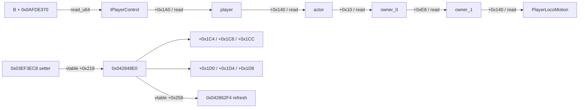

# GameApp 1.58.2 HITBOX 静态恢复报告

> 分析日期：2026-08-17  
> 分析方式：离线静态分析  
> 工具链：radare2 6.1.8、Python 3.10、Capstone 5.0.7、pyelftools

## 1. 执行摘要

本轮已闭合当前 GameApp 1.58.2 的本地玩家 `actor → PlayerLocoMotion → 三轴碰撞字段` 路径，并用 ELF RELA/RTTI 确认 setter 与 refresh 虚表槽。旧 `libClient.so` worker 也已闭合为固定 `0..99` 共 100 槽、stride 8 的实体遍历，包含 `B+0x1CC50` secondary identity gate、`B+0x1CC74` local identity gate、marker gate 与三轴 writer。当前 exact-SHA GameApp 的全实体集合映射及对象生命周期仍未唯一化，因此公开 HITBOX 功能继续 evidence-gated。

## 2. 目标与范围

| 属性 | 值 |
|---|---|
| 文件 | `D:\Projects\bingxi\liblibGameApp.so` |
| 类型 | ELF64 / AArch64 / DYN |
| 大小 | `176533320` 字节 |
| SHA-256 | `d8efe55c37b061ce41cb3830ec743401138bf40b8bacf251f18f7b026bf0140e` |
| GNU Build ID | `662a450a7331aff319cbc4b3897c2124f8fd61f9` |
| 旧 worker 文件 | `libClient.so`，SHA-256 `0e83d59aea5b32e45704068b2e35390bedb431891a56a9a5cccd357e5b17f13b`，Build ID `e1431492d41ecf4a593b6adea174d6618595e599` |
| 网络 | 离线 |
| 动态修改 | 未执行 |

Scope 详见 [`../work/hitbox-recovery-20260817/scope.md`](../work/hitbox-recovery-20260817/scope.md)。

## 3. 核心结果

### 3.1 当前版本对象链

```text
control = read_u64(B + 0x0AFDE370)
player  = read_u64(control + 0x1A0)
actor   = read_u64(player  + 0x140)
owner_0 = read_u64(actor   + 0x10)
owner_1 = read_u64(owner_0 + 0xE8)
loco    = read_u64(owner_1 + 0x140)
```

现有 anonymous-BSS evaluator 可直接表达为：

```text
initialSeed         = 0x00781370
intermediateOffsets = [0x1A0, 0x140, 0x10, 0xE8, 0x140]
dereferenceMode     = POINTER64
```

### 3.2 字段与引擎 setter

| 语义 | 主字段 | 镜像/刷新字段 |
|---|---:|---:|
| X / width | `+0x1C4` | `+0x1D0` |
| Y / height | `+0x1C8` | `+0x1D4` |
| Z / depth | `+0x1CC` | `+0x1D8` |

关键 RVA：

| 对象 | RVA |
|---|---:|
| Lua wrapper | `0x058BB83C` |
| actor collision setter | `0x03EF3EC8` |
| actor collision getter | `0x03EF3F3C` |
| Locomotion common setter | `0x042849E0` |
| Locomotion refresh | `0x042862F4` |
| PlayerLocoMotion vptr | `0x0A32DBF8` |

`0x042849E0` 写六个字段后调用虚表 `+0x258`。refresh 会按运行时缩放重算镜像字段，所以镜像值不应被强制等同于主字段。getter 对主字段乘 `0.01`，证明主字段采用 centi-unit int32；回滚应保存原始 int32，而非通过 getter 浮点往返。

### 3.3 selector 映射

```text
selector 1 -> value * 220 -> X、Z
selector 2 -> value * 220 -> Y
```

布尔启用时：

```text
X = 220
Y = 220
Z = 220
```

### 3.4 旧 worker 的 100 槽闭合结果

```text
B = read_u64(libClientBase + 0x971B90)
localId     = read_u32(B + 0x1CC74)
secondaryId = read_u32(B + 0x1CC50)
table = H(H(H(H(B+0x7D3630)+0x08)+0xF0)+0x68)

for index in 0..99:
    actor = H(H(H(table+index*8)+0x60)+0x38)
    marker = read_u32(H(actor+0x158)+0x4C)
    field130 = read_u32(actor+0x130)
    candidateId = sign_extend_i32(read_u32(H(actor+0x318)+0x38))
    loco = H(actor+0x140)
```

接受条件是 `marker==0x42C80000`、`field130!=secondaryId`，以及 `localId==0 || candidateId!=sign_extend_i32(localId)`。接受后，writer `0x4E66D4` 在 `0x596978/0x596994/0x596A28` 分别写 `loco+0x1C4/+0x1C8/+0x1CC`。`w14=0/6` 是 worker accepted/skip 控制码而非生命状态。`0x593CDC` 的 `cmp w22,#0x64` 与 counter=100 witness 证明不会访问第 101 槽。配置槽 ELF 初值 `9999` 不是回滚值。

### 3.5 调用与数据流



## 4. Evidence

### E-001
- title: GameApp 精确身份与关键字节校验
- observed_at: 2026-08-17
- source_type: file
- source_ref: `../work/hitbox-recovery-20260817/verification-result.json`
- content_hash: `16697DD578A12B381DB4A9A0364E1D7D99EE056577B23C0450B6A528BEE7EAAA`
- repro_command: `py -3.10 D:\Projects\minix\work\hitbox-recovery-20260817\verify_gameapp_hitbox_recipe.py`
- raw_excerpt: `"passed": true`，39 项 GameApp 与旧 worker SHA/Build-ID/bytes/RELA/CFG witness 检查全部通过。
- linked_workitem: n/a
- supersedes: none

### E-002
- title: 三轴字段写入函数聚类
- observed_at: 2026-08-17
- source_type: file
- source_ref: `../work/hitbox-recovery-20260817/gameapp_collision_store_clusters.txt`
- content_hash: `89C2DFB1E25C1F67F156C13D53F1718571D295B9356B797A5D9D2B921B2248B8`
- repro_command: `py -3.10 D:\Projects\minix\work\hitbox-recovery-20260817\cluster_gameapp_collision_stores.py`
- raw_excerpt: `0x042849E0` 连续写 `+0x1C8/+0x1C4/+0x1CC` 与 `+0x1D4/+0x1D0/+0x1D8`。
- linked_workitem: n/a
- supersedes: none

### E-003
- title: RTTI/vtable RELA 解析
- observed_at: 2026-08-17
- source_type: file
- source_ref: `../work/hitbox-recovery-20260817/gameapp_42849e0_vtables.txt`
- content_hash: `8116C59A7222308EFEA530304AAD067235ACA5033097F312F765DA3E5A61D38F`
- repro_command: `py -3.10 D:\Projects\minix\work\hitbox-recovery-20260817\resolve_42849e0_vtables.py`
- raw_excerpt: `PlayerLocoMotion address_point=0xA32DBF8`，slot `+0x218` 指向 `0x042849E0`。
- linked_workitem: n/a
- supersedes: none

### E-004
- title: 机器可读 production 配方
- observed_at: 2026-08-17
- source_type: file
- source_ref: `../work/hitbox-recovery-20260817/production-hitbox-recipe.json`
- content_hash: `3780424DE85926327B83DDF99038EA2FD60DE0D7C306030A6CE857A3A44CFFEC`
- repro_command: `Get-Content -Raw D:\Projects\minix\work\hitbox-recovery-20260817\production-hitbox-recipe.json | ConvertFrom-Json`
- raw_excerpt: `localPlayer=closed`、`legacyWorker100SlotTraversal=closed`、`currentExactShaFullEntitySet=fail_closed`。
- linked_workitem: n/a
- supersedes: none

## 5. Findings

### F-001
- title: 当前 GameApp 的 HITBOX 对象为 PlayerLocoMotion
- severity: n/a_re
- category: reverse_algo
- status: validated
- evidence_ids: [E-001, E-002, E-003]
- location: `0x03EF3EC8`, `0x042849E0`, vptr `0x0A32DBF8`
- impact: 可构造带强身份校验的本地玩家动态对象配方。
- confidence: high
- repro_steps: 运行 E-001 验证脚本并检查 E-002/E-003。
- remediation: n/a

### F-002
- title: selector 1 对应 X/Z，selector 2 对应 Y
- severity: n/a_re
- category: reverse_algo
- status: validated
- evidence_ids: [E-001, E-004]
- location: `loco+0x1C4/+0x1C8/+0x1CC`
- impact: 布尔启用值可确定为 `{220,220,220}`。
- confidence: high
- repro_steps: 对照旧 worker 的三字段写和当前 Locomotion 字段布局。
- remediation: n/a

### F-003
- title: 当前 exact-SHA 全实体 HITBOX 仍需 fail-close
- severity: n/a_re
- category: design
- status: validated
- evidence_ids: [E-004]
- location: `ControlFeature.HITBOX` profile readiness
- impact: 旧 worker 虽已闭合为 100 槽，但旧表/`H()` handle 模型尚无唯一的当前版本集合与生命周期映射，直接开放会形成错误功能声明。
- confidence: high
- repro_steps: 检查配方的 `fullFeatureReady=false` 和失败原因 `CURRENT_EXACT_SHA_FULL_ENTITY_SET_MAPPING_LIFECYCLE_NOT_UNIQUE`。
- remediation: 当前版本全实体集合映射与对象生命周期唯一化后再接入公开功能。

### F-004
- title: 旧 HITBOX worker 固定遍历 100 槽
- severity: n/a_re
- category: reverse_algo
- status: validated
- evidence_ids: [E-001, E-004]
- location: `0x592EF0`、`0x593CDC`、`0x596978/0x596994/0x596A28`
- impact: 旧版本的根、上限、筛选与三轴写入语义均可作为当前版映射依据，且不再误报为 9/13 槽。
- confidence: high
- repro_steps: 运行 E-001 验证器并检查 E-004 的 `legacyWorkerEvidence`。
- remediation: n/a

## 6. Path

### P-001
- title: setCollisionSize 到碰撞字段的调用路径
- path_type: callflow
- start: Lua 注册字符串 `setCollisionSize`
- goal: PlayerLocoMotion 三轴主字段与 refresh
- steps:
  1. wrapper `0x058BB83C` 解析 actor 和三个数值 — evidence: E-001 — finding: F-001
  2. actor setter `0x03EF3EC8` 通过 `actor+0x10 → +0xE8 → +0x140` 得到 Locomotion — evidence: E-001 — finding: F-001
  3. 虚表 `+0x218` 调用 `0x042849E0` 写主字段和镜像字段 — evidence: E-002/E-003 — finding: F-001
  4. 虚表 `+0x258` 调用 `0x042862F4` 刷新/缩放镜像 — evidence: E-001 — finding: F-001
- residual_risks: 旧 100 槽语义已闭合；当前 exact-SHA 全实体集合等价映射与对象生命周期仍缺唯一证据。

## 7. 接线决策

1. 机器配方已写入 [`production-hitbox-recipe.json`](../work/hitbox-recovery-20260817/production-hitbox-recipe.json)。
2. 详细验证、事务写、回滚与失败枚举见 [`production-hitbox-recipe.md`](../work/hitbox-recovery-20260817/production-hitbox-recipe.md)。
3. public `ControlFeature.HITBOX` 继续 evidence-gated；UI/Controller 未就绪文案明确显示“旧 worker 100 槽已闭合，但当前 exact-SHA 全实体集合映射/生命周期未唯一化”。
4. 未来接线不得复用单标量 patch：必须保存原始三轴、绑定 PID/startTime/actor/loco/vptr，并支持部分写逆序回滚和逐项回读。

## 8. Timeline

关键时间线见 [`../work/hitbox-recovery-20260817/timeline.md`](../work/hitbox-recovery-20260817/timeline.md)。

