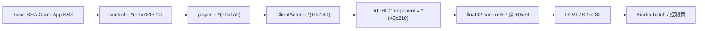
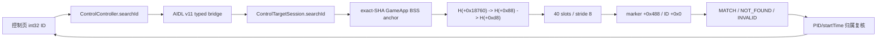

# MINIX 功能解锁、FAKE_FLIGHT、SearchID 与 LIFE_STATE 接入报告

> 分析日期：2026-08-17
> 工具链：radare2 6.1.8、Gradle/AGP 9.1.1、Android NDK 28、ADB、UI Automator、apksigner 37.0.0
> 结论：控制面板的运行失败锁死与档案加载时序已修复；FAKE_FLIGHT 已接入当前版本档案并完成真机指令双向回读；SearchID 已通过 AIDL v11 接入控制页固定 40 槽只读扫描；LIFE_STATE 已恢复为当前 exact-SHA GameApp 的 `AttrHPComponent` 当前生命值并进入生产字段档案。HITBOX 的旧 worker 100 槽语义已闭合但当前全实体集合映射继续门禁；SetheadSpeed 已收敛为明确的 `production_ready=false` 配方。

> 当前架构：控制实现统一位于 `me.dartcv.minix.control`，通过固定证书、`android:sharedUserId`、同 Linux UID、普通非导出 `:control` Service 和 AIDL v11/Binder 传输；身份与 maps/SO 指纹门禁在每次 native 操作前后复核。详见 [`2026-08-18_架构-Control传输说明-report.md`](2026-08-18_架构-Control传输说明-report.md) 与 [`README.md`](README.md)。

## 1. 范围与结果

原功能解锁 Scope 见 [`scope.md`](../work/minix-feature-unlock-20260817/scope.md)，SearchID UI Scope 见 [`scope.md`](../work/searchid-ui-20260817/scope.md)，LIFE_STATE Scope 见 [`scope.md`](../work/life-state-recovery-20260817/scope.md)。范围是本地项目、用户提供的精确 SO 和 Android 真机；本轮静态恢复未使用网络、虚拟机或 logcat，也未执行联机房间与多人同步测试。新构建完成时 ADB 设备列表为空，因此 LIFE_STATE 与 SearchID 的设备取证紧随重新连接执行。

| 项目 | 结果 |
|---|---|
| 项目 | `D:\Projects\minix` |
| GameApp SHA-256 | `D8EFE55C37B061CE41CB3830EC743401138BF40B8BACF251F18F7B026BF0140E` |
| 设备 | `3B15AR005R800000`，Android API 36，arm64-v8a |
| 身份 | 游戏与 MINIX 均为 UID `10552` |
| 注入档案 | `miniworld-1.58.2-arm64-injection-direct-v4` |
| 单元测试 | `34 suites / 252 tests / 0 failures / 0 errors` |
| Debug APK | `58850243` bytes，SHA-256 `898627CE1E88177C597E8E1A7E34C023E179B215ED7C1F95557006E5FC13FDAD` |
| Release APK | `42748032` bytes，SHA-256 `7E6ED32AE96F34783E4F471B48943ACEFC69E5357411D5ED41F1BF2BA6BD4171` |
| 签名 | 当前 clean 产物为 v2-only、单 signer，证书 SHA-256 `A40DA80A59D170CAA950CF15C18C454D47A39B26989D8B640ECD745BA71BF5DC` |

### 1.1 身份与命名解释

本报告的“控制服务”指 `:control` 进程中的普通 `android.app.Service`，其 Manifest 为 `android:exported="false"`，调用方式是显式 `bindService()` + AIDL/Binder。证书 signer、`sharedUserId` 和 PackageManager 分配的同一 Linux UID共同构成身份条件；APK Signature Scheme v2/v3 只描述签名封装，不单独创建 shared UID。当前源码、AIDL、JNI 导出和文档统一采用 `Control*` / `ProcControl*` 术语。

## 2. Evidence → Finding → Path

### 2.1 Evidence

| E-id | source_ref | content_hash | 观察与复现 |
|---|---|---|---|
| E-001 | `D:\Projects\bingxi\work\fakeflight_candidates_20260817.txt` | `6F7815D56E30066B02D9379C968F0D8560CBECB8A9CE8D7B99AF6869BDFB98DC` | `r2 -q -e scr.color=false -c "pd 80 @ 0x052e1360;pxw 20 @ 0x052e13f0;q" D:\Projects\bingxi\liblibGameApp.so` |
| E-002 | [`fake-flight-recovery-20260817/README.md`](../work/fake-flight-recovery-20260817/README.md) | `CD192DAAA52C87499A763B9767DA280525DC77A95B67B3B3C455949D9A094D2C` | 记录两个重复 word 候选的控制流判别和闭合补丁配方 |
| E-003 | [`gameapp-static-check-20260817/README.md`](../work/gameapp-static-check-20260817/README.md) | `C79A65A2C5DECF9BCC6DC7AC21EB2AC5EBD0018D327F38CA1BECE6955C0B1A12` | 独立复核 exact SHA、RVA、宽度、映射、expected/desired 与 native guard；结构化结果哈希为 `A6B5CE11A59E1D9C6538BB8C2E2920FF7E0A5E37042E5C3332604D7037AB52F7` |
| E-004 | [`build-validation.txt`](../work/minix-feature-unlock-20260817/build-validation.txt) | `2022C117631874F2DFDB69A0435AB92BB500E5C7C12B484333D4758FF487EBC2` | 运行 Gradle 单测、native 构建、APK 构建与 apksigner 校验 |
| E-005 | [`runtime-validation.txt`](../work/minix-feature-unlock-20260817/runtime-validation.txt) | `9984AEA09E0AE54C6517614EFC8EB41653A62AA83E46DDAD41D83C3E3875381A` | 记录 UID、PID、load bias、VA、双向指令字和控制面板结果；可用 `run-as me.dartcv.minix od ... /proc/28779/mem` 重现 |
| E-006 | [`minix-fake-on.xml`](../work/minix-fake-on.xml)、[`minix-fake-off.xml`](../work/minix-fake-off.xml)、[`minix-data-values.xml`](../work/minix-data-values.xml) | `5DDDA57A326ACA911DEF0C0EE4237FB5FF0374F14C73A832240585A70952B593`、`D1DFFD71804AAF9BE2064F9BFE0F4DA0C787DD6B92D499C71359A078CC773399`、`AB80A20FD05A2BE2FA2237EF1280B52684E6D411C640D95BFFDD198C25899AF2` | UI Automator 分别证明 FAKE_FLIGHT checked 往返、数据字段实读和证据门禁控件状态 |
| E-007 | [`minix-control-verified.png`](../work/minix-control-verified.png) | `2FF77F8B7BC5BA3813BA895ABFB3DA4EB8E86D806C21BEA90E219B2245394B39` | 设备端 screencap 可视化确认 KILL_COUNT、GetDataLong(1)、LIFE_STATE 档案状态与待闭合控件 |
| E-008 | [`searchid-ui-20260817/README.md`](../work/searchid-ui-20260817/README.md)、[`build-validation.txt`](../work/searchid-ui-20260817/build-validation.txt) | `E2D0009F787B69654A65E3DE86C5FBC287EF4835B701BCE9FE2DD55DBF39FFDC`、`501437BC70C55EDE94FB8754A79DD434A116A86F5732EFC2F44210498091A3AE` | SearchID 原始逆向证据、生产 profile、AIDL v11、Controller/UI 接线，以及含 LIFE_STATE/HITBOX 门禁文案的当前源码 249 项测试、lint、Debug/Release 和签名验收 |
| E-009 | [`production-hitbox-recipe.md`](../work/hitbox-recovery-20260817/production-hitbox-recipe.md)、[`verification-result.json`](../work/hitbox-recovery-20260817/verification-result.json) | `5587655E482CEAD0EFEBE545BC2908AC8F68DC97AF32E336BB5C8EA14D17CBAA`、`16697DD578A12B381DB4A9A0364E1D7D99EE056577B23C0450B6A528BEE7EAAA` | HITBOX 本地玩家链和旧 worker 固定 100 槽、stride 8、`B+0x1CC50/+0x1CC74` gates、marker、三轴 writer 与控制码均已闭合；39 项静态校验全通过，当前 exact-SHA FULL_ENTITY_SET 仍 fail-close |
| E-010 | [`aim_control_recovery_continued_20260817.md`](../work/aim-direct-recovery-20260817/aim_control_recovery_continued_20260817.md)、[`aim_candidate_recipe_20260817.json`](../work/aim-direct-recovery-20260817/aim_candidate_recipe_20260817.json) | `B2B86AA5CEBD0CDFBA6584B534810CAF8801062CC2CBC869E37B62397E57E2D6`、`62F89DEAC4EFF1F7FD9B75603A5496167031F0798E80F9BDD931089A3367A642` | AIM 的 40 槽候选链、状态/本地身份过滤和 JNI 本地配置已闭合；最终 GameApp writer、宽度、目标值和回读仍缺失 |
| E-011 | [`production-draw-recipe.md`](../work/draw-recovery-20260817/production-draw-recipe.md)、[`production-draw-recipe.json`](../work/draw-recovery-20260817/production-draw-recipe.json) | `34260ED1F71E2AC6B0FC15FE9E89F358466A5F153375B5D896D081C979149934`、`DE035D9FF6A260293EA81DC3AA897C73883112E8E4A3266E2353B5B8685836D1` | DRAW 的实体表、字段、矩阵链、W 分量和九字段文本协议已闭合；循环边界、完整投影/框体/距离公式及 health/zy/name 映射仍缺失 |
| E-012 | [`production-life-state-recipe.md`](../work/life-state-recovery-20260817/production-life-state-recipe.md)、[`verification-result.json`](../work/life-state-recovery-20260817/verification-result.json) | `28AB2266C7EC23178CABC70FBDA6E787E53F9D2B6D4D64055927114110CFB0B7`、`3E30E146CE10F3CA7F4D86D6D1F28C66546B86131A1760FB7B7BD34476F1915F` | exact-SHA 双 SO、原 JNI selector 2 的 float32/`FCVTZS` 语义、当前 PlayerControl/ClientActor/AttrHPComponent 链、RTTI、构造默认值和最终 getter 共 13 项静态检查全通过 |
| E-013 | [`HEADSPEED_RECOVERY_REPORT.md`](../work/headspeed-recovery-20260817/HEADSPEED_RECOVERY_REPORT.md)、[`HEADSPEED_RECIPE_NOT_READY.json`](../work/headspeed-recovery-20260817/HEADSPEED_RECIPE_NOT_READY.json) | `B0DF526046272ADF959513697F71B623C24D035F9C91DF25F1EDB19EAE37FD8F`、`1981DB0CCB96EFD6A392075891FEF62902E7C1689C2283764DF7109270AD83AA` | SetheadSpeed 的 delay setter/唯一 consumer、旧 resolver 轴字段、角度算法、前置指令写与 worker launcher 已闭合；selector、停用/恢复和 UI 参数仍缺，因此机器清单保持 `production_ready=false` |
| E-014 | [`2026-08-18_架构-Control传输说明-report.md`](2026-08-18_架构-Control传输说明-report.md)、[`../app/src/main/java/me/dartcv/minix/transport/TransportPolicy.kt`](../app/src/main/java/me/dartcv/minix/transport/TransportPolicy.kt) | `6AC0F1BC056D2E0F7134D0B457096C89C0667C5E9CC434E8D238205367005D5D`、`B214B56FAB57DD927B6C9820B58BD9416650F42EACF7F43137F25F5EEA3071A5` | Control 命名空间与 AIDL v11 迁移、证书/shared UID/Binder 单通道策略；历史构建快照保留在原始证据中，当前 clean 矩阵与产物哈希见 `codex.md` §0.1 |
| E-015 | [`../work/feature-readiness-audit-20260818.json`](../work/feature-readiness-audit-20260818.json) | `718685E9D64975732E6DF2C7E283DF257322895A5ECB31585C735A8BCFE42AFF` | 统一静态审计确认 head_spin 为最接近闭合候选，但 selector、生命周期、恢复字、轴快照和 UI 契约六门槛仍未闭合；AIM/DRAW 继续 evidence-gated |

### 2.2 Findings

| F-id | severity | evidence_ids | confidence | location | status | 结论 |
|---|---|---|---|---|---|---|
| F-001 | n/a_re | E-004, E-005 | high | `ControlController.kt`、`ControlBridgeClient.kt`、`MinixApp.kt` | validated | 运行时失败曾被 UI/Controller 双层门禁当成永久阻断；目标过早打开后又只读旧快照，导致注入功能长期不进入 `supportedFeatures`。现已允许完整重试，并对暂态档案独立重探。 |
| F-002 | n/a_re | E-001, E-002, E-003 | high | `liblibGameApp.so+0x052e13f8` | validated | 当前精确 SO 的 FAKE_FLIGHT 唯一写点为 RVA `0x052e13f8`；关闭值 `0x39449269`，开启值 `0xd503201f`，宽度 U32，映射要求 executable。 |
| F-003 | n/a_re | E-004, E-005, E-006 | high | `ControlInjection.kt`、`ControlTargetSession.kt`、native compare/write 后端 | validated | UI 开启后字节从 `69 92 44 39` 变为 `1f 20 03 d5`，关闭后完整恢复；PID `28779` 与 startTime `1231376` 全程不变。 |
| F-004 | n/a_re | E-005, E-006, E-007 | high | 控制面板 | validated | 飞行、模拟飞行、防闪、数据读取开关均为 enabled；数据读取返回 KILL_COUNT=`0`、GetDataLong(1)=`0xf547c994f5e`；玩家三轴输入和应用按钮为 enabled。 |
| F-005 | n/a_re | E-003, E-005 | high | 跨进程 AArch64 执行段写入 | accepted_risk | 字节回读证明内存写链成立，但当前链没有目标进程 I-cache 刷新握手；实际移动语义仍需人工对局观察。 |
| F-006 | n/a_re | E-008 | high | `ControlSearchId.kt`、`IControlBridge.aidl`、`ControlController.kt`、`MinixApp.kt` | validated_static | SearchID 已闭合为 exact-SHA BSS anchor、`0x18760 -> 0x88 -> 0xd8` 与 40 槽只读扫描；AIDL payload、int32 输入、PID/startTime 归属、命中/未命中/typed 失败及生命周期清理均有测试。 |
| F-007 | n/a_re | E-009 | high | GameApp `0x03EF3EC8`、legacy worker `0x593AE4..0x596A28` | evidence_gated | HITBOX 本地玩家链及旧 worker 的 `0..99` 固定槽循环、identity/marker gates 与三轴 writer 已闭合；`w14=0/6` 是 accepted/skip 控制码。当前 exact-SHA GameApp 全实体集合到旧表/handle 模型的唯一映射与对象生命周期仍缺，因此 UI 继续 fail-close。 |
| F-008 | n/a_re | E-010 | high | AIM worker `0x5F321C..0x6229E0` | evidence_gated | AIM 与 SearchID 共用 exact 40 槽候选链；`candidate+0x488` 必须等于 `100.0f` 且 `candidate+0x24` 必须不同于 `B+0x1CC74`。现有可见写点均为 libClient 本地配置，不能当作 GameApp writer。 |
| F-009 | n/a_re | E-011 | high | DRAW worker `0x623BA0+0xEC04` | evidence_gated | DRAW 已闭合 `candidate+0x14/+0x18/+0x1C` 坐标、`+0x24/+0x28/+0x488` 元数据、矩阵链和九字段 wire shape；SearchID 的 40 槽边界不能替代 DRAW 自身尚未恢复的迭代/过滤证据。 |
| F-010 | n/a_re | E-012 | high | GameApp `ClientActor+0x210 -> AttrHPComponent+0x38` | validated_static | LIFE_STATE 的存储值是 mutable float32 current HP；当前地址链为 `*(BSS+0x781370) -> *(+0x1a0) -> *(+0x140) -> *(+0x210) -> +0x38`，并按原 JNI `FCVTZS` 向零截断为 signed int32。旧 masked-H seed 仅保留作语义证据，不进入生产路径。 |
| F-011 | n/a_re | E-013 | high | libClient `0x58918c` / worker `0x589698` | evidence_gated | SetheadSpeed 写入的是 `input*10` 微秒循环延时；worker 每轮将两个 float 轴加 `1.0` 并对 `361.0` 取模。由于唯一 commonFunction selector、关闭线程、前置指令恢复、轴原值恢复和 UI 参数未闭合，本轮不创建生产功能。 |

### 2.3 Path

#### P-001：FAKE_FLIGHT 调用与验证路径

- path_type: `callflow`
- start: 控制面板“模拟飞行”开关
- goal: 当前进程执行段指令受控切换并可恢复
- steps:
  1. UI 仅在目标四元身份和 `supportedFeatures` 命中时开放开关 — evidence: E-005/E-006 — finding: F-001
  2. v4 档案以 GameApp exact SHA 解析 `loadBias + 0x052e13f8` — evidence: E-001/E-002 — finding: F-002
  3. 会话预读 U32，只接受 disabled/enabled 中与操作方向一致的 expected word — evidence: E-003/E-004 — finding: F-003
  4. native 后端确认 readable+executable 映射、4 字节对齐和 PID/startTime，再执行 guarded compare/write 与回读 — evidence: E-003 — finding: F-003
  5. UI 重新读取服务端功能状态；开启显示 checked，关闭恢复原指令并显示 unchecked — evidence: E-005/E-006 — finding: F-003
- residual_risks: 实际运动效果与 I-cache 可见性由人工对局验收；字节验证不替代该观察。


#### P-002：LIFE_STATE typed 读取路径

- path_type: `dataflow`
- start: 控制页“数据读取”开关与字段刷新
- goal: 读取当前玩家 HP，并保持原 APK selector 2 的 int32 返回语义
- steps:
  1. exact-SHA GameApp profile 解析唯一匿名 BSS anchor，并绑定 PID/UID/startTime — evidence: E-012 — finding: F-010
  2. 以 pointer64 顺序解引用 `BSS+0x781370`、`+0x1a0`、`+0x140`、`+0x210` — evidence: E-012 — finding: F-010
  3. 从 `AttrHPComponent+0x38` 只读四字节 float32；任一零指针、短读、映射错误或身份变化均返回 typed failure — evidence: E-012 — finding: F-010
  4. 按原 JNI `FCVTZS` 语义向零截断为 signed int32，经 Binder 批次回传并显示 — evidence: E-012 — finding: F-010
- residual_risks: 静态配方与解码已闭合；正常 HP、受伤变化和归零表现等待设备端复核。



## 3. 实现变更

1. `ControlInjection.kt` 将生产档案升级为 v4，并加入 FAKE_FLIGHT 的 executable U32 配方。
2. `MinixApp.kt` 把 FAKE_FLIGHT 移入“可用功能”，增加档案就绪、运行时失败可重试和执行段补丁说明。
3. `ControlController.kt` 对 `MODULE_NOT_FOUND`、`FINGERPRINT_UNAVAILABLE` 等暂态状态持续重探；数据档案先就绪不再阻止注入档案刷新。
4. 同进程 maps 刷新保留功能状态，Binder 客户端在字段刷新后重读开关、支持集合、身份和档案元数据。
5. 新增 FAKE_FLIGHT 开启/关闭双向 expected-word、写后回读、executable 映射和 UI 排序测试。
6. AIDL 协议升级至 v11，增加 SearchID 命令和完整 typed 结果；Binder 客户端验证请求 ID、布尔值、状态、槽位、失败原因与 startTime 的一致性。
7. `ControlController` 增加 SearchID 前置门禁和 PID/startTime 归属；Compose 控制页增加 int32 输入、“扫描 40 槽”按钮及三类结果展示。
8. 新增 Controller、桥接 decoder、UI 纯函数和 Control 传输策略测试；当前为 `34 suites / 252 tests / 0 failures / 0 errors`；最后一项覆盖扫描期间目标身份变化时清除旧命中结果，并将矛盾 Binder payload 映射为 `INVALID_RESPONSE`。
9. `ControlAddressRecipes.kt` 与 `ControlReadOnlyFieldProfiles.kt` 新增 LIFE_STATE pointer64 配方和 `FLOAT32_TRUNCATE_TOWARD_ZERO` 解码；地址 recipe、profile 完整性、零指针、身份变化和 float32 截断均有单元测试。
10. SetheadSpeed 仅新增静态证据与机器可读 `NOT_READY` 清单；未修改 production feature map、AIDL、Service 或 native 写路径。
11. 2026-08-18 将 UI/ViewModel/Action 的 Control 回调和轮询入口迁移为 Control 命名；`TransportPolicy` 固定证书/shared UID/Binder 通道，AIDL、Service 与 JNI 导出同步使用 Control 命名。
12. 2026-08-18 新增 `work/feature-readiness-audit-20260818.json`，统一记录 head_spin、DRAW、AIM 的 exact-SHA 就绪度；三项均未加入 `supportedFeatures`，并为 head_spin 固定五步静态闭合顺序。

## 4. 复现

```powershell
Set-Location 'D:\Projects\minix'

.\gradlew.bat :app:testDebugUnitTest --console=plain
.\gradlew.bat :app:externalNativeBuildDebug :app:assembleDebug --console=plain

adb -s 3B15AR005R800000 install -r `
  'D:\Projects\minix\app\build\outputs\apk\debug\app-debug.apk'

adb -s 3B15AR005R800000 shell cmd package list packages -U
adb -s 3B15AR005R800000 shell run-as me.dartcv.minix `
  od -An -tx1 -N 4 -j 494895424504 /proc/28779/mem
```

开启时应读到 `1f 20 03 d5`，关闭时应恢复 `69 92 44 39`。若游戏重启，先从新 PID 的 offset-zero GameApp 映射重新计算 load bias 和运行 VA，旧 PID/VA 不复用。

## 5. 人工验收项

- 在实际对局中观察 FAKE_FLIGHT 对 movement gate 的效果，并记录目标状态、触发顺序和关闭恢复表现。
- 如效果未立即生效，优先核对 AArch64 I-cache 可见性，而不是更换已经由 CFG 唯一化的 RVA。
- AIM 的 40 槽候选/过滤已闭合但最终 writer 未唯一化；DRAW 同样保持不可操作。HITBOX 已闭合本地玩家链与旧 worker 100 槽/gates/writer，但当前 exact-SHA FULL_ENTITY_SET 映射和生命周期尚未唯一化，公开开关继续 evidence-gated。
- LIFE_STATE 已进入当前字段档案；ADB 重连后分别保存正常 HP、受伤后的递减值与归零状态，核对其 int32 值和界面刷新。

## 6. SearchID 接入结果

### 6.1 调用链



生产 profile 只在 GameApp SHA-256 等于 `D8EFE55C37B061CE41CB3830EC743401138BF40B8BACF251F18F7B026BF0140E` 时生效。候选对象必须先满足 `candidate+0x488` 的 u32 bits 为 `0x42c80000`，之后才读取 `candidate+0x0` 的 int32 ID。resolver 或标量读取任一步失败都保留为 typed `INVALID`，不会降级成 `NOT_FOUND`。

### 6.2 静态验收

- int32 最小值、最大值、0、上下溢出和非法字符串均有 UI 纯函数测试。
- 按钮要求连接 READY、目标 UID 与 Service UID 相同、PID/startTime 非空、native memory-ready。
- Binder 返回请求 ID 不一致、未知状态、越界槽位、布尔值与 typed 状态矛盾或失败原因形状错误时统一转为受控 invalid response。
- Controller 命中结果显示 1-based 槽位；未命中保留扫描结果；目标进程退出、切换、关闭或断连时清除旧结果。
- `testDebugUnitTest`、arm64 native、Debug/Release APK、`lintDebug` 和 Release lint vital 均通过；当前 clean 的两个 APK 都是 v2-only、单 signer。

设备重新连接后执行：

```powershell
adb -s 3B15AR005R800000 install -r `
  'D:\Projects\minix\app\build\outputs\apk\debug\app-debug.apk'
adb -s 3B15AR005R800000 shell pm list packages -U | `
  Select-String 'me.dartcv.minix|com.minitech.miniworld'
adb -s 3B15AR005R800000 shell uiautomator dump /sdcard/minix-searchid.xml
adb -s 3B15AR005R800000 pull /sdcard/minix-searchid.xml `
  'D:\Projects\minix\work\searchid-ui-20260817\minix-searchid.xml'
```

先用任意 int32 记录 `NOT_FOUND` 或 typed failure；取得实际房间中的有效 ID 后再记录 `MATCH` 和槽位。该多人房间效果项保留给人工验证。
