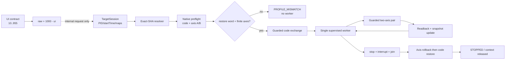
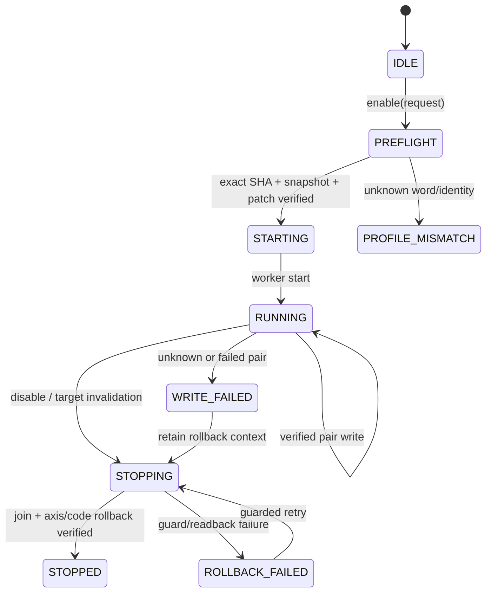

# TARGET_APP `head_spin` 内部 gated 实现报告

> 生成日期：2026-08-18（Asia/Shanghai）  
> 工作区：`D:/Projects/minix`  
> 范围：固定样本的静态恢复、内部控制器、native 适配器和构建验证。

## 0. 结论先行

- `production_ready=false`：当前实现是内部 gated controller，不属于公开功能。
- `ControlFeature`、AIDL/Binder public feature list、`supportedFeatures` 和 Compose UI 均未加入 `head_spin`。
- 静态恢复、生命周期 fixture、native conversion fixture、native batch 静态契约、lint、arm64 native build 和 Debug/Release assemble 已通过。
- target-side native/runtime identity 行为与设备验证仍为 pending；本报告不把静态构建结果当作运行时验收。

## 1. Evidence → Finding → Path

| Evidence | Finding | Path |
|---|---|---|
| formal selector scan（SHA-256 `0193AF8FDD0D1906566C4E26FED47CED034F5F07007A09DA2500DEA05CA07247`） | 正式域 `[1,101] × {0,1}` 仅 selector `17` 到达恢复出的 worker；selector `18` 保持独立 | [`../work/headspeed-recovery-20260817/selector-scan-20260818/formal_1_101_both.json`](../work/headspeed-recovery-20260817/selector-scan-20260818/formal_1_101_both.json) |
| lifecycle CFG（SHA-256 `FF8B863E0723E58D0DA5109E0818B62666D83CEE36968D0A82EBFB482F8C5AB9`） | 原 detached worker 的重复启用/停用边界不作为 MINIX 运行时入口 | [`../work/headspeed-recovery-20260817/headspin_lifecycle_cfg.json`](../work/headspeed-recovery-20260817/headspin_lifecycle_cfg.json) |
| prepatch restore（SHA-256 `E14BD24030966A5457970E773FC3E2A18EC7A4F5AEA1127D82096B83C8F045B8`） | exact-SHA 代码恢复字固定为 `0x72a80bea`，启用字为 `0xb9005909` | [`../work/headspeed-recovery-20260817/headspin_prepatch_restore.json`](../work/headspeed-recovery-20260817/headspin_prepatch_restore.json) |
| axis snapshot（SHA-256 `5A5B215D92B56D61C4A76E939E6F469EA6113CEB2793CD1819C707243363F5DA`） | 两个 float 轴均有原值/最近验证值，partial pair 可补偿回滚 | [`../work/headspeed-recovery-20260817/headspin_axis_snapshot.json`](../work/headspeed-recovery-20260817/headspin_axis_snapshot.json) |
| UI contract（SHA-256 `29C22F8FB14F452CE3C93189E28403EDFD539C08169EEF1934CBE362E61F2F7A`） | 进度范围 `10..955`、`raw=1000-ui`，selector 17/18 source split 可重复 | [`../work/headspeed-recovery-20260817/headspin_ui_contract.json`](../work/headspeed-recovery-20260817/headspin_ui_contract.json) |
| native batch contract check（8/8 invariants） | C++ loop 的 error paths 均保留 `completedCount=index`；8 个 error 状态均被覆盖 | [`../work/headspeed-recovery-20260817/headspin_native_batch_contract_check.json`](../work/headspeed-recovery-20260817/headspin_native_batch_contract_check.json) |
| Kotlin supervisor + adapter fixtures | 12 个 supervisor 测试、7 个 native conversion 测试通过，未知 after 不会被伪造 | [`../work/headspeed-recovery-20260817/headspin_minix_verification.json`](../work/headspeed-recovery-20260817/headspin_minix_verification.json) |
| public-surface audit | 公共 enum、AIDL、Binder、supported set、Compose feature list 均没有 `head_spin` | [`../work/feature-readiness-audit-20260818.json`](../work/feature-readiness-audit-20260818.json) |
| public-surface static check（5 files / 0 hits） | ControlModels、AIDL、ControlInjection、BridgeClient、Compose feature list 均不含 `head_spin` | [`../work/headspeed-recovery-20260817/headspin_public_surface_check.json`](../work/headspeed-recovery-20260817/headspin_public_surface_check.json) |

## 2. 静态恢复结果

### 2.1 固定身份

| 项目 | 值 |
|---|---|
| `CLIENT_MODULE` SHA-256 | `0e83d59aea5b32e45704068b2e35390bedb431891a56a9a5cccd357e5b17f13b` |
| `TARGET_MODULE` SHA-256 | `d8efe55c37b061ce41cb3830ec743401138bf40b8bacf251f18f7b026bf0140e` |
| ABI | `arm64-v8a` |
| selector | `17`（character/head source） |
| 独立 selector | `18`（crosshair source，不并入本实现） |

### 2.2 地址、算法和 patch

```text
H(0x000de990) -> +0x38 -> +0x08 -> +0x50
axis A = +0x54 (float32 raw bits)
axis B = +0x58 (float32 raw bits)
angle' = fmod(angle + 1.0f, 361.0f)
delay = raw_input * 10 microseconds
patch RVA = 0x037b220c
restore word = 0x72a80bea
patched word = 0xb9005909
```

地址解析要求：目标 PID、`startTimeTicks`、maps fingerprint、module SHA/load base 必须在同一次 session 内一致；任一字段变化会使写入路径进入 fail-closed 状态。

## 3. MINIX 内部实现

### 3.1 Supervisor

`app/src/main/java/me/dartcv/minix/control/HeadSpin.kt` 提供：

- `ControlHeadSpinExactShaTargetResolver`：唯一 module + exact SHA + 映射边界校验。
- `ControlHeadSpinSupervisor`：单 worker、重复 enable 幂等、可中断 stop/join、写入 gate 和 generation 绑定。
- `ControlHeadSpinAxisSnapshot`：记录原始轴值及每次成功回读值。
- `CodePatchOwnership` 三态：`NOT_APPLIED`、`APPLIED`、`UNCERTAIN`。
- 未知 code after、异常或身份不匹配时保留 rollback context；不会用 expected 值冒充 after。
- native rollback 返回 `PROFILE_MISMATCH` 但明确 observed 为 restore word 时，按“已恢复”处理；这只在 rollback 分支生效。

### 3.2 Native adapter

`app/src/main/java/me/dartcv/minix/control/ControlHeadSpinNativeBackend.kt` 复用 `TargetNativeProbe` 的 scoped maps u32 batch：

1. preflight 读取 executable code word 与两个 writable axis。
2. guarded code-word exchange。
3. guarded two-axis exchange。
4. `completedCount`/`failedIndex`/`observedValueBits` 转换为 typed Kotlin result。
5. partial pair 只确认 native 明确完成的轴；未观测 after 保持 `null`，由 supervisor 保留回滚责任。

底层 C++ 适配器源为 `app/src/main/cpp/target_native_probe.cpp`。静态脚本 `tools/verify_headspin_native_batch_contract.ps1` 验证循环前不变量和所有错误状态覆盖。

### 3.3 生命周期接点

`ControlTargetSession` 只为内部请求组装一次性 target identity；`ControlService` 在 target close、invalidation、anti-flash teardown 和 service destroy 路径调用停止/回滚 helper。该实例没有 Binder 方法，也没有加入 feature catalog。

## 4. UI 契约

契约文件：[`headspin_ui_contract.md`](../work/headspeed-recovery-20260817/headspin_ui_contract.md)

- UI progress：`10..955`。
- wire 变换：`raw_input = 1000 - ui_progress`。
- 默认显示 `955`，raw 默认 `0`；supervisor 内部仍使用有界 raw interval。
- `CharacterRotation_speed`/“头部旋转”保持 selector `17`；`HeadRotation_speed`/“准心旋转”保持 selector `18`。
- UI 契约不等于公开 UI 接线；当前 Compose feature list 不包含该功能。

## 5. 错误与回滚语义

| 场景 | 记录方式 | 后续动作 |
|---|---|---|
| code write 明确回读 patched word | `APPLIED` | 启动 worker |
| code write before/after 明确为 restore word | `NOT_APPLIED` | 丢弃临时 context |
| after 缺失、异常或身份不匹配 | `UNCERTAIN` | 禁止新 enable，保留 context，等待 guarded rollback |
| partial pair（仅 A 完成） | `appliedA=true, appliedB=false` | 先补偿 A，再处理 code restore |
| rollback guard 命中原字且 observed=restore | `PROFILE_MISMATCH` + observed restore | 标记已恢复并释放 context |
| maps/startTime 改变 | `TARGET_CHANGED` | 停止 worker，阻断旧 snapshot 写回 |

## 6. 可复现验证

以下命令均在 `D:/Projects/minix` 执行：

```powershell
.\gradlew.bat :app:testDebugUnitTest --no-daemon
.\gradlew.bat :app:testDebugUnitTest --tests me.dartcv.minix.control.HeadSpinTest --tests me.dartcv.minix.control.HeadSpinNativeBackendTest --no-daemon
powershell -ExecutionPolicy Bypass -File .\tools\verify_headspin_native_batch_contract.ps1
.\gradlew.bat :app:lintDebug --no-daemon
.\gradlew.bat :app:externalNativeBuildDebug --no-daemon
.\gradlew.bat :app:assembleDebug :app:assembleRelease --no-daemon
```

最终结果：

| 检查 | 结果 |
|---|---|
| 全量 JVM 单测 | 36 suites / 271 tests / 0 failures / 0 errors / 0 skipped |
| HeadSpin fixtures | supervisor 12 + adapter conversion 7，全部通过 |
| native batch 静态契约 | 8/8 completed-count invariants，PASS |
| public-surface static check | 5 files / 0 `head_spin` hits，PASS |
| lint | PASS，0 errors，15 warnings（既有依赖/版本提示） |
| external native build | PASS，`arm64-v8a` |
| assemble | PASS，Debug/Release |

最终 APK 工件：

| 工件 | 大小 | SHA-256 |
|---|---:|---|
| `app/build/outputs/apk/debug/app-debug.apk` | 59,731,142 | `290F1272CE6E90CCABF2412983861D422383ADC6399B55641DB88296B1B7662B` |
| `app/build/outputs/apk/release/app-release.apk` | 42,829,952 | `9B7006927CD45236486E52ECF3EEF3BF4522860BEA878A494DA337BE2F20C768` |

## 7. 数据流与生命周期图





## 8. 剩余门禁与下一步

1. 采集 `TARGET_APP` 侧 native batch 的真实响应 fixture，覆盖 preflight、guard mismatch、partial pair、verify failure 和 rollback。
2. 在可控 target fixture 上验证 PID/startTime/maps generation 变化时的 fail-closed 行为；设备验证结果单独记录，不回写成静态通过。
3. 只有 `HEAD_G_NATIVE_RUNTIME` 关闭后，才重新评估是否需要版本化 AIDL/UI schema；在此之前保持 public surface 关闭。

## 9. 相关文件

- [`../app/src/main/java/me/dartcv/minix/control/HeadSpin.kt`](../app/src/main/java/me/dartcv/minix/control/HeadSpin.kt)
- [`../app/src/main/java/me/dartcv/minix/control/ControlHeadSpinNativeBackend.kt`](../app/src/main/java/me/dartcv/minix/control/ControlHeadSpinNativeBackend.kt)
- [`../app/src/test/java/me/dartcv/minix/control/HeadSpinTest.kt`](../app/src/test/java/me/dartcv/minix/control/HeadSpinTest.kt)
- [`../app/src/test/java/me/dartcv/minix/control/HeadSpinNativeBackendTest.kt`](../app/src/test/java/me/dartcv/minix/control/HeadSpinNativeBackendTest.kt)
- [`../tools/verify_headspin_native_batch_contract.ps1`](../tools/verify_headspin_native_batch_contract.ps1)
- [`../tools/verify_headspin_public_surface.ps1`](../tools/verify_headspin_public_surface.ps1)
- [`../work/headspeed-recovery-20260817/HEADSPIN_MINIX_IMPLEMENTATION_DESIGN.md`](../work/headspeed-recovery-20260817/HEADSPIN_MINIX_IMPLEMENTATION_DESIGN.md)
- [`../work/headspeed-recovery-20260817/headspin_minix_verification.json`](../work/headspeed-recovery-20260817/headspin_minix_verification.json)
- [`../work/feature-readiness-audit-20260818.json`](../work/feature-readiness-audit-20260818.json)
