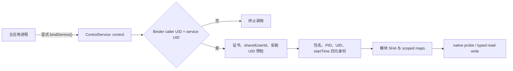

# Control 传输架构说明

> **生效日期：** 2026-08-18
> **适用项目：** [`D:/Projects/minix`](../)
> **状态：** 当前生效

## 结论

MINIX 使用一条证书绑定、`android:sharedUserId`、安装 UID 校验和普通 Binder Service 组成的本地控制链。控制实现统一位于 `me.dartcv.minix.control`，服务组件为 `ControlService`，AIDL 接口为 `me.dartcv.minix.control.IControlBridge`，协议版本为 v11。

目标访问由 `:control` 进程中的非导出 `android.app.Service` 承载。服务和客户端同时校验调用 UID、目标包身份、PID、进程启动时间、模块完整 SHA-256 与 scoped maps 指纹，然后执行 typed read/write 或功能 worker。

## 身份与边界

| 关注点 | 当前事实 |
|---|---|
| 包身份 | 活动 signer SHA-256 为 `A40DA80A59D170CAA950CF15C18C454D47A39B26989D8B640ECD745BA71BF5DC` |
| shared UID | 两包声明 `android:sharedUserId="ca.sailboat.a"`，安装后由 PackageManager 分配 UID |
| IPC | `android:exported="false"`、`android:process=":control"` 的普通 Service + `IControlBridge` |
| 协议 | v11；方法顺序和 JSON 字段保持原有 wire 形状，descriptor/package 迁移后旧客户端进入版本失配 |
| native 边界 | 仅在目标身份、模块指纹和 maps 身份完整时执行受保护的 probe 与 typed 事务 |
| 网络面 | Manifest 不声明网络权限，配置与报告均为本地文件 |

## 组件路径

| 组件 | 当前路径 |
|---|---|
| Service | `app/src/main/java/me/dartcv/minix/control/ControlService.kt` |
| Binder 客户端 | `app/src/main/java/me/dartcv/minix/control/ControlBridgeClient.kt` |
| 控制会话 | `app/src/main/java/me/dartcv/minix/control/ControlController.kt` |
| 目标会话 | `app/src/main/java/me/dartcv/minix/control/ControlTargetSession.kt` |
| AIDL | `app/src/main/aidl/me/dartcv/minix/control/IControlBridge.aidl` |
| Kotlin native adapter | `app/src/main/java/me/dartcv/minix/control/nativeadapter/TargetNativeProbe.kt` |
| C++ JNI probe | `app/src/main/cpp/target_native_probe.cpp` |

## 调用路径



1. `ControlBridgeClient` 通过显式 `ComponentName` 绑定 `ControlService`。
2. `ControlService` 的 Binder stub 核对 `Binder.getCallingUid()` 与自身 UID。
3. `ControlTargetSession` 锁定目标包、PID、effective UID、startTime 和 maps generation。
4. 任一身份或映射证据变化都会清空会话、停止 worker，并让下一次操作从预检开始。
5. Anti-flash、typed 字段读取、玩家位置和 SearchID 均经过同一会话门禁。

## 命名与协议迁移

本次重构一次性完成以下迁移：

- Java/Kotlin 实现统一位于 `me.dartcv.minix.control`。
- AIDL descriptor 统一为 `me.dartcv.minix.control.IControlBridge`。
- Service、Binder 客户端、控制会话、目标会话、功能引擎和测试均使用 `Control*` / `ProcControl*` 命名。
- 7 个 JNI 导出符号统一使用 `Java_me_dartcv_minix_control_nativeadapter_*`。
- 协议版本从 v10 升至 v11，旧 descriptor 客户端需要全量重编译。

方法顺序、功能 wire ID、shared UID、签名身份、`:control` 进程和 native 库名保持稳定。应用自身的 Service 与客户端随同一次安装更新。
## 验收清单

```powershell
Set-Location D:\Projects\minix
.\gradlew.bat :app:testDebugUnitTest :app:lintDebug :app:externalNativeBuildDebug --no-daemon
powershell -ExecutionPolicy Bypass -File .\tools\verify_headspin_native_batch_contract.ps1
powershell -ExecutionPolicy Bypass -File .\tools\verify_headspin_public_surface.ps1
```

另外核对：

- Manifest 指向 `.control.ControlService`，且 `exported=false`、`process=:control`。
- AIDL descriptor 为 `me.dartcv.minix.control.IControlBridge`。
- `llvm-nm`/`readelf` 可见 7 个 `Java_me_dartcv_minix_control_nativeadapter_*` 符号。
- clean build 生成的 DEX/APK 不含旧包路径或旧 descriptor。
- 单元测试、lint、native build 和 Debug/Release assemble 均通过。
