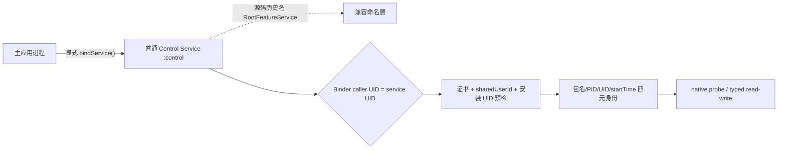

# Root 方案弃用说明与控制链命名迁移

> **生效日期：** 2026-08-18  
> **适用项目：** [`D:/Projects/minix`](../)  
> **状态：** Root 执行方案已弃用；本文记录命名迁移与运行边界。外层 UI/ViewModel/Action 已切换到 Control 语义，底层协议兼容面保持不变。

## 结论先行

MINIX 当前采用的是证书身份 + `android:sharedUserId` + 同 Linux UID + 普通 Binder 控制服务的 Android 应用模型。运行链路没有 Root shell、`su`、UID 0 服务、Magisk、Shizuku 或独立特权守护进程。目标访问在同 UID 条件下由 `:control` 进程中的非导出 `android.app.Service` 承载，并通过 AIDL/Binder 进行调用。

代码包路径、类名和 AIDL 全限定名中仍可见 `root` / `Root*`，这些字符串只承担历史兼容和证据追溯作用：它们不表示权限等级，也不应被解释成 Root 实现。后续新文档统一使用“控制服务”“控制桥”“控制会话”等术语。

| 关注点 | 当前事实 | 阅读旧文档时的解释 |
|---|---|---|
| 特权模型 | 普通应用进程；未启用 Root 能力 | `RootFeatureService` 是历史类名，不是 Root 服务 |
| 包身份 | 活动 signer SHA-256 为 `A40DA80A59D170CAA950CF15C18C454D47A39B26989D8B640ECD745BA71BF5DC` | 证书是 shared UID 的身份条件之一 |
| UID 关系 | 两包声明 `android:sharedUserId="ca.sailboat.a"`，由 PackageManager 分配同一 Linux UID | v3 只是 APK 签名封装，单独不产生 shared UID |
| IPC | `android:exported="false"` 的 `:control` Service + AIDL v10 + 普通 Binder | `IRootFeatureBridge` 是协议历史名称 |
| 目标访问 | 同 UID 下的受限 native probe、typed 读写和身份复核 | `/proc`/native 路径不等同于 Root 提权 |

## Evidence → Finding → Path

### Evidence

| E-id | 证据位置 | 可复核内容 |
|---|---|---|
| E-ROOT-001 | [`../codex.md`](../codex.md) §1.1、§3.1、§3.2 | 明确列出无 Root shell/`su`/UID 0 依赖，并记录证书、shared UID、普通 Service 与 Binder 关系 |
| E-ROOT-002 | [`2026-08-17_逆向移植-MINIX功能接线-report.md`](2026-08-17_逆向移植-MINIX功能接线-report.md) §1、§3 | 记录普通非导出 `:control` Service、AIDL v10、同 UID 门禁和当前证书指纹 |
| E-ROOT-003 | [`../app/src/main/AndroidManifest.xml`](../app/src/main/AndroidManifest.xml) 与构建验收记录 | `sharedUserId`、`exported=false`、`:control` 进程和 v3-only 签名配置的落点 |
| E-ROOT-004 | [`README.md`](README.md) | 文档阅读顺序与 Root 历史命名索引 |
| E-ROOT-005 | [`../app/src/main/java/me/dartcv/minix/transport/TransportPolicy.kt`](../app/src/main/java/me/dartcv/minix/transport/TransportPolicy.kt)、[`../app/src/test/java/me/dartcv/minix/transport/TransportPolicyTest.kt`](../app/src/test/java/me/dartcv/minix/transport/TransportPolicyTest.kt) | 当前通道固定为 `CERTIFICATE_SHARED_UID_BINDER`，Root/su 入口关闭并有单测约束 |

### Findings

| F-id | 结论 | 处理状态 |
|---|---|---|
| F-ROOT-001 | Root 执行方案不属于当前发布架构；权限授予不会改变 PackageManager 的 signer/shared UID 记录 | 已记录为弃用基线 |
| F-ROOT-002 | `Root*` 包、类和 AIDL 名称属于底层兼容面，保留它们可避免 JNI、Manifest、Binder 描述符和测试引用的突变；外层 UI/ViewModel/Action 已迁移到 Control 命名 | 底层保留，外层迁移完成 |
| F-ROOT-003 | 证书、`sharedUserId` 与安装后的 Linux UID 必须作为一组验证；v3 签名状态单独不足以证明共享 UID | 已在基线和报告中固定 |
| F-ROOT-004 | 新功能接线以控制服务命名和同 UID 身份检查为入口，继续沿用 exact-SHA、maps、PID/startTime 与 typed 事务门禁 | 生效 |

### Path

现行调用路径如下；节点中的旧名只用于定位现有源码。



1. PackageManager 先确认目标包可见、活动 signer 与预期证书一致，并核对 `sharedUserId`。
2. MINIX 与目标包的安装 UID 必须相同；服务端同时校验 Binder caller UID。
3. 通过四元身份、模块完整 SHA 和 scoped maps 后，才进入 typed 读写或功能 worker。
4. 任何证据变化都清空会话并回到可重试状态；该行为与 Root 权限无关。

## 命名迁移规则

### 现阶段

- `root` 包目录、`RootFeatureService`、`RootFeatureBridgeClient`、`RootController`、`IRootFeatureBridge` 等保留原全限定名。
- Manifest 组件名、AIDL 描述符、JNI 注册名和底层测试引用以现有源码为准；本轮仅迁移外层 UI/ViewModel/Action 名称，并新增无副作用的 `TransportPolicy` 元数据与单测。
- 用户可见文案和新报告使用“同 UID 控制服务”“控制桥”“控制会话”“证书身份”等名称。

### 后续重命名门槛

如需把历史名称迁移到 `control` 命名空间，按以下顺序执行并单独记录构建证据：

1. 先增加新名称的兼容别名或桥接层，保持 AIDL descriptor、Manifest 组件和 JNI 符号稳定。
2. 运行单元测试、AIDL 编解码测试、native 构建、Manifest 合并和 APK 签名验收。
3. 在至少一个已安装同 UID 组合上复核服务绑定、UID 门禁、目标会话和回滚。
4. 旧名称无引用后再移除；移除动作不改变证书、`sharedUserId` 或控制协议。

## 静态核对清单

在源码目录执行以下检查，结果应体现“Root 名称可见、Root 能力不可见”的现状：

```powershell
Set-Location 'D:\Projects\minix'

# 运行入口核对：服务是普通非导出 :control Service
Get-ChildItem app/src -Recurse -File | Select-String `
  -Pattern 'android:exported="false"|android:process=":control"|sharedUserId|bindService'

# 历史命名核对：允许 Root* 兼容标识，但不应出现特权入口实现
Get-ChildItem app/src -Recurse -File | Select-String `
  -Pattern '(?i)RootFeatureService|RootFeatureBridgeClient|IRootFeatureBridge|RootController'
```

证书与 shared UID 的设备核对命令、完整 SHA 及功能验收步骤以 [`../codex.md`](../codex.md) 为准；本说明不替代那些门禁。

## 本轮静态验收

外层命名迁移和策略元数据已通过 `34 suites / 252 tests / 0 failures / 0 errors`；Debug/Release APK、native arm64 构建和 lint 均成功，lint error 为 0。两份 APK 均通过 v3-only 单 signer 验签与 16 KiB 对齐检查。完整命令、APK 哈希、Manifest 摘要和无特权入口扫描结果见 [`../artifacts/control-transport-verification-20260818.txt`](../artifacts/control-transport-verification-20260818.txt)。本轮未进行设备安装或运行时测试，ADB 当前无设备。

## 维护约定

- 任何新增文档先链接本说明，再引用历史 `Root*` 文件路径。
- 发现新的 Root 语义或特权入口时，先更新 Evidence/Finding/Path，再决定是否进行代码迁移。
- 版本、证书、`sharedUserId`、AIDL 协议或 Service 导出属性发生变化时，同时更新本说明、[`../codex.md`](../codex.md) 与 [`README.md`](README.md)。
